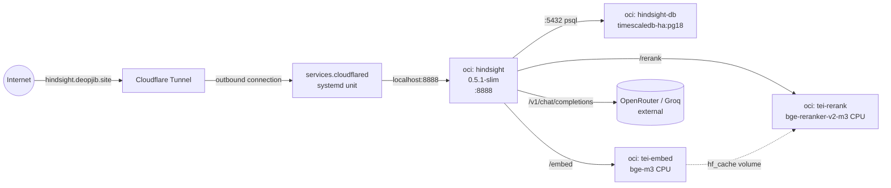

# VPS hindsight 스택을 homelab으로 이전

## Overview

VPS에서 돌고 있는 hindsight RAG 스택(arcane + caddy + hindsight + hindsight-db + 외부 LLM API)을 homelab(NixOS, AMD HX 370 + Radeon 890M)으로 이전한다. 동시에 imperative 도구(arcane, caddy)를 제거하고 NixOS 선언형 모듈로 재구성하며, embedding·reranker를 외부 API에서 로컬 TEI(CPU)로 전환한다. Jina API 토큰 소진으로 reranker 로컬화가 로드맵 Phase 2에서 로드맵 Phase 1(이 플랜)로 앞당겨짐.

### 용어: 로드맵 Phase vs 이 플랜 내부 Sub-phase

이 문서는 두 계층의 "Phase"를 사용하므로 혼동 방지를 위해 먼저 명시한다:

| 계층                | 의미                                                 | 범위                                |
| ------------------- | ---------------------------------------------------- | ----------------------------------- |
| **로드맵 Phase 1**  | 이 플랜 전체 (VPS→homelab 마이그레이션)              | 전체 구현 범위                      |
| **로드맵 Phase 2+** | 별도 플랜 (AI 확장, Vulkan iGPU, Beszel 모니터링 등) | 이 플랜 범위 외                     |
| **Sub-phase A / B** | 이 플랜 내부 실행 단계 (인프라 선언 / 데이터 컷오버) | 이 플랜의 Implementation Units 구성 |

아래 "Phase 1" 등 숫자 표기는 **로드맵 Phase**를 가리키고, "Phase A/B" 또는 "Sub-phase"는 **이 플랜 내부**를 가리킨다.

## Problem Frame

- **비용·lock-in**: VPS 월 비용 + 업체 이전 시 재구성 고통. 하드웨어 바뀌어도 `configuration.nix` 재적용만으로 재구축 가능한 선언형 환경 필요 (see origin: `docs/ideation/2026-04-14-vps-to-homelab-migration-ideation.md`)
- **선언형 투명성**: `arcane` 같은 imperative Docker UI 제거. `systems/homelab/*.nix`가 단일 소스 오브 트루스
- **AI 추론 비용 점진 감소**: embedding/reranker부터 로컬화. LLM 본체는 외부 API 유지 (31B iGPU 불가). Jina 토큰 소진이 reranker 로컬화를 강제

## Requirements Trace

- R1. VPS `sync/services/docker-compose.yml` 전체 스택이 homelab에 선언형으로 재현되어야 함 (arcane/caddy 제외)
- R2. `hindsight.deopjib.site` 도메인이 homelab을 가리키며 TLS + 공개 인터넷 접근 유지
- R3. 기존 TimescaleDB 데이터(hindsight-db-data volume)가 homelab으로 무손실 이전
- R4. embedding · reranker가 외부 API 호출 없이 homelab에서 로컬 처리 (OpenRouter/Groq LLM API만 외부 유지)
- R5. 전체 구성이 `jj git push` → comin auto-apply로 재현 가능해야 함 (secrets 포함)
- R6. Dry-run first 전략: VPS 정지 전에 homelab에서 빈 스택 검증 완료. 컷오버 다운타임 ≤ 30분
- R7. 롤백 경로: VPS 유지 기간 동안 DNS만 되돌리면 즉시 VPS로 복귀 가능

## Scope Boundaries

- VPS 측 `sync/services/docker-compose.yml`의 arcane · caddy 완전 제거. 대체 UI 설치 안 함 — NixOS 선언형이 "관리 UI" 역할 흡수
- hindsight 이미지 `0.5.0` → `0.5.1-slim` 전환. 9999 대시보드 포트 비노출
- `arcane.deopjib.site` DNS 레코드 삭제 (서브도메인 폐기)
- iGPU Vulkan/ROCm 활성화는 **Phase 1에 하지 않음** (embedding/reranker CPU 추론)
- 외부 SSH 뒷구멍 신규 구축 안 함 — 기존 iptime DDNS + 포트포워딩 유지
- 모니터링 스택(Beszel, Dozzle) 포함 안 함
- VPS 인스턴스 종료·호스팅 해지·백업 폐기 등 은퇴 절차는 이 플랜 범위 외 — 사용자 직접 관할 (DNS 전환 후 최소 7일 이상 유지하여 긴급 롤백 대비는 권장)

### Preconditions (Phase A 시작 전 필수)

- **GitHub 계정·commit 서명 방어 (Review P0-2)**: `services.comin`이 public repo `rjcnd105/hj-dotfiles` main을 auto-apply하므로 GitHub 계정 장악 = homelab system-scope RCE. 1인 운영 마찰 대비 ROI 기준으로 다음 "Sweet Spot" 조합 적용 (신뢰 축: Apple ID 단일):
  - **2FA: iCloud Keychain Passkey 등록** + SMS 백업 제거. Touch ID Secure Enclave 단독 등록은 Mac 초기화 시 소실되므로 Apple ID sync 경로(passkey)를 탄다. Safari에서 GitHub 2FA 등록 시 `platform authenticator` 선택 시 자동으로 iCloud Keychain에 저장됨
  - **SSH signing key 등록 (완료 2026-04-15)**: `~/.ssh/id_ed25519`를 GitHub Signing Key 슬롯에 `workspace signing 2026-04-15` 제목으로 등록 완료. GitHub은 Authentication Key와 Signing Key를 **별도 슬롯**으로 관리하므로 양쪽에 모두 등록돼야 signed commit이 "Verified" 배지를 받음 (Authentication 슬롯의 `mym1ultra` 항목은 같은 키, 기등록)
  - **로컬 서명**: jj에 SSH 서명 활성 (`jj config set --user signing.backend ssh` / `signing.key ~/.ssh/id_ed25519` / `signing.sign-all true`). 설정 후 다음 commit부터 자동 서명
  - **Branch protection**: jj 서명 활성 + test commit 1건 "Verified" 확인 이후 `Require signed commits` + `Include administrators`만 활성. PR 강제·status check 강제는 1인 자가 리뷰 환경에서 마찰만 추가하므로 생략. **순서 엄수**: 서명 활성 전 protection을 먼저 켜면 unsigned push가 reject되어 lockout 가능
  - **Recovery Code 보관**: GitHub → Settings → Password and authentication → Recovery codes 다운로드 → **Apple Notes에 Lock Note + Advanced Data Protection** 상태로 저장 (E2E 암호화, Apple ID 경유 복구). 인쇄는 하지 않음. 재확인 트리거: "남은 코드 3개 이하" GitHub 경고 / Mac 초기화·교체 / Apple ID 변경 / 2FA 방식 변경 / 기한 2028-04-15 (2년 경과)
  - **SSH signing key 분실 전략**: 별도 백업 불요. 분실 시 `ssh-keygen -t ed25519`로 재발급 + GitHub에 새 signing key 등록. **기존 signed commit은 old public key가 repo에 남아있는 한 검증 유지**. Sub-phase A·B 중 마이그레이션 사이에서의 마찰은 Operational Notes "comin 안전 운용" 옵션으로 완화
- **sops age key 실제 경로 확인**: `sops.age.sshKeyPaths = [ "/etc/ssh/ssh_host_ed25519_key" ]` 가정이 맞는지, 아니면 별도 age 키 파일 경로인지 homelab에서 1회 확인 (Unit 1 선행)

### Deferred to Separate Tasks

- **homelab RAM/iGPU UMA 조정**: 커널 인식 ~16GB vs 설치 ~36GB 차이 확인 및 BIOS 조정 → 별도 작업 (로드맵 Phase 1 후). `dmidecode`는 이 플랜에 포함
- **Phase 2+ AI 확장**: llama.cpp 확장, LiteLLM proxy, Open WebUI, iGPU Vulkan — 별도 플랜
- **Phase 2 모니터링**: Beszel + Dozzle — 별도 플랜
- **CF Access OAuth proxy**: 별도 플랜 (현재 API-key로 충분)
- **VPS 저장소 측 docker-compose.yml 정리 커밋**: `/Users/hj/study_ex/my-backend/vps` 저장소에서 수행 (이 플랜 범위 외)

## Context & Research

### Relevant Code and Patterns

- `systems/homelab/default.nix:1-49` — homelab 진입점. `networking`, `virtualisation.docker.enable`, `services.llama-cpp`, `services.comin`, `environment.systemPackages` 이미 정의. 새 모듈은 여기 `imports`에 추가
- `systems/homelab/default.nix:8-10` — `imports = [ ./hardware-configuration.nix ]` 패턴. `getModulePaths`(flake.nix)는 `default.nix`만 자동 로드하므로 신규 하위 모듈은 명시 import 필수
- `homes/workspace/sops.nix:45-134` — 현행 sops-nix **home-manager scope** 사용 예. `sops.templates`로 `.env` 파일 렌더링하는 패턴. oci-container는 **system scope** sops가 필요해 신규 패턴 도입
- `systems/default.nix:21-23` — sops-nix가 `home-manager.sharedModules`로 주입되고 있음. system scope 도입 시 `imports = [ inputs.sops-nix.nixosModules.sops ]` 추가 필요
- `.sops.yaml:21-25` — homelab creation_rule 이미 활성화 (hj_age + homelab_age). `secrets/homelab/*.yaml`은 자동으로 homelab age key로 암호화
- `systems/homelab/default.nix:34-44` — `services.comin` 활성 상태. GitHub `rjcnd105/hj-dotfiles` main 브랜치 poll → nixos-rebuild auto-apply
- `docs/guides/homelab-install-guide.md:291-305` — secrets-dependent 모듈의 첫 배포 관습 명시 (Mac에서 push → comin이 감지 → secrets 포함 rebuild → 수동 rebuild 불필요)
- `docs/plans/2026-04-08-001-feat-nixos-homelab-setup-plan.md` — 선행 작업, homelab 초기 구축 플랜
- `CLAUDE.md` — `myOptions` specialArgs 패턴 (모든 모듈 `{ pkgs, myOptions, ... }` 시그니처), `just darwin-switch` 경로, `docs/plans/YYYY-MM-DD-NNN-*` 파일명 관습
- `justfile:26-27` — `build_hj-homelab`은 eval-only (풀 빌드 아님). homelab 자체 rebuild는 comin이 처리
- external: `/Users/hj/study_ex/my-backend/vps/sync/services/docker-compose.yml` — VPS 기존 스택 참조 원본
- external: `/Users/hj/study_ex/my-backend/vps/sync/services/Caddyfile` — 기존 라우팅 (`arcane.deopjib.site`, `hindsight.deopjib.site:8888+9999`)

### Institutional Learnings

- `docs/solutions/best-practices/extending-nix-darwin-flake-to-nixos-2026-04-08.md` — darwin+NixOS 혼합 flake 구조 확립. 이 마이그레이션은 그 구조를 그대로 활용
- `docs/solutions/`에는 `oci-containers`, `cloudflared`, `comin`, `amdgpu` 관련 학습 **없음** — 이번 작업의 해결책은 완료 후 `ce-light-compound`로 `docs/solutions/`에 축적 권장

### External References

- hindsight 공식 configuration (`https://hindsight.vectorize.io/developer/configuration`) — 이번 플랜에서 사용할 env 변수명 출처
- hindsight v0.5.1 release notes (`gh api repos/vectorize-io/hindsight/releases/tags/v0.5.1`) — embed/rerank 관련 fix #1010, #1016, #999, #1009, #957, #919 포함
- TEI 공식 Supported Models (`https://github.com/huggingface/text-embeddings-inference#supported-models`) — bge-reranker-base/large, gte-multilingual-reranker-base만 명시. **bge-reranker-v2-m3는 공식 명시 없지만 XLM-RoBERTa 아키텍처라 실질 작동 보고 다수**
- `docker manifest inspect ghcr.io/vectorize-io/hindsight:0.5.1-slim` 결과: OCI Image Index, amd64/arm64 지원 확인됨

## Key Technical Decisions

- **모듈 분리**: `systems/homelab/default.nix`에 모두 추가하지 않고 `services-stack.nix`(oci-containers) + `cloudflared.nix`(tunnel) + `sops.nix`(system-level secrets) 세 파일로 분리. 이유: 현재 default.nix 50줄 → 4 컨테이너 + CF Tunnel + secrets 추가 시 200줄+ 예상, 변경 단위와 review 단위가 구분됨. 관습상 homelab 하위 분리가 처음이지만 정당화 가능
- **system-level sops-nix 신규 도입**: 기존 sops는 home-manager scope만. oci-container는 systemd unit → system scope 필수. `imports = [ inputs.sops-nix.nixosModules.sops ]` 추가 + `sops.age.sshKeyPaths = [ "/etc/ssh/ssh_host_ed25519_key" ]`(또는 homelab_age 경로)
- **oci-container env 주입**: `environmentFiles = [ config.sops.secrets."services.env".path ]` 형식. sops는 `.yaml` 입력을 `key=value` 포맷으로 decrypt한 파일을 생성 (format = "dotenv")
- **공유 HF cache volume**: `hf_cache` named volume을 tei-embed + tei-rerank가 마운트 → 모델 다운로드 중복 제거. Phase 2 llama.cpp/ComfyUI 확장 시 재사용
- **TimescaleDB 이미지 태그 핀**: `timescale/timescaledb-ha:pg18` 정확히 동일 (minor drift 시 pg_textsearch 확장 호환성 위험)
- **DB 이전: volume tar 복사**: 공식 dump/restore 가이드 없음. `tar czf` + `scp` + `tar xzf`가 가장 안전. VPS↔homelab 이미지 태그 일치가 전제
- **Cutover 순서**: VPS 미중단 상태에서 homelab dry-run 완료 → VPS 일시 정지 → 데이터 복사 → homelab 기동 → DNS 전환. 총 다운타임 ≤ 30분
- **DNS TTL 단축**: 컷오버 전 24시간 전부터 TTL=60s로 낮춤. 전파 시간 최소화
- **VPS 인스턴스 유지 권장**: DNS 전환 성공 후에도 VPS를 **최소 7일** 유지하여 긴급 롤백 대비. `hsdb-*.tar.gz` 백업도 동일 기간 보존. 인스턴스 종료·호스팅 해지는 이 플랜 범위 외(사용자 관할)
- **주석 언어**: 한국어 (nix-dots 시스템 모듈 관습 일관)
- **모듈 시그니처**: `{ pkgs, inputs, config, myOptions, ... }` — `myOptions`는 CLAUDE.md 규약에 따라 필수 argument

## Open Questions

### Resolved During Planning

- `hindsight:0.5.1-slim` 레지스트리 태그 존재: **확정** (OCI Image Index, amd64/arm64). 그대로 사용
- TEI env 정확한 변수명: **확정**
  - `HINDSIGHT_API_EMBEDDINGS_PROVIDER=tei`, `HINDSIGHT_API_EMBEDDINGS_TEI_URL=http://tei-embed:80`
  - `HINDSIGHT_API_RERANKER_PROVIDER=tei`, `HINDSIGHT_API_RERANKER_TEI_URL=http://tei-rerank:80`
- comin 첫 배포 가능 여부: **확정**. `.sops.yaml` homelab rule + homelab age key 등록 완료. `jj git push`만으로 auto-apply

### Deferred to Implementation

- **homelab RAM 실제 인식값**: Unit 1 배포 후 `sudo dmidecode -t memory` 실측 → iGPU UMA vs DIMM 인식 판별. concurrency 튜닝 값은 실측값에 따라 조정. 이 확인은 Phase 1 cutover와 독립적 (Phase 1 스택 RAM 사용 ~3-6GB)
- **TEI CPU 이미지 정확한 태그**: `cpu-latest`는 안정 vs `cpu-1.5`/`cpu-1.6` 같은 구체 버전 중 무엇이 bge-m3 + bge-reranker-v2-m3 둘 다 안정 지원하는지 — 실제 배포 시 manifest inspect로 확정
- **hindsight concurrency 튜닝값**: 현재 VPS의 "budget" 값(LLM max 6, worker 4, reranker max candidates 150)을 homelab에 상향할지는 실제 부하 측정 후. Phase 1은 동일 값 유지
- **comin poll 간격·실패 rollback 동작**: 기본값 사용. 실제 부하나 장애 패턴 관찰 후 tuning

## High-Level Technical Design

> _이 섹션은 플랜 리뷰어가 구조를 검증하기 위한 directional guidance이며 implementation specification이 아니다. 구현자는 이를 맥락으로만 활용하고 코드로 복사하지 말 것._

### 컨테이너 상호작용 (Phase 1 완료 후)



### secrets → oci-container 주입 경로

```mermaid
flowchart TB
    yaml[secrets/homelab/services.yaml<br/>SOPS encrypted]
    sops[sops-nix NixOS 모듈<br/>activation 시 decrypt]
    path["/run/secrets/services.env<br/>format: dotenv, 0400"]
    env[virtualisation.oci-containers.<br/>containers.hindsight.environmentFiles]
    container[hindsight container<br/>process env]

    yaml -->|age homelab_age + hj_age| sops
    sops -->|sops.secrets."services.env"| path
    path -->|filesystem read| env
    env -->|podman/docker run --env-file| container
```

### 컷오버 시퀀스 (다운타임 구간)

```mermaid
sequenceDiagram
    participant Dev as 개발자
    participant VPS
    participant HL as homelab
    participant CF as Cloudflare DNS

    Note over Dev,HL: Unit 1-3 완료 (homelab 선언형 인프라 + 빈 DB 기동 검증)
    Dev->>HL: Unit 4 dry-run (빈 DB로 smoke test)
    HL-->>Dev: /health, /embed, /rerank, /v1/recall 정상

    rect rgb(255, 220, 220)
        Note over Dev,CF: 다운타임 시작 (~20-30분)
        Dev->>VPS: docker compose down
        Dev->>VPS: tar czf hsdb.tar.gz hindsight-db-data
        Dev->>HL: scp hsdb.tar.gz
        Dev->>HL: docker stop hindsight-db
        Dev->>HL: tar xzf into hindsight-db-data
        Dev->>HL: docker start hindsight-db; docker restart hindsight
        HL-->>Dev: recall smoke test 통과
        Dev->>CF: hindsight.deopjib.site → homelab tunnel
        Dev->>CF: arcane.deopjib.site 삭제
        CF-->>Dev: DNS 전파 시작 (TTL 60s)
    end

    Note over Dev,VPS: 7일+ VPS 유지 (긴급 롤백 대비, 종료는 플랜 외 사용자 관할)
```

## Implementation Units

### Phase A — 선언형 인프라 구축 + Dry-run (VPS 미중단)

Phase A는 VPS와 병행 가능. 문제 발견 시 Phase A만 되돌리면 VPS는 무영향.

- [ ] **Unit 1: system-level sops-nix 통합 + services.yaml secret 생성**

**Goal:** oci-container가 환경변수로 주입받을 수 있도록 system scope `sops.secrets` 패턴 신설. `secrets/homelab/services.yaml` 신규 파일로 API 키 6종 + CF Tunnel credentials를 암호화 저장.

**Requirements:** R1, R5

**Dependencies:** 없음 (homelab age key·`.sops.yaml`·comin 이미 준비됨)

**Files:**

- Create: `systems/homelab/sops.nix`
- Create: `secrets/homelab/services.yaml` (sops로 암호화, plaintext 커밋 금지)
- Modify: `systems/homelab/default.nix` (`imports`에 `./sops.nix` 추가)

**Approach:**

- `systems/homelab/sops.nix`에 `imports = [ inputs.sops-nix.nixosModules.sops ]`
- `sops.defaultSopsFile = ../../secrets/homelab/services.yaml;` (서비스용 전용 파일)
- `sops.age.sshKeyPaths = [ "/etc/ssh/ssh_host_ed25519_key" ]` — homelab age key가 SSH 호스트 키에서 파생되어 있는지 `homelab-install-guide.md`에 따라 확인. 아니면 명시 경로 사용
- `sops.secrets."services.env" = { format = "dotenv"; mode = "0400"; owner = "root"; };` — oci-container가 읽을 파일 형태
- `sops.secrets."cloudflared-credentials" = { format = "json"; mode = "0400"; owner = "cloudflared"; };` — CF Tunnel용 별도 파일 (nixpkgs `services.cloudflared.tunnels.<id>.credentialsFile`이 **JSON 형식만** 지원하므로 token 방식은 채택 안 함 — Review P1-1)
- `secrets/homelab/services.yaml`은 `sops secrets/homelab/services.yaml`로 편집(dotenv format은 sops 1.x 지원)
- 저장할 키(dotenv): `HINDSIGHT_DB_PASSWORD`, `OPENROUTER_API_KEY`, `GROQ_API_KEY`, `HINDSIGHT_API_TENANT_API_KEY`
- 저장할 파일(JSON): `cloudflared-credentials` (CF 대시보드에서 다운로드한 tunnel credentials JSON 원본을 별도 YAML 파일로 sops 암호화 — e.g., `secrets/homelab/cloudflared.yaml`)

**Execution note:** 첫 배포 전에 `sops -e -i secrets/homelab/services.yaml` 형태로 로컬에서 암호화 상태 확인. 절대 plaintext 커밋 금지(`.sops.yaml`의 rule이 자동으로 homelab+hj age keys로 암호화)

**Patterns to follow:**

- `homes/workspace/sops.nix:45-85` — secret 선언 구조 (다만 home scope → system scope로 포팅)
- `docs/guides/homelab-install-guide.md:291-305` — secrets-dependent 첫 배포 경험칙

**Test scenarios:**

- Happy path: `sops -d secrets/homelab/services.yaml` → 로컬에서 hj_age로 decrypt 가능해야 함
- Happy path: homelab에서 `sudo cat /run/secrets/services.env`가 성공적으로 읽히고 format이 dotenv (key=value 라인)
- Edge case: dotenv value에 `=` 문자 포함 시 escape 확인 (CF tunnel token 등 base64 문자에 `=` 나옴)
- Error path: age key 없는 호스트에서 activation 시 명확한 에러 (sops-nix가 보고)
- Integration: Unit 3에서 이 secret을 oci-container `environmentFiles`에 연결 시 env 실제 주입

**Verification:**

- `nixos-rebuild switch --flake .#homelab_hj` (로컬 또는 comin 경유) 후 `systemctl status sops-nix.service` 활성 상태
- `sudo stat /run/secrets/services.env` → mode 0400, owner root
- `sudo head -1 /run/secrets/services.env` → plaintext key=value 확인 (값은 보지 않음)

---

- [ ] **Unit 2: Cloudflare Tunnel 선언형 구성**

**Goal:** `services.cloudflared`로 CF Tunnel을 선언. `hindsight.deopjib.site` (cutover 전에는 임시 `hindsight-test.deopjib.site`)를 localhost:8888로 라우팅.

**Requirements:** R2

**Dependencies:** Unit 1 (CF_TUNNEL_TOKEN 또는 credential 파일 sops에 등록됨)

**Files:**

- Create: `systems/homelab/cloudflared.nix`
- Modify: `systems/homelab/default.nix` (`imports`에 `./cloudflared.nix` 추가)
- External (이 플랜 외): Cloudflare 대시보드에서 Tunnel 생성 + tunnel ID 획득 + credentials JSON 다운로드 → sops에 삽입

**Approach:**

- `services.cloudflared.enable = true;`
- `services.cloudflared.tunnels.<tunnel-id> = { credentialsFile = config.sops.secrets."cloudflared-credentials".path; default = "http_status:404"; ingress = { "hindsight-test.deopjib.site" = "http://localhost:8888"; }; };`
- dry-run 단계에서는 `hindsight-test.deopjib.site`만 라우팅. Unit 6에서 `hindsight.deopjib.site`로 교체
- `sops.secrets."cloudflared-credentials"` 선언은 Unit 1의 `sops.nix`에서 JSON format으로 이미 정의됨 (Unit 1 Approach 참조)
- **공개 노출 경계 결정 (Review P1-3)**: ingress 매핑에서 hindsight API의 `/health`만 공개로 허용, `/metrics`와 Control Plane 경로는 `http_status:403` 또는 Cloudflare Access 정책으로 차단. 구현 힌트: ingress 항목을 hostname+path 단위로 분리(`hindsight.deopjib.site/health` → 200, `hindsight.deopjib.site/metrics` → 403). TEI(`:8001`, `:8002`)는 **ingress에 노출 금지** — 컨테이너 바인딩도 Unit 3에서 `127.0.0.1:8001` 등 loopback 전용으로 확인

**Patterns to follow:**

- nixpkgs `services.cloudflared` 공식 모듈 (이 flake에 전례 없음 → 첫 도입)
- `systems/homelab/default.nix:27-31` `services.llama-cpp` 짧은 블록 스타일 준수

**Test scenarios:**

- Happy path: `systemctl status cloudflared-tunnel-<id>` 활성 + recent log에 connector registered
- Happy path: `curl -H "Host: hindsight-test.deopjib.site" https://<cloudflare-endpoint>` 요청이 Cloudflare → cloudflared → localhost:8888로 전달 (hindsight 미기동 상태면 502 or 404 정상)
- Error path: credentials 파일 경로 틀리면 cloudflared 시작 실패 + journalctl에서 명확한 이유
- Error path: ingress에 나열되지 않은 hostname 요청은 default `http_status:404` 응답
- Integration: Unit 4에서 hindsight 기동 후 이 라우팅으로 실제 `/health` 응답

**Verification:**

- `journalctl -u cloudflared-tunnel-<id> -n 50` 에러 없음, "Registered tunnel connection" 로그
- Cloudflare 대시보드 Zero Trust → Networks → Tunnels에서 "HEALTHY" 상태
- `dig hindsight-test.deopjib.site` → CF 레코드 정상

---

- [ ] **Unit 3: hindsight 스택 oci-containers 선언**

**Goal:** `virtualisation.oci-containers`로 4 컨테이너(hindsight, hindsight-db, tei-embed, tei-rerank) + 공유 볼륨 선언. 이 flake 최초의 oci-containers 사용.

**Requirements:** R1, R4

**Dependencies:** Unit 1 (services.env secret), Unit 2 선행 권장 (같은 모듈 패턴 학습)

**Files:**

- Create: `systems/homelab/hindsight-stack.nix`
- Modify: `systems/homelab/default.nix` (`imports`에 `./hindsight-stack.nix` 추가)

**Approach:**

- `virtualisation.oci-containers.backend = "docker";` (homelab에 이미 `virtualisation.docker.enable = true` 있음 — `systems/homelab/default.nix:23`)
- 공유 docker network 생성: `systemd.services.init-hindsight-network` (oneshot, ExecStart로 `docker network create hindsight --driver bridge` idempotent)
- 4개 컨테이너 선언 (env, volumes, dependsOn, network mapping). 구체 env 키는 `docs/ideation/2026-04-14-vps-to-homelab-migration-ideation.md`의 "목표 아키텍처" 절과 `docs/guides`의 sops 패턴을 따름 — 현 단계에선 값이 아닌 구조만 결정
- `environmentFiles = [ config.sops.secrets."services.env".path ]` 모든 컨테이너 공통
- 비밀이 아닌 env(모델 id, provider 이름, 포트 등)는 `environment` 맵에 직접
- volumes:
  - `hindsight-db-data` (hindsight-db 전용)
  - `hf_cache` (tei-embed + tei-rerank 공유)
- 이미지 태그 pinning: `timescale/timescaledb-ha:pg18`, `ghcr.io/vectorize-io/hindsight:0.5.1-slim`, `ghcr.io/huggingface/text-embeddings-inference:cpu-latest` (구체 버전은 배포 직전 manifest inspect로 재확인)
- concurrency 튜닝 env는 VPS 현재값 그대로 유지 (Phase 1 이후 실측 기반 상향)

**Execution note:** tei-embed/tei-rerank가 모델을 최초 다운로드하는 동안 수십분~1시간 걸릴 수 있음. dry-run(Unit 4) 전에 `sudo docker pull` 또는 컨테이너 기동 후 로그로 모델 다운로드 완료 기다림. 이후 `hf_cache` volume에 캐시되어 재기동 시 즉시

**Pre-implementation gate (Review P1-4):** Unit 3 PR을 열기 전 hindsight 0.5.1 소스에서 `RerankerProvider::Tei` enum variant 실제 존재를 확인한다. 확인 방법: `gh api repos/vectorize-io/hindsight/git/trees/v0.5.1 --jq '.tree[] | select(.path | contains("reranker"))'`로 관련 파일 경로를 찾아 `grep -r "Tei" <file>` 검증. 존재하지 않거나 feature flag 필요시 Unit 3 구성을 reranker TEI fallback에서 외부 API 임시 유지로 변경

**Patterns to follow:**

- external: `my-backend/vps/sync/services/docker-compose.yml` — env 변수명·포트·볼륨 이름 기준
- nixpkgs `virtualisation.oci-containers` 공식 옵션 (이 flake 첫 도입)
- `systems/homelab/default.nix:27-31` 한국어 주석 스타일 준수

**Test scenarios:**

- Happy path: 4 컨테이너 모두 `systemctl status docker-<name>.service` active. `docker ps` 출력에 4개 정상 running
- Happy path: 공유 network에서 `docker exec hindsight ping hindsight-db` 성공
- Happy path: `hf_cache` volume이 tei-embed와 tei-rerank 양쪽에서 마운트 확인 (`docker inspect`)
- Edge case: comin auto-apply 중 docker daemon 재시작되면 컨테이너 순서 의존성(`dependsOn`)이 올바르게 작동해 hindsight가 db보다 먼저 뜨지 않음
- Error path: `services.env` 파일 없으면 hindsight 컨테이너가 시작 실패 + journalctl에 명확한 사유
- Error path: hindsight-db 재시작 시 hindsight가 DB 재연결 시도 + 성공
- Integration: Unit 4에서 각 컨테이너가 의도한 포트/프로토콜로 서로 통신

**Verification:**

- `docker ps` 4개 컨테이너 STATUS "Up (healthy)" (healthcheck 정의된 경우)
- `docker logs tei-embed | tail -20` → "Ready" 또는 모델 로드 완료 메시지
- `docker logs tei-rerank | tail -20` → 동일
- `docker logs hindsight-db | tail -5` → "database system is ready to accept connections"
- `docker logs hindsight | tail -20` → startup 에러 없음, "Tenant extension initialized" 등

---

- [ ] **Unit 4: Dry-run smoke test (빈 DB 기반)**

**Goal:** VPS 데이터 복사 전에 homelab 스택 전체가 선언된 형태로 작동하는지 검증. 실패 시 Phase A만 되돌리면 VPS 무영향.

**Requirements:** R1, R4, R6

**Dependencies:** Unit 1, 2, 3

**Files:**

- Create: `docs/plans/smoke-tests/2026-04-14-homelab-dryrun.md` (검증 체크리스트, 실측 결과 기록용)

**Approach:**

- homelab SSH 접속 후 각 엔드포인트 curl로 응답/지연 측정
- CF Tunnel 경로로 외부에서도 같은 엔드포인트 도달성 확인 (`hindsight-test.deopjib.site`)
- 실측값 기록: TEI embed/rerank 쿼리별 지연(ms), 컨테이너 메모리 사용, 모델 다운로드 완료 시점

**Test scenarios:**

- Happy path: `curl http://localhost:8888/health` → 200 + `{"status":"ok"}` 또는 hindsight 기대 응답
- Happy path: `curl http://localhost:8001/health` (tei-embed), `http://localhost:8002/health` (tei-rerank) → 200
- Happy path: `curl -X POST http://localhost:8001/embed -d '{"inputs":"한국어 테스트 문장"}'` → 1024차원 벡터 (bge-m3)
- Happy path: `curl -X POST http://localhost:8002/rerank -d '{"query":"q","texts":["a","b","c"]}'` → 각 score
- Happy path: hindsight `/v1/recall` 빈 DB에 질의 → 200 + 빈 결과 (400/500 에러 아님)
- **Extension gate (Review P0-4, VPS 실측 기반 2026-04-15)**: VPS의 `pg_extension` 조회 결과 `pg_textsearch 1.0.0`, `vector 0.8.2`, `timescaledb 2.26.1`, `timescaledb_toolkit 1.22.0` 설치 확인됨. `timescale/timescaledb-ha:pg18`에 이들이 번들되는 것이 경험적으로 확인됨. 따라서 Unit 4에서는 빈 DB에 대해 `docker exec hindsight-db psql -U hindsight -d hindsight -c "SELECT extname, extversion FROM pg_extension ORDER BY extname;"` 실행 후, 네 개(pg_textsearch/vector/timescaledb/timescaledb_toolkit)가 **동일 또는 상위 버전으로** 존재함을 확인. 누락 시 이미지 태그 drift 의심 → Unit 3 pinning 재검증
- **Embedding-space check (Review P0-3, 해소됨 2026-04-15)**: VPS `sync/services/docker-compose.yml:83`의 `HINDSIGHT_API_EMBEDDINGS_LOCAL_MODEL: BAAI/bge-m3` 확인. VPS 저장 벡터와 homelab TEI(bge-m3)가 동일 모델 공간이므로 "임베딩 공간 불연속" 리스크는 성립하지 않음. 남은 marginal 리스크는 hindsight 내장 inference와 TEI 간 pooling·normalization 구현 차이로 인한 미세 품질 변화뿐이며, Unit 5 verification의 "알려진 memory 샘플 recall 비교"로 충분히 커버됨. 별도 Unit 4 gate 불필요
- Happy path: 외부에서 `curl https://hindsight-test.deopjib.site/health` → 200, TLS 정상
- Edge case: tei-embed `/embed`에 긴 입력(512+ 토큰) → 정상 처리 또는 명확한 truncation
- Edge case: hindsight가 시작할 때 TEI가 아직 준비 중이면 기다리는지, 또는 즉시 실패하는지 (허용 가능 여부 확인)
- Error path: tei-rerank 컨테이너 강제 정지 → hindsight `/v1/recall` 요청이 명확한 에러 반환
- Integration: 전체 경로 외부 curl → CF → cloudflared → hindsight → (embed + rerank + db 빈) → 응답까지 end-to-end 성공

**Verification:**

- 모든 happy path 시나리오가 smoke-tests 문서에 ✓로 기록됨
- 실측 레이턴시가 브레인스토밍 예상 범위(embed 50-150ms, rerank 20-60ms/쌍) 안
- 48시간 이상 안정적 구동 확인 (comin poll + docker restart 시에도 정상 복구)

---

### Phase B — 데이터 컷오버 + DNS 전환 (다운타임 ~20-30분)

- [ ] **Unit 5: VPS 데이터 백업 및 homelab 이관**

**Goal:** hindsight-db-data volume을 VPS에서 homelab으로 무손실 이전. 이미지 태그 핀 일치로 확장 호환성 보장.

**Requirements:** R3

**Dependencies:** Unit 4 완료 (homelab 스택 작동 확인)

**Files:**

- Create: 백업 파일 `~/hsdb-20260414.tar.gz` (외장 디스크·로컬·homelab에 각 1부, 7일 보관)
- Modify: homelab의 `hindsight-db-data` volume (plaintext 파일시스템 변경, nix 파일 변경 아님)

**Approach:** 0. **Pre-flight 실측 (Review P2-5)**: VPS에서 `sudo du -sh /var/lib/docker/volumes/hindsight-db-data` 실측. 크기 + VPS↔homelab 전송 대역폭으로 실제 downtime 추정치 재계산. "20-30분" 숫자는 이 실측 전까지 placeholder

1. DNS TTL 단축 확인: Cloudflare에서 `hindsight.deopjib.site` TTL 60s로 24시간 전에 변경했는지 사전 확인
2. 백업 사용자 알림 (개인 사용이라 단일): 다운타임 시작 공지 (필요 시)
3. VPS: `docker compose -f sync/services/docker-compose.yml down`. **완전 종료 확인 (Review P2-6)**: `docker logs <hindsight-db> --tail 30`에서 `"database system is shut down"` 메시지 확인 후에만 다음 단계 진행. 확인 없이 tar를 뜨면 WAL flush 미완료 상태의 스냅샷이 될 수 있음
4. VPS: volume 덤프 (`docker run --rm -v hindsight-db-data:/src -v $PWD:/dst alpine tar czf /dst/hsdb-$(date +%Y%m%d).tar.gz -C /src .`) + 즉시 `chmod 600 hsdb-*.tar.gz` (민감 데이터 노출 방지)
5. 로컬로 `scp` 후 homelab으로 재전송 (직접 VPS→homelab도 가능하나 로컬 경유가 백업 보관에 유리)
6. homelab: `docker stop hindsight-db` (Unit 3에서 이미 실행 중)
7. homelab: `docker run --rm -v hindsight-db-data:/dst -v ~/:/src alpine sh -c 'rm -rf /dst/* && tar xzf /src/hsdb-*.tar.gz -C /dst'`
8. homelab: `docker start hindsight-db; docker restart hindsight`
9. smoke test: `docker exec hindsight-db psql -U hindsight -d hindsight -c 'SELECT count(*) FROM memories;'` + `SELECT count(*) FROM embeddings;`
10. hindsight `/v1/recall`로 실제 데이터 질의 → 기대 결과 확인

**Execution note:** Step 9 결과값을 VPS 정지 직전의 동일 쿼리 결과와 비교. 일치해야 함 (VPS 정지 직전에 `docker exec` 로 미리 count 조회 후 기록 권장)

**Patterns to follow:**

- 브레인스토밍 문서 "데이터 마이그레이션 세부" 섹션의 smoke test 쿼리

**Test scenarios:**

- Happy path: `count(*) FROM memories` VPS 정지 직전값 == homelab 복원 후값
- Happy path: `count(*) FROM embeddings` 동일 일치
- Happy path: hindsight `/v1/recall`로 특정 알려진 memory 내용을 질의 → VPS와 동일한 상위 결과
- Edge case: 대용량 DB(수 GB+) 압축/전송 시간이 예상보다 길 때 별도 channel로 진행 (VPS 정지 상태 유지)
- Error path: tar extract 중 디스크 full → `df -h` 사전 확인, 여유 공간 ≥ 2× 백업 파일 크기
- Error path: 이미지 태그 불일치로 확장 호환성 깨지면 hindsight-db 시작 시 로그에 `extension "pg_textsearch" does not exist` 같은 에러. Unit 3 이미지 태그 pinning 재확인
- Integration: 복원 후 hindsight가 DB에 자동 연결 + recall 응답 완전 (embedding 벡터 + text search 합성)

**Verification:**

- 데이터 카운트 일치 확인 완료 (정지 직전 값 == 복원 후 값)
- `/v1/recall` 샘플 질의 결과가 VPS와 동일 상위 문서 반환
- `hsdb-*.tar.gz` 백업이 로컬·외장 디스크·homelab 3곳에 보관되어 있음

---

- [ ] **Unit 5.5: 클라이언트 retry/backoff 동작 확인 (Review P2-4)**

**Goal:** Unit 6(DNS cutover) 직전에, hindsight를 호출하는 클라이언트(개인 브라우저 에이전트 등)가 DNS propagation 구간의 일시적 502/unreachable 응답을 exponential backoff로 재시도하는지 확인. 실패 응답을 silent drop하면 cutover 순간의 write가 유실되는 리스크.

**Requirements:** R3, R6 (무손실 이전 + ≤30분 다운타임)

**Dependencies:** Unit 5 완료 (homelab 정상 작동), Unit 6 미진행

**Files:** 없음 (동작 관찰 + 문서 기록)

**Approach:**

1. 클라이언트 측 hindsight API 호출 코드 위치 식별 (브라우저 에이전트 또는 스크립트의 hindsight 클라이언트 래퍼)
2. 네트워크 오류 발생 시 처리 경로 확인: retry 정책 존재 여부, max attempts, backoff 간격, 실패 시 drop vs queue
3. 간이 재현: `iptables`로 클라이언트↔hindsight 경로를 수 초간 DROP 후 복구. 그 동안 생성된 memory가 최종적으로 DB에 들어가는지 확인
4. retry 정책이 없거나 drop 설계라면 Unit 6 cutover 전에 **수동 write 일시 중지** 안내를 체크리스트에 추가

**Test scenarios:**

- Happy path: 3초 네트워크 차단 구간에서 클라이언트가 재시도 후 성공. DB에 memory 정상 저장
- Edge case: 30초 이상 차단 시 재시도 소진 후 실패하더라도 클라이언트가 명시적 에러 표시 (silent drop 금지)
- Error path: retry 미구현이 확인되면 Unit 6 checklist에 "cutover 전 브라우저 에이전트 일시 중지" 단계 추가

**Verification:**

- 클라이언트 retry 경로가 문서화되고 동작 확인됨. 혹은 cutover 전 수동 중지 절차가 Unit 6 실행 checklist에 추가됨

---

- [ ] **Unit 6: DNS 컷오버 + 임시 서브도메인 정리**

**Goal:** `hindsight.deopjib.site`가 VPS → homelab tunnel로 전환. `arcane.deopjib.site` 삭제. 외부 접근자들에게 투명한 전환.

**Requirements:** R2, R6

**Dependencies:** Unit 5 + Unit 5.5 완료 (homelab에서 실제 데이터 응답 확인 + 클라이언트 retry 경로 확인)

**Files:**

- External: Cloudflare 대시보드 DNS / Zero Trust Tunnels 설정 (nix 파일 변경 없음)
- Modify: `systems/homelab/cloudflared.nix` — ingress에 `hindsight.deopjib.site` 추가, 임시 `hindsight-test.deopjib.site` 제거 (또는 ingress 배열 정리)

**Approach:**

1. Cloudflare 대시보드에서 `hindsight.deopjib.site`를 VPS Caddy 엔드포인트에서 homelab cloudflared tunnel로 재지정 (CNAME/Tunnel route 변경)
2. `systems/homelab/cloudflared.nix` ingress 업데이트 → `jj describe` + `jj git push`
3. comin poll (수 분) → homelab에서 tunnel 설정 reload. cloudflared는 ingress 변경 시 자동 재연결
4. 외부 curl 검증: `curl -v https://hindsight.deopjib.site/health` → homelab 경로 응답 + TLS 유효
5. `arcane.deopjib.site` 레코드 Cloudflare에서 삭제
6. 이전 임시 `hindsight-test.deopjib.site` 레코드 삭제

**Test scenarios:**

- Happy path: `hindsight.deopjib.site` 외부에서 접속 시 homelab hindsight 응답
- Happy path: hindsight 클라이언트(개인 device) 쪽에서 API 호출 중단 없이 연속 작동
- Edge case: DNS 전파 지연으로 일부 지역에서 VPS로 여전히 라우팅 → TTL 짧게 설정했으므로 수 분 내 해소. VPS는 아직 가동 중이라 실제 서비스 단절은 없음
- Edge case: CF Tunnel 설정 변경 중 수 초간 503 → 자동 복구
- Error path: `arcane.deopjib.site` 삭제 후 해당 URL 접근 시 Cloudflare "does not exist" 기본 페이지 (정상)
- Integration: DNS 전환 후 30분 모니터링 — hindsight API 에러율 변동 없음

**Verification:**

- 외부 여러 위치(집/모바일/다른 네트워크)에서 `hindsight.deopjib.site/health` 200 응답
- `dig hindsight.deopjib.site +short` → Cloudflare 프록시 IP 여전히 나옴 (homelab IP는 Tunnel 뒤라 노출 없음)
- `arcane.deopjib.site` 더 이상 resolve 안 됨
- hindsight 로그에서 normal traffic 패턴 확인

---

### Phase A-보조: 진단 툴 (선행 커밋)

- [ ] **Unit 8: dmidecode 패키지 추가 (Phase A와 병행 OR 선행)**

**Goal:** homelab의 BIOS/iGPU UMA 실측을 위한 진단 도구. RAM 인식 이슈(열린 질문 #1) 해결 수단.

**Requirements:** 직접 관련 없음 (operational)

**Dependencies:** 없음

**Files:**

- Modify: `systems/homelab/default.nix:46-49` (이미 작업된 상태면 merge 확인)

**Approach:**

- `environment.systemPackages`에 `dmidecode` 추가 (이미 편집됨 — 현 대화 과정에서)
- Phase A 첫 커밋에 포함하거나 독립 커밋

**Test expectation: none** — 순수 패키지 추가. 배포 후 `sudo dmidecode --version` 실행 가능 여부로 검증

**Verification:**

- `nixos-rebuild switch` 후 `sudo dmidecode -t memory | rg 'Size|Speed|Locator'` 정상 실행

## System-Wide Impact

- **Interaction graph:**
  - 신규: `services.cloudflared` systemd unit ↔ CF Cloudflare edge
  - 신규: `virtualisation.oci-containers.containers.*` 4개가 각자 systemd unit (`docker-<name>.service`)으로 관리됨. `dependsOn` 그래프 명시 필요 (hindsight → hindsight-db + tei-embed + tei-rerank)
  - 변경 없음: `services.llama-cpp` (Phase 1엔 건드리지 않음, 127.0.0.1:8080 그대로)
  - 변경 없음: `services.comin` (poll 대상 repo 그대로)
- **Error propagation:**
  - TEI 컨테이너가 죽으면 hindsight `/v1/recall`이 500 반환 → sops env에 recover 정보 없음, systemd `Restart=always` 정책으로 자동 재시작. `depends_on.healthy` 유사 동작은 oci-containers의 `dependsOn` + 컨테이너 자체 healthcheck로 구현
  - sops secret activation 실패 시 oci-containers도 기동 실패 (fail-fast). 로그 명확성 중요
- **State lifecycle risks:**
  - `hindsight-db-data` volume은 **stateful**. 이미지 태그 drift 시 확장 호환성 깨질 수 있어 `timescale/timescaledb-ha:pg18` pinning 엄수
  - `hf_cache` volume은 **stateless** 성격이지만 삭제 시 TEI 모델 재다운로드 (수십분). 삭제 보호 필요 — `docker volume rm` 주의
  - comin auto-apply 중 volumes는 보존되지만 컨테이너는 재생성될 수 있음 — 데이터 손실 없음을 확인
- **API surface parity:**
  - hindsight API (`/v1/*`, `/health`, `/metrics`) 외부 계약은 변경 없음. 클라이언트(개인 사용) 무영향
  - `9999` 대시보드 포트는 비노출 (의도적 — Caddyfile 패턴 `hindsight:9999` 제거). 대시보드 의존 자동화 없는지 확인 (현재 없음으로 추정)
- **Integration coverage:** 멀티 레이어 상호작용을 unit test가 증명 못함 — Unit 4의 dry-run smoke test + Unit 5의 실제 데이터 재연결 테스트가 필수 integration 포인트
- **Unchanged invariants:**
  - `hindsight.deopjib.site` API 계약 유지 (URL path, auth header, response shape)
  - `.sops.yaml` age 규칙 유지 (hj_age + homelab_age 그대로)
  - comin poll URL (`rjcnd105/hj-dotfiles#main`) 변경 없음
  - `homes/homelab/default.nix`(사용자 home-manager) 영향 없음

## Risks & Dependencies

| 위험                                                                             | Likelihood | Impact                         | Mitigation                                                                                                                                                                                                     |
| -------------------------------------------------------------------------------- | ---------- | ------------------------------ | -------------------------------------------------------------------------------------------------------------------------------------------------------------------------------------------------------------- |
| homelab 전원/네트워크 장애로 서비스 중단                                         | Low        | High (DNS 전환 후엔 단독 의존) | Unit 6 이후 VPS 7일+ 유지 기간 동안 가용성 모니터링. 장기 외출 시 VPS 인스턴스 유지 연장                                                                                                                       |
| TEI 모델 다운로드 실패/지연                                                      | Medium     | Medium                         | Unit 3 Execution note — dry-run 전에 pull 완료 확인. `hf_cache` volume이 재사용 방지                                                                                                                           |
| **TEI 공식 Supported Models에 bge-reranker-v2-m3 미명시**                        | Medium     | Medium                         | XLM-RoBERTa cross-encoder 아키텍처 실질 작동 보고. TEI 메이저 업그레이드 시 깨지면 `Alibaba-NLP/gte-multilingual-reranker-base`(공식 명시)로 fallback — Unit 3에 fallback env 템플릿 주석으로 기록             |
| **첫 system-level sops-nix 도입 실패**                                           | Medium     | High                           | Unit 1을 독립 커밋으로 분리. comin auto-apply 중 실패해도 homelab이 이전 generation으로 rollback 가능 (NixOS 기본 동작). `sops-nix.service` 상태를 Unit 1 verification에서 확인                                |
| **첫 oci-containers 도입 시 network/volume 선언 오류**                           | Medium     | High                           | Unit 3을 Unit 1·2와 분리된 커밋으로. `docker network create` 멱등성 확인                                                                                                                                       |
| CF Tunnel 연결 불안정                                                            | Low        | High                           | `services.cloudflared` systemd Restart 정책 기본값 충분. Cloudflare 대시보드에서 connector HEALTHY 상태 모니터링                                                                                               |
| volume tar 복사 중 스키마 버전 drift                                             | Low        | High                           | 이미지 태그 `timescale/timescaledb-ha:pg18` **정확히 동일** pinning. Unit 5 Step 9 count 검증이 drift 탐지                                                                                                     |
| DNS 전파 중 일부 지역 VPS 유지                                                   | Low        | Low                            | TTL 60s 사전 단축. VPS 7일+ 유지 기간이라 실제 단절 없음                                                                                                                                                       |
| CPU 추론 레이턴시 누적 (reranker top-150)                                        | Low        | Medium                         | 실측 지연(Unit 4)이 목표 범위 초과 시 `RERANKER_MAX_CANDIDATES` 150→50 조정                                                                                                                                    |
| comin poll 실패로 Unit 1·2·3·6 변경이 homelab에 반영되지 않음                    | Low        | High                           | comin 로그 모니터링. 수동 fallback: `ssh homelab "sudo nixos-rebuild switch --flake ..."`                                                                                                                      |
| sops encrypted secret에 실수로 plaintext 커밋                                    | Low        | Critical (키 유출)             | `.sops.yaml` creation_rule로 자동 암호화. `sops -e` 외 방법으로 생성 금지. pre-commit 훅으로 `yaml`에 plaintext 감지 가능 (기존 프로젝트에 있으면 활용)                                                        |
| VPS 인스턴스 해지 후 긴급 롤백 필요 (플랜 외 사용자 관할 작업)                   | Very Low   | Critical                       | 7일 이상 VPS 유지 권장. `hsdb-*.tar.gz` 1개월 이상 보존. 새 VPS 재구축 시 이 플랜의 Unit 3·5를 reverse 수행                                                                                                    |
| **GitHub 계정 탈취 → comin auto-apply로 NixOS RCE** (Review P0-2)                | Very Low   | Critical                       | Preconditions 섹션의 하드웨어 2FA + main 브랜치 protection을 Phase A 시작 전 필수 활성화. Sub-phase A·B 중에는 Operational Notes의 "comin 안전 운용" 옵션으로 배포 전용 브랜치 또는 `dry-activate` 게이트 권장 |
| **hindsight 0.5.1-slim에서 `RerankerProvider::Tei` 미지원 가능성** (Review P1-4) | Low        | High                           | Unit 3 PR 전 hindsight 소스에서 enum variant 존재 확인. 미지원 시 reranker를 외부 API(litellm-sdk) 임시 유지로 전환 후 메이저 릴리스 대기                                                                      |

## Documentation / Operational Notes

- **변경 직후**: `docs/solutions/best-practices/`에 작업 후 학습 기록 (`oci-containers 첫 도입 체크리스트`, `system-level sops-nix 패턴`, `cloudflared NixOS 선언형` 각 1개 문서). `ce-light-compound` 스킬로 자동화 가능
- **comin 모니터링**: homelab SSH 접속 후 `journalctl -u comin -f` (2주간 주기 확인)
- **마이그레이션 중 comin 안전 운용 (Review P2-2, 선택)**: Sub-phase A·B 구간에서는 잘못된 commit 한 건이 auto-apply로 즉시 적용되어 homelab을 degraded state로 고정시킬 수 있음. 이 리스크를 낮추려면:
  - (옵션 1) `services.comin.remotes[0].branches.main.name`을 한시적으로 `deploy` 같은 배포 전용 브랜치로 변경 → main에 push한 뒤 확인 후 `deploy`로 fast-forward해야 homelab 반영
  - (옵션 2) main push 전 `nixos-rebuild dry-activate --flake .#homelab_hj`로 빌드·활성화 에러를 사전 차단. 한계: Mac에서 직접 실행은 darwin→linux 크로스빌드 부담 → `ssh homelab 'sudo nixos-rebuild dry-activate ...'` 또는 `--target-host homelab --use-remote-sudo` 권장. SSH 불가 구간에서는 이 안전망 자체가 무효
  - 원격 복구 경로가 iptime DDNS 단일이므로, ISP IP 전환 + DDNS 업데이트 지연 시 SSH 차단 가능성을 고려해 **대규모 push는 물리 접근 가능한 시간대에 수행** 권장
- **hindsight 메트릭**: `/metrics` 엔드포인트 노출 계속 됨. Phase 2 Beszel 도입 시 Prometheus-format 수집 가능 (지금은 수집하지 않음)
- **롤백 runbook**: Unit 6을 되돌리려면 Cloudflare 대시보드에서 `hindsight.deopjib.site`를 VPS Caddy 엔드포인트로 재지정. 이 플랜의 Appendix로 간단한 runbook 작성 여부 검토 (선택적)
- **VPS 저장소 정리**: `/Users/hj/study_ex/my-backend/vps`에서 별도 PR로 `sync/services/docker-compose.yml` deprecated 표시. 이 플랜 범위 외

## Phased Delivery

### Phase A — 인프라 선언 + Dry-run (VPS 미중단, 블로킹 없음)

- Unit 1: system sops-nix + services.yaml
- Unit 2: cloudflared tunnel (임시 test 서브도메인)
- Unit 3: oci-containers 스택
- Unit 4: smoke test (빈 DB)
- Unit 8: dmidecode (병행 또는 선행)

체크포인트: Unit 4의 모든 happy path 시나리오 ✓. 실측 레이턴시가 목표 범위 내. 48시간 안정 구동.

### Phase B — 데이터 컷오버 (다운타임 ~20-30분)

- Unit 5: 데이터 tar 이전
- Unit 6: DNS 컷오버 + arcane.deopjib.site 삭제

체크포인트: 외부 `hindsight.deopjib.site` 정상 + 데이터 카운트 일치 + 30분 에러율 관찰.

## Sources & References

- **Origin document:** [docs/ideation/2026-04-14-vps-to-homelab-migration-ideation.md](../ideation/2026-04-14-vps-to-homelab-migration-ideation.md)
- Related prior plan: [docs/plans/2026-04-08-001-feat-nixos-homelab-setup-plan.md](2026-04-08-001-feat-nixos-homelab-setup-plan.md)
- Related solution: [docs/solutions/best-practices/extending-nix-darwin-flake-to-nixos-2026-04-08.md](../solutions/best-practices/extending-nix-darwin-flake-to-nixos-2026-04-08.md)
- Install guide: `docs/guides/homelab-install-guide.md` (secrets 첫 배포 관습)
- External source VPS stack: `/Users/hj/study_ex/my-backend/vps/sync/services/{docker-compose.yml,Caddyfile}` (별도 저장소)
- hindsight docs: https://hindsight.vectorize.io/developer/configuration
- hindsight v0.5.1 release notes: https://github.com/vectorize-io/hindsight/releases/tag/v0.5.1
- TEI repo: https://github.com/huggingface/text-embeddings-inference
- NixOS 모듈 레퍼런스: `services.cloudflared`, `virtualisation.oci-containers`, `sops-nix` (nixpkgs/sops-nix 공식)

## Review Findings

**검토 일자**: 2026-04-15
**검토 방식**: 4개 document-review 에이전트 병렬 실행 (feasibility, adversarial, coherence, security)
**플랜 등급**: Deep (cross-cutting migration, 3개 새 NixOS 패턴 동시 도입, 데이터 마이그레이션 포함)

각 항목의 `status` 필드 의미:

- `will-revise` — 다음 리비전에서 플랜 본문에 수정 반영 예정
- `accept-with-mitigation` — 위험 인지 + 모니터링/런북으로 대응, 플랜 본문 수정 없음
- `out-of-plan` — 플랜 범위 밖 (별도 작업)

### P0 — 즉시 결정/조치 필요

**P0-1: 공개 저장소 OPSEC 노출 (이미 commit됨)**

- **발견**: `docs/guides/iptime-ssh-port-forwarding.md:61`의 `ssh -p 2323` 예시 + 이 플랜/ideation 문서의 "iptime DDNS + 비표준 포트" 서술이 `feedback_security_in_public_docs.md` 원칙에 위배
- **임팩트**: `*.iptime.org` 브루트포스의 단서 공개, `feat/vps-to-homelab-migration` 작업과 독립된 선재적 보안 이슈
- **렌즈**: security
- **status**: `out-of-plan` — git history 정리는 별도 분기 작업으로 처리. 이 플랜에서는 새로 추가되는 서술에 민감정보 금지 원칙만 준수

**P0-2: GitHub 계정 = NixOS system-scope RCE 경로**

- **발견**: `services.comin`이 public repo `rjcnd105/hj-dotfiles` main을 auto-apply. 계정 탈취 시 homelab에서 임의 NixOS 코드 실행. Risks 표에 부재
- **임팩트**: 단일 장애점. 다른 P1/P2 위험보다 blast radius가 큼
- **렌즈**: security
- **status**: `will-revise` — 플랜 전제(Preconditions)에 "GitHub 계정 하드웨어 2FA + main 브랜치 protection" 명시, Risks 표에 항목 추가

**P0-3: 임베딩 공간 불연속 (VPS `local` → homelab `tei`)**

- **발견**: VPS의 `/Users/hj/study_ex/my-backend/vps/sync/services/docker-compose.yml:84`가 `HINDSIGHT_API_EMBEDDINGS_PROVIDER: local`. 기존 저장된 벡터가 bge-m3 TEI 벡터와 동일 공간이라는 보장 없음. Unit 5 `count(*)` 검증으로는 미탐지
- **임팩트**: Phase B 완료 후 "데이터는 이전됐으나 retrieval 품질 무효화" 시나리오. 감지는 사용자 요청 품질 저하로만 나타남
- **렌즈**: feasibility + adversarial (독립 확인)
- **status**: `will-revise` — Phase A에 "VPS 현행 embedding model 식별 + 신/구 벡터 cosine similarity sample 비교" 게이트 추가

**P0-4: `pg_textsearch` 확장 번들 미검증**

- **발견**: 플랜 Decision 7이 `timescale/timescaledb-ha:pg18` 이미지에 `pg_textsearch` 번들을 가정. 이 확장은 TimescaleDB 공식이 아니며 ParadeDB 또는 Vectorize 커스텀 빌드일 가능성. tar 복원 후 `CREATE EXTENSION pg_textsearch` 실패 시 Phase B cutover window 내 rollback 외 대안 없음
- **임팩트**: 데이터 tar 전송이 정상이어도 DB 기동 실패로 전체 cutover 무효화
- **렌즈**: feasibility
- **status**: `will-revise` — Unit 4 test scenarios에 "빈 DB에서 `CREATE EXTENSION pg_textsearch` 성공 확인" 선행 게이트 추가

### P1 — Phase A 완료 전 해결 필요

**P1-1: Cloudflared credential 방식 미결정**

- **발견**: Unit 1/2가 `CLOUDFLARE_TUNNEL_TOKEN`과 `cloudflared-credentials` (JSON) 양방을 혼재 언급. nixpkgs `services.cloudflared.tunnels.<id>`는 **JSON credentials만** 지원 — token 방식은 systemd unit 직접 작성 필요
- **렌즈**: feasibility + coherence
- **status**: `will-revise` — JSON credentials 단일 방식으로 확정, Unit 1 비밀 목록 및 Unit 2 문구 통일

**P1-2: `--env-file` 주입의 `/proc/<pid>/environ` + `docker inspect` 평문 노출**

- **발견**: sops 파일시스템 암호화가 런타임에서 `docker inspect`와 `/proc/<pid>/environ`을 통해 우회됨. 개인 홈랩이지만 container-level 권한 상승 시 pivot 경로
- **렌즈**: security
- **status**: `accept-with-mitigation` — homelab root 접근 통제에 의존 명시, Phase 2에서 Docker secret mount(파일 경로) 또는 rootless 모드 검토 note 추가

**P1-3: API key 및 `/metrics`·`/health` 노출 경계 미정의**

- **발견**: `hindsight.deopjib.site`가 공개 인터넷 직결. `ApiKeyTenantExtension` 미적용 엔드포인트 목록이 플랜에 부재
- **렌즈**: security
- **status**: `will-revise` — Unit 2 ingress 규칙에 "/health는 공개, /metrics 및 내부 경로는 CF Access 또는 127.0.0.1 바인딩" 결정 명시

**P1-4: hindsight 0.5.1-slim의 `RerankerProvider=tei` enum 존재 미검증**

- **발견**: 환경변수명 존재는 확인했으나 소스에서 `RerankerProvider::Tei` variant가 0.5.1에 존재하는지 미검증
- **렌즈**: feasibility
- **status**: `applied` (2026-04-15) — Unit 3에 "Pre-implementation gate" 추가. `gh api repos/vectorize-io/hindsight/git/trees/v0.5.1`로 소스 조회 + `grep -r "Tei" <file>` 검증. 미지원 확인 시 reranker를 외부 API(litellm-sdk) 임시 유지로 전환하도록 fallback 명시

### P2 — 플랜 구조 개선

**P2-1: 3개 변수 동시 변경 (slim + TEI embed + TEI rerank)**

- **발견**: 문제 발생 시 원인 귀속이 3개 축으로 분기
- **렌즈**: adversarial
- **status**: `accept-with-mitigation` — Unit 3 verification에 "각 축 독립 검증 서브스텝" 명시 (기존 compose와의 비교는 하지 않되 축별 health 분리 확인)

**P2-2: comin auto-apply가 마이그레이션 중 위험 증폭**

- **발견**: degraded state 고정 가능, iptime DDNS IP 전환 지연 시 원격 복구 불가
- **렌즈**: adversarial
- **status**: `applied` (2026-04-15) — Operational Notes에 "마이그레이션 중 comin 안전 운용" 서브섹션 추가. (옵션 1) 배포 전용 브랜치(`deploy`)로 comin poll 일시 전환, (옵션 2) `nixos-rebuild dry-activate` 선행 검증 (Mac에서 실행 시 `--target-host homelab` 필요, 한계 명시), 물리 접근 시간대 권장 문구

**P2-3: 7일 grace period 근거 부재 + 관찰 지표 미정의**

- **발견**: "99% 가용성"의 측정 방법, RAG 품질 평가 방법, cold path sample coverage 미정의
- **렌즈**: adversarial
- **status**: `accept-user-judgment` (2026-04-15) — 사용자가 VPS 폐기 절차는 본인 관할로 지정. Unit 7 test scenarios 재정의(관찰 조건 AND 결합)는 플랜 본문에 반영하지 않음. 리뷰어 제안은 여기 기록으로만 보존

**P2-4: DNS cutover 중 클라이언트 retry 시맨틱 미검증**

- **발견**: hindsight 브라우저 에이전트가 write 실패 시 drop이면 silent data loss
- **렌즈**: adversarial
- **status**: `applied` (2026-04-15) — Unit 5.5 "클라이언트 retry/backoff 동작 확인" 신설. Unit 6 Dependencies에 Unit 5.5 포함. retry 미구현 시 cutover 전 "수동 write 일시 중지" 안내 추가

**P2-5: 20-30분 downtime 추정 근거 부재**

- **발견**: 데이터 크기·대역폭 실측 전 추정값
- **렌즈**: feasibility
- **status**: `applied` (2026-04-15) — Unit 5 Approach Step 0에 VPS `du -sh /var/lib/docker/volumes/hindsight-db-data` 실측 선행 명시. "20-30분 downtime"은 실측 전까지 placeholder

**P2-6: TimescaleDB tar 일관성 확인 절차 부재**

- **발견**: `docker compose down` 후 종료 완료 로그 확인 단계 부재
- **렌즈**: feasibility
- **status**: `applied` (2026-04-15) — Unit 5 Approach Step 3에 `docker logs <hindsight-db> --tail 30 | grep "database system is shut down"` 확인 명시. Step 4에 `chmod 600 hsdb-*.tar.gz`로 민감 데이터 노출 방지도 함께 추가

**P2-7: bge-reranker-v2-m3 실제 RAG 품질 A/B 부재**

- **발견**: forward pass 가능성과 순위 품질은 다른 문제. fallback(gte-multilingual)도 "품질이 더 나쁠 수 있음"
- **렌즈**: adversarial
- **status**: `accept-with-mitigation` — 사용자가 "ab테스트 안 함" 결정(2026-04-14). Unit 6 cutover 전제에 "실 데이터 5-10건 무작위 sample 수동 recall 검수"만 포함

**P2-8: 용어 드리프트 (Phase A/B/C vs Phase 1/2/3, tunnel/도메인 할당, dry-run 범위, sops 키 경계)**

- **발견**: coherence-reviewer가 6건 식별 (Overview에서 "Phase 2→Phase 1" 등)
- **렌즈**: coherence
- **status**: `applied` (2026-04-15) — Overview에 "용어: 로드맵 Phase vs 이 플랜 내부 Sub-phase" 구분 표 추가. 로드맵 Phase 1 = 이 플랜 전체, 로드맵 Phase 2+ = 별도 플랜, Sub-phase A/B/C = 이 플랜 내부 실행 단계로 층위 명시

### 요약

**처리 결과 (총 16건)**:

- **applied**: 9건 (P0-2, P1-1, P1-3, P1-4, P2-2, P2-4, P2-5, P2-6, P2-8) — 플랜 본문에 반영 완료
- **resolved**: 1건 (P0-3) — 실측으로 우려 해소, 본문에 해소 메모
- **narrowed**: 1건 (P0-4) — 실측으로 scope 축소, 본문에 축소된 형태 반영
- **accept-with-mitigation**: 3건 (P1-2, P2-1, P2-7) — 위험 인지 유지, 본문 수정 없음
- **accept-user-judgment**: 1건 (P2-3) — 사용자 결정으로 본문 반영 제외
- **out-of-plan**: 1건 (P0-1) — git history 정리 별도 분기

**검토 → 반영 파이프라인 클로즈 완료 (2026-04-15).** 후속 업데이트는 실제 구현 중 발견되는 새 이슈 단위로 추가.
