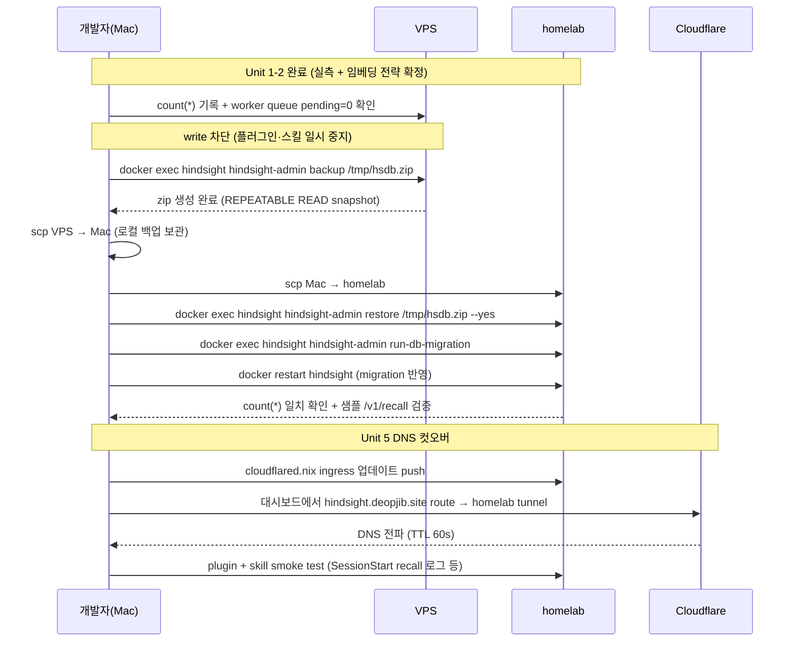
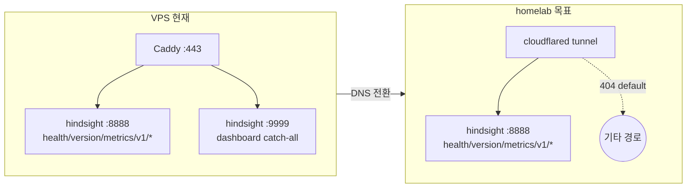

# VPS hindsight 데이터 homelab 이관 + DNS 컷오버

## Overview

선행 플랜(`2026-04-14-001`)의 Phase A(선언형 인프라) 완료 이후, Phase B에 해당하는 **데이터 컷오버 + DNS 전환**을 수행한다. homelab 하드웨어에는 이미 `hindsight` + `hindsight-db` 컨테이너가 host network 모드로 동작하고 DB 확장(`pg_textsearch` 1.0.0, `vector` 0.8.2, `timescaledb` 2.26.3, `timescaledb_toolkit` 1.22.0)이 설치된 빈 상태다.

선행 플랜의 Phase A는 TEI 전제로 설계됐지만 2026-04-17 llama-swap 전환 플랜(`2026-04-17-001`)으로 아키텍처가 진화했다. 이 플랜은 데이터 이전 · DNS 전환 · Cloudflare Tunnel 경로 확정 · Claude Code `hindsight-memory` 플러그인 연결 확인을 범위로 하며, Phase A 산출물은 "완료된 인프라"로 전제한다.

## Problem Frame

- VPS `hindsight-db-data` volume(bge-m3 임베딩 + TimescaleDB 시계열 memory/embeddings)을 homelab으로 무손실 복제해야 한다 (see origin plan R3)
- `hindsight.deopjib.site` DNS가 VPS Caddy → homelab Cloudflare Tunnel로 전환되어야 외부 접근 계약이 유지된다 (R2, R6)
- Claude Code `hindsight-memory` 플러그인 + `files/workspace/.claude/skills/hindsight/` 스킬이 homelab API를 투명하게 호출해야 한다
- Cloudflare Tunnel이 현재 `hindsight-test.deopjib.site` dry-run 상태이므로 본 도메인 ingress 및 경로 분리(9999 대시보드 미노출)를 확정해야 한다
- **임베딩 공간 불연속**: VPS 저장 벡터는 `BAAI/bge-m3` 출력이고 homelab은 `harrier` 출력이다. 둘 다 1024-dim이지만 의미 공간이 다르다 — 단순 tar 복제 후 동일 DB에서 신·구 벡터가 공존하면 재호출 품질이 저하된다. 결정이 필요하다

## Requirements Trace

- R1. `hindsight-db-data` volume 데이터(memories, embeddings, banks 등 모든 테이블)가 VPS 정지 직전 카운트와 동일하게 homelab에 복원
- R2. `hindsight.deopjib.site` 외부 접근이 homelab Cloudflare Tunnel 경로로 응답하며 TLS 유효
- R3. Claude Code `hindsight-memory` 플러그인이 cutover 후 별도 설정 변경 없이 recall/retain 동작 (토큰·URL이 이미 일치)
- R4. Cloudflare Tunnel ingress가 VPS Caddyfile과 의미적으로 동등한 API 경로만 공개 (`/health`, `/version`, `/metrics`, `/v1/*`) — 9999 대시보드는 비노출
- R5. 임베딩 공간 전략이 명시적으로 결정되어 기록되며, 구 memory 품질 리스크가 사용자가 받아들인 기대치와 일치
- R6. 컷오버 다운타임 ≤ 30분 (선행 플랜 R6 계승, Unit 1 실측으로 재산정)
- R7. DNS 전환 후 최소 7일간 VPS 인스턴스 유지로 긴급 롤백 경로 확보

## Scope Boundaries

- Phase A 인프라(선언형 스택, sops, cloudflared 모듈)는 이미 배포 완료 전제 — 이 플랜에서 코드 재작성 안 함
- llama-swap/prefix-proxy/reranker 아키텍처 변경 안 함 (선행 플랜 `2026-04-17-001` 산출물 그대로 유지)
- VPS 측 `docker-compose.yml` 정리/커밋은 이 저장소 범위 외 (`study_ex/my-backend/vps` 별도 repo)
- VPS 인스턴스 종료·호스팅 해지 등 은퇴 절차는 사용자 직접 관할 (7일+ 유지 권장만 포함)
- 새 플러그인 기능 추가 안 함 — 기존 `hindsight-memory` 0.3.0 + `files/workspace/.claude/skills/hindsight/` 동작 확인만

### Deferred to Separate Tasks

- **VPS 저장소 docker-compose.yml archive**: `/Users/hj/study_ex/my-backend/vps` 저장소의 별도 커밋으로 deprecated 표시
- **임베딩 재생성 배치 스크립트**: Unit 2에서 "재임베딩" 선택 시 별도 구현 플랜으로 분리 (현재 플랜에서는 전략 결정까지만)
- **CF Access OAuth 도입**: 현재 `ApiKeyTenantExtension`의 single-token 인증으로 충분, 별도 플랜

## Context & Research

### Relevant Code and Patterns

- `systems/homelab/hindsight-stack.nix` — 컷오버 대상 API 컨테이너. host network 모드, `HINDSIGHT_API_PORT=8888`
- `systems/homelab/cloudflared.nix:13-19` — 현재 tunnel `a19003a7-293f-4872-b8a5-1db544878f45`의 ingress가 `hindsight-test.deopjib.site` → `localhost:8888` 1건뿐. 본 도메인 추가 + test subdomain 정리 대상
- `systems/homelab/sops.nix:33-45` — `sops.templates."services.env"` 내 `HINDSIGHT_API_TENANT_API_KEY`가 `47c66a7f...`로 설정됨
- `secrets/shared/pub.enc.yaml:1-2` — `HINDSIGHT_API_URL=https://hindsight.deopjib.site`, `HINDSIGHT_API_TOKEN=47c66a7f...`. **플러그인 토큰이 homelab tenant key와 이미 일치 → cutover 후 재설정 불필요**
- `files/workspace/.config/mise/config.toml:152-155` — `HINDSIGHT_BANK_ID=my`, `HINDSIGHT_BANK_USER=hj`, `HINDSIGHT_API_KEY="$HINDSIGHT_API_TOKEN"` (mise env 주입)
- `files/workspace/.claude/skills/hindsight/SKILL.md` — curl 경유 API 호출 스킬, `$HINDSIGHT_API_URL/v1/default/banks/$HINDSIGHT_BANK_ID/*` 패턴. URL 변경 없음
- external: `/Users/hj/study_ex/my-backend/vps/sync/services/docker-compose.yml:83-84` — VPS embedding provider `local` + `BAAI/bge-m3` (1024-dim). 벡터 출처
- external: `/Users/hj/study_ex/my-backend/vps/sync/services/Caddyfile:4-20` — VPS 현행 경로 분리 (`/health`, `/version`, `/metrics`, `/v1/*` → 8888, 그 외 → 9999). homelab은 9999 미노출이므로 catch-all = 404

### Institutional Learnings

- `docs/solutions/integration-issues/docker-host-access-host-network-2026-04-17.md` — hindsight 컨테이너가 host network 모드임. 컨테이너 재시작 시 `:8888` listen 유지 확인 방법 기록
- `docs/solutions/best-practices/extending-nix-darwin-flake-to-nixos-2026-04-08.md` — homelab 배포 경로. `jj git push` → comin poll → auto-apply
- `docs/solutions/` 내 데이터 이전(tar/scp/restore) 직접 선례 없음 — 이 작업 완료 후 `ce:compound`로 축적 권장

### External References

- hindsight v0.5.0 → v0.5.2 release notes: schema/migration breaking change 여부 검증 대상 (Unit 1에서 확정)
- TimescaleDB 2.26 minor upgrade (VPS `docker-compose.yml`에 `:pg18` tag pin, 설치된 실제 버전은 homelab 2.26.3): `timescale/timescaledb-ha:pg18` 태그가 upstream에서 rolling되지만 extension minor upgrade는 backward compatible (Timescale 공식)

## Key Technical Decisions

- **데이터 이관 방식: `hindsight-admin backup/restore` (logical backup)**. volume tar 방식은 폐기. 근거:
  - `hindsight-admin backup`은 `hindsight-api` 패키지 내장 CLI로 REPEATABLE READ 트랜잭션 기반 consistent snapshot을 zip으로 생성 — VPS DB를 **정지하지 않고** 백업 가능 → 다운타임은 "write 차단 + 전송 시간"으로 축소
  - zip은 application-level 데이터(memory banks, documents, chunks, entities, memory units, cooccurrences, memory links)만 포함 → TimescaleDB 버전 drift · Docker image tag drift · 확장 버전 drift에 독립적 (선행 플랜 P0-4 리스크 완전 해소)
  - restore는 대상 schema를 비우고 import — homelab 빈 DB 상태와 자연스럽게 조합
- **Schema migration 명시적 실행**: `hindsight-admin run-db-migration`으로 0.5.0 dump → 0.5.2 schema 마이그레이션을 restore 직후 분리 실행. 자동 migration 의존 제거로 실패 시점 디버깅 용이 (`HINDSIGHT_API_RUN_MIGRATIONS_ON_STARTUP=false` 일시 설정 또는 restore 후 API 기동 전 수동 실행)
- **선언형 범위**: 이 플랜에서 변경되는 nix 파일은 `systems/homelab/cloudflared.nix` 한 건. 데이터 이관은 imperative(`ssh` + `docker exec hindsight-admin`)이며 결과 상태는 nix 선언 밖이므로 문서화로만 관리
- **DNS 전환 단위**: Cloudflare 대시보드 DNS/Tunnel route 변경은 외부 조작(nix 밖). `cloudflared.nix` ingress는 push해둬야 comin이 반영하므로 **nix push → Cloudflare 대시보드 변경** 순서 엄수
- **CF Tunnel 경로 분리**: nixpkgs `services.cloudflared.tunnels.<id>.ingress`는 hostname + path-prefix 매핑 지원. VPS Caddy의 `/v1/*` 등 handle 블록을 ingress 항목으로 변환. 9999 dashboard catch-all은 **포함하지 않음** → 공개 표면 축소 (선행 플랜 Review P1-3 결정과 일치)
- **Worker queue quiescent 요구**: `hindsight-admin backup` zip에 worker task queue는 포함되지 않음. cutover 시점에 처리 중인 retain/reflect 작업이 있으면 유실 가능 → Unit 3 pre-backup 단계에서 worker 큐 비워진 상태 확인 필수
- **다운타임 재산정**: zip 생성 + scp + restore + migration. 기존 30분 placeholder는 유지하되 Unit 1 실측에서 2차 확정 (logical backup이라 volume 크기와 선형 비례는 아님)
- **롤백 경로**: DNS만 VPS Caddy로 되돌리면 즉시 복귀. VPS 인스턴스 7일+ 유지 + `hsdb-*.zip` 로컬 1부 보관
- **주석 언어**: 한국어 (선행 플랜 규약 일관)

## Open Questions

### Resolved During Planning

- 플러그인 `HINDSIGHT_API_URL`/`HINDSIGHT_API_TOKEN` 재설정 필요 여부: **불필요**. `pub.enc.yaml`이 이미 `hindsight.deopjib.site` + homelab과 동일 토큰을 가리키므로 DNS 전환이 변경을 대체
- homelab DB 확장 일치: **확인됨** — `pg_textsearch 1.0.0`, `vector 0.8.2`, `timescaledb 2.26.3`, `timescaledb_toolkit 1.22.0` 모두 존재. VPS에서 관찰된 확장 집합과 호환

### Needs User Decision Before Unit 3 (🚨 블로커)

- **임베딩 공간 불연속 전략** — **결정(2026-04-17): B (일괄 재임베딩), 원본 timestamp 유지 제약 포함**
  - 배경: VPS 저장 벡터는 `BAAI/bge-m3`(1024-dim), homelab 신규 embedding은 `harrier`(1024-dim). 동일 차원이지만 서로 다른 의미 공간이라 단순 복제 시 신·구 memory가 같은 `embeddings` 테이블에서 섞여 recall 품질 저하
  - **선택: B — 일괄 재임베딩**. restore 직후 모든 memory 원문 → harrier 재임베딩 → `embeddings` 테이블의 벡터 컬럼을 **in-place update**
  - **추가 제약**: 재임베딩이 "새 row 생성"이 아닌 "기존 row의 vector 컬럼 overwrite"여야 함. `created_at`, `memory_id`, 기타 메타는 원본 timestamp 그대로 유지 → memory의 시간축이 재임베딩 작업에 의해 오염되지 않아야 함
  - 기각된 대안:
    - A(현상 복제 + 감수) — 수개월 recall 품질 저하 수용 거부
    - C(homelab을 bge-m3로 복귀) — 직전 llama-swap 전환 작업 가치 훼손
  - 구현 경로: hindsight `admin-cli.md`에는 re-embed 전용 명령 없음. Unit 3의 restore + run-db-migration 이후 별도 스크립트(Python + harrier API 또는 homelab prefix-proxy 직접 호출)로 embeddings 테이블 UPDATE. 이 스크립트는 Unit 3 내부 step 또는 별도 분기 플랜(`docs/plans/<date>-NNN-reembed-harrier.md`)으로 작성 — Unit 3 실행 시 결정

### Deferred to Implementation

- **VPS 0.5.0 → homelab 0.5.2 schema migration**: Unit 1에서 hindsight CHANGELOG 확인. migration이 자동이면 pass, 수동이면 Unit 3 restore 순서 조정
- **실측 다운타임**: Unit 1에서 `du -sh` + 내부 대역폭으로 결정. "≤ 30분" 목표 재평가
- **CF Tunnel 경로 ingress 구체 문법**: nixpkgs `services.cloudflared.tunnels.<id>.ingress`의 hostname + path 복합 키 문법은 Unit 4 구현 시 모듈 옵션 문서로 재확인

## High-Level Technical Design

> *이 섹션은 directional guidance이며 implementation specification이 아니다. 구현자는 맥락으로만 활용할 것.*

### 컷오버 시퀀스 (핵심 구간)

### CF Tunnel ingress 전환 (VPS Caddy → homelab cloudflared)

## Implementation Units

- [x] **Unit 1: Pre-flight 실측 및 호환성 확정**

**Goal:** `hindsight-admin backup` 생성 파일 크기와 전송 시간 실측 + 0.5.0→0.5.2 schema migration 경로 확정. 실측 없이 cutover 시작 금지.

**Requirements:** R1, R6

**Dependencies:** 없음 (homelab + VPS 양쪽 접근 가능 전제)

**Files:**
- Create: `docs/plans/smoke-tests/2026-04-17-hindsight-migration-preflight.md` (실측 결과 기록용)

**Approach:**
- VPS에서 **dry-run backup**: `docker exec hindsight hindsight-admin backup /tmp/hsdb-dryrun.zip` → 생성된 zip 크기 측정 후 삭제. 이 과정에서 backup 명령이 0.5.0에서 정상 동작하는지 확인 (CLI binary 존재 + DATABASE_URL env 자동 주입)
- VPS→Mac, Mac→homelab scp 대역폭 샘플 측정. zip 크기 / 대역폭으로 전송 시간 산출
- VPS에서 `docker exec hindsight hindsight_api psql ... -c 'SELECT count(*) FROM memory_units; SELECT count(*) FROM embeddings;'` 또는 API `/v1/default/banks/my/memories` 개수로 스냅샷 기록 (backup zip 복원 후 일치 검증 기준)
- VPS에서 worker queue 상태 조사: `docker logs hindsight --tail 200 | grep -i worker` 또는 `SELECT status, count(*) FROM tasks GROUP BY status` (tasks 테이블 존재 시) — pending/processing 개수가 0인 시간대를 cutover 윈도우로 선택
- **Schema migration 경로 확정**: hindsight `v0.5.0 → v0.5.2` changelog 확인 (`gh api repos/vectorize-io/hindsight/releases`). migration이 있으면 `hindsight-admin run-db-migration`로 명시 실행 계획. 없으면 Unit 3에서 skip

**Patterns to follow:**
- hindsight 공식 admin-cli 문서 (`/Users/hj/.claude/plugins/marketplaces/hindsight/hindsight-docs/docs/developer/admin-cli.md`) — backup/restore/run-db-migration 절차

**Test scenarios:**
- Happy path: `hindsight-admin backup /tmp/hsdb-dryrun.zip` 성공, zip 크기 기록. REPEATABLE READ snapshot이라 VPS API가 여전히 요청 처리 중이어도 완료됨
- Happy path: 0.5.0 hindsight 컨테이너에 `hindsight-admin` CLI 실제 포함 확인 (`docker exec hindsight which hindsight-admin`)
- Happy path: release notes에서 0.5.0 → 0.5.2 migration 존재 여부 이분 분류
- Edge case: zip 크기가 예상보다 크거나(수 GB) 홈 업로드 대역폭이 느리면 Unit 3 downtime을 재산정하고 사용자에게 공지
- Error path: 0.5.0 컨테이너에 `hindsight-admin` 부재 시(구 버전) → VPS 측 컨테이너를 0.5.1/0.5.2로 임시 업그레이드 후 backup 실행 (homelab 배포 전 별도 VPS 조정). 또는 fallback으로 volume tar 방식 재검토

**Verification:**
- 실측 파일에 backup zip 크기, 추정 전송 시간, VPS 카운트 스냅샷, worker quiescent 확인 시간대, migration 존재 여부가 기록됨
- `hsdb-dryrun.zip`은 검증 후 삭제(민감 데이터, Unit 3 실전 백업은 별도 생성)

---

- [x] **Unit 2: 임베딩 공간 전략 확정 (블로커 해결)**

**Goal:** Open Questions의 임베딩 불연속 항목 결정을 명시적으로 기록. Unit 3 이후의 recall 품질 기대치를 고정.

**Requirements:** R5

**Dependencies:** Unit 1 완료 (실측 맥락 제공)

**Files:**
- Modify: 이 플랜 본문 Open Questions 섹션 (결정 기록)
- Create (선택지 B 선택 시): `docs/plans/embedding-reindex-YYYY-MM-DD.md` 별도 플랜 참조

**Approach:**
- 사용자에게 선택지 A/B/C 중 선택 요청 (권장: A)
- 선택 결정을 본 플랜 Open Questions 섹션에 `**결정(YYYY-MM-DD): X**` 형태로 기록
- B를 선택한 경우 hindsight가 bulk re-embed CLI/endpoint 제공 여부 조사 후 별도 플랜으로 분기 (현재 플랜은 pause)

**Execution note:** 이 Unit은 코드 작업이 아닌 의사결정 체크포인트. 결정 없이 Unit 3 진행 금지.

**Test expectation: none** — 순수 의사결정/문서화 단계.

**Verification:**
- 플랜 본문에 결정 기록 + 근거 1-2줄 포함
- 선택지 B 분기 시 새 플랜 파일 링크가 이 플랜에 역참조

---

- [x] **Unit 3: `hindsight-admin` logical backup + restore**

**Goal:** VPS application-level snapshot(memory banks, documents, chunks, entities, memory units, cooccurrences, memory links)을 homelab으로 무손실 복제. 다운타임은 write 차단 + 전송 + restore + migration 합.

**Requirements:** R1, R6

**Dependencies:** Unit 1, Unit 2

**Files:**
- Create: `hsdb-YYYYMMDD.zip` (로컬 Mac · homelab 각 1부, 7일+ 보관)
- Modify: homelab hindsight `public` schema 내용 (nix 파일 변경 아님)

**Approach:**
1. **DNS TTL 사전 단축**: cutover 24시간 이상 전, Cloudflare에서 `hindsight.deopjib.site` TTL 60s로 변경
2. **Pre-cutover 스냅샷**: VPS에서 memories·embeddings 카운트 + worker queue pending 개수 기록. Unit 1 기록과 대조
3. **Write 차단**: 개인 Claude Code `hindsight-memory` 플러그인 일시 중지(세션 종료 또는 훅 disable). 스킬의 수동 curl 호출도 중단. VPS hindsight는 stop하지 않음 — backup이 REPEATABLE READ 스냅샷이라 live 상태여도 consistent
4. **Worker quiescent 대기**: VPS `docker logs hindsight` 상에서 retain/reflect 완료까지 대기. pending tasks = 0 확인 후 진행
5. **Backup 생성**: `ssh vps "docker exec hindsight hindsight-admin backup /tmp/hsdb-$(date +%Y%m%d).zip"` + 즉시 `chmod 600`. 컨테이너 내부 `/tmp`에서 호스트로 복사: `docker cp hindsight:/tmp/hsdb-*.zip ~/`
6. **Mac 경유 scp**: `scp vps:~/hsdb-*.zip ./` → `scp hsdb-*.zip homelab:~/` + Mac에 로컬 백업 1부 보관
7. **homelab restore 사전 준비**: DNS 전환 전 상태 유지(VPS가 여전히 `hindsight.deopjib.site` 서빙). homelab hindsight API는 실행 중이므로 restore는 live API를 차단하지 않아도 가능 (admin-cli restore는 transaction 내 truncate + copy)
8. **homelab restore**: `ssh homelab "docker cp ~/hsdb-*.zip hindsight:/tmp/ && docker exec hindsight hindsight-admin restore /tmp/hsdb-YYYYMMDD.zip --yes"`
9. **Schema migration**: `ssh homelab "docker exec hindsight hindsight-admin run-db-migration"` — 0.5.0 dump → 0.5.2 schema 반영. output에서 migration 실행 수 확인 (0개면 no-op)
10. **API 재시작**: `ssh homelab "docker restart hindsight"` → 로그에 DB connection OK 확인
11. **복원 검증**: homelab에서 memories/embeddings 카운트 == Unit 1 스냅샷, `/v1/default/banks/my/memories` 목록 반환 여부, 알려진 내용 1건 recall 응답(품질은 임베딩 전략에 따른 해석)

**Execution note:** backup은 VPS 미정지 상태에서 실행되지만, step 3 "write 차단" 시점과 step 5 "backup 완료" 시점 사이에 VPS로 들어온 write는 backup 스냅샷에 포함되지 않고 homelab에 유실된다. 그래서 클라이언트 측 write 차단이 logical backup 방식의 진짜 "다운타임 시작". step 3~step 11까지가 사용자 체감 다운타임.

**Patterns to follow:**
- hindsight 공식 admin-cli 문서 backup/restore/run-db-migration 절차
- 선행 플랜 Unit 5 step 0/3/6의 pre-flight 체크 정신(snapshot 기록, clean state 확인)은 유지

**Test scenarios:**
- Happy path: VPS 스냅샷 `count(*)` == homelab 복원 후 `count(*)` (memories, embeddings, banks 모두)
- Happy path: `hindsight-admin run-db-migration` output에 실행된 migration 목록 또는 "no migrations needed"
- Happy path: homelab `/health` → 200, `/v1/default/banks/my/memories` 응답 구조가 VPS와 동일
- Happy path: 알려진 memory 내용 1건을 query 문자열로 recall 요청 시 해당 memory가 상위 결과에 포함 (임베딩 전략 A 선택 시 구 memory는 score 품질 저하 수용)
- Edge case: backup zip이 예상보다 커서 docker `/tmp`에 공간 부족 → 호스트 bind mount로 직접 쓰기 (`docker exec` 대신 `docker run --rm -v hindsight-db-data:/dummy hindsight hindsight-admin backup /out/...`)
- Edge case: worker queue가 pending>0인 상태로 backup 진행되면 처리 중 retain task가 homelab에 미반영 — step 4 quiescent 대기 재확인
- Error path: `hindsight-admin` CLI가 VPS 0.5.0 컨테이너에 없으면 Unit 1에서 사전 감지. 발견 못한 경우 VPS를 0.5.2로 임시 업그레이드 후 retry (롤백 가능, homelab 미영향)
- Error path: restore 중 transaction rollback(디스크 full, constraint violation) → homelab `public` schema는 restore 시작 전 상태 유지됨(admin-cli restore가 transaction 단위). 재시도 가능
- Error path: run-db-migration 실패 → hindsight 컨테이너 재시작이 자동 migration 시도(기본값 ON)하므로 이중 실패 가능. 로그 확인 후 `HINDSIGHT_API_RUN_MIGRATIONS_ON_STARTUP=false` 일시 설정 후 수동 재시도
- Integration: 복원 후 `/v1/default/banks/my/memories/recall`이 실데이터 기반 응답

**Verification:**
- 카운트 일치 + 알려진 memory 1-3건 샘플 recall/조회 검증
- `hsdb-YYYYMMDD.zip`이 Mac, homelab 2곳 이상 보관
- homelab hindsight 로그에 fatal error 없음, migration 실행 내역 기록

---

- [x] **Unit 4: Cloudflare Tunnel ingress 본 도메인 전환**

**Goal:** `cloudflared.nix` ingress가 `hindsight.deopjib.site`의 API 경로만 공개하도록 전환. 9999 대시보드 비노출 유지.

**Requirements:** R2, R4

**Dependencies:** Unit 3 완료 (homelab이 실데이터로 응답 가능)

**Files:**
- Modify: `systems/homelab/cloudflared.nix` (ingress 재구성, `hindsight-test.deopjib.site` 엔트리 정리)

**Approach:**
- `services.cloudflared.tunnels."a19003a7-...".ingress`에 `hindsight.deopjib.site` hostname 추가. VPS Caddyfile의 `/health`, `/version`, `/metrics`, `/v1/*` 경로를 동등 매핑으로 작성
- nixpkgs `services.cloudflared.tunnels.<id>.ingress`의 hostname + path 문법을 모듈 옵션 문서로 재확인 후 작성 (구현 시점 결정). 지원 형식이 제한적이면 "전 경로 → `http://localhost:8888`" 단일 매핑 + hindsight 자체 auth(`ApiKeyTenantExtension`)로 보호 + `/metrics`는 별도 Cloudflare Access 정책(선택) 구조로 대체
- `hindsight-test.deopjib.site` 엔트리는 dry-run 완료 후 삭제 또는 그대로 유지(병행 사용은 비권장). cutover와 독립 정리
- `default = "http_status:404"` 유지 — 9999 dashboard 대응 catch-all 없음

**Execution note:** 이 변경은 `jj git push` → comin auto-apply 경로로 homelab에 반영됨. Cloudflare 대시보드에서 `hindsight.deopjib.site` route 목적지를 VPS → tunnel로 변경하기 전에 **nix 변경이 먼저 homelab에 반영되어 있어야** 라우팅이 유효하다 (순서 엄수).

**Patterns to follow:**
- 선행 플랜 Unit 2, Unit 6 Approach
- VPS `Caddyfile`의 경로 분리 규칙

**Test scenarios:**
- Happy path: `journalctl -u cloudflared-tunnel-<id> -n 50` → "Updated to new configuration" 로그 + 에러 없음
- Happy path: DNS 전환 이전에 `curl -H "Host: hindsight.deopjib.site" <cloudflare-edge-endpoint>/health` → 200 (tunnel 내부 경로 검증)
- Edge case: 모듈 옵션이 path-level ingress 미지원이면 대안(hostname 단일 + 앱 레이어 보호) 적용 후 문서 갱신
- Error path: 잘못된 ingress 문법으로 cloudflared 기동 실패 → journalctl에서 명확한 이유, 이전 config로 즉시 롤백 (jj로 commit revert + push)
- Integration: Unit 5 DNS 전환 직후 `curl https://hindsight.deopjib.site/health` → 200

**Verification:**
- cloudflared 서비스 active, connector HEALTHY (Cloudflare 대시보드 Zero Trust → Tunnels)
- homelab 내부에서 `curl http://localhost:8888/health`는 200 유지 (컨테이너 영향 없음)
- 외부 edge 단에서 경로별 응답 분리 확인 가능 (DNS 전환 후 Unit 5에서 최종 확인)

---

- [x] **Unit 5: DNS 컷오버 + 플러그인/스킬 smoke test**

**Goal:** `hindsight.deopjib.site`를 homelab tunnel로 전환, plugin + skill이 즉시 작동하는지 확인.

**Requirements:** R2, R3, R6, R7

**Dependencies:** Unit 3, Unit 4 완료

**Files:** 없음 (Cloudflare 대시보드 조작 + 동작 관찰). `docs/plans/smoke-tests/2026-04-17-hindsight-migration-preflight.md`에 post-cutover 결과 추가

**Approach:**
1. Cloudflare 대시보드: `hindsight.deopjib.site` DNS/Tunnel route를 기존 VPS Caddy 엔드포인트에서 homelab tunnel(ID `a19003a7-...`)로 재지정
2. 전파 대기(TTL 60s + 여유). `dig @1.1.1.1 hindsight.deopjib.site +short` 로 Cloudflare proxy IP 유지 확인
3. 외부 검증: 다른 네트워크(모바일/테더링)에서 `curl -H "Authorization: Bearer $HINDSIGHT_API_TOKEN" https://hindsight.deopjib.site/v1/default/banks/my` → 200
4. 플러그인 smoke test: Claude Code 새 세션 시작 → `hindsight-memory` SessionStart/UserPromptSubmit 훅 로그 확인(`~/.claude/plugins/data/hindsight-memory/state/` 활동 타임스탬프, 필요 시 `debug: true` 임시 활성)
5. 스킬 smoke test: `files/workspace/.claude/skills/hindsight/SKILL.md`의 memory 추가/조회 curl 체인 수동 실행 → 기존 memory(VPS에서 이관된) 중 하나의 내용을 기준 쿼리로 recall 요청 → 응답 확인 (임베딩 전략 A 선택 시 품질 저하는 예상 범위)
6. `arcane.deopjib.site` DNS 레코드 삭제(선행 플랜 scope) + 임시 `hindsight-test.deopjib.site` 레코드 삭제
7. 30분 모니터링: homelab `docker logs hindsight --tail 0 -f` + CF Tunnel connector 상태

**Execution note:** 클라이언트 retry 미구현 가정 시 cutover 시각 ±2분 동안 개인 브라우저 에이전트/스크립트 일시 중지 권장 (선행 플랜 Unit 5.5 참조).

**Patterns to follow:**
- 선행 플랜 Unit 6 Approach + Test scenarios

**Test scenarios:**
- Happy path: 외부 여러 위치에서 `/health` 200 + 응답 시간 기존 VPS 대비 유사 또는 개선
- Happy path: hindsight-memory 플러그인 UserPromptSubmit 훅이 Homelab API에 recall 요청 성공 (debug 로그 또는 `last_recall.json` 갱신)
- Happy path: `files/workspace/.claude/skills/hindsight/SKILL.md`의 curl 체인이 이관된 실제 memory를 반환 (임베딩 전략에 따른 품질 해석)
- Edge case: DNS 전파 지연으로 일부 지역이 여전히 VPS로 라우팅 → VPS 가동 중이라 실제 단절 없음, 수 분 내 해소
- Error path: `/metrics` 공개 여부가 Unit 4의 정책과 어긋남 → ingress 재검토 (내부 경로 노출 방지)
- Integration: 30분 관찰 동안 homelab `docker-hindsight` NRestarts 증가 없음, CF Tunnel connector HEALTHY 유지

**Verification:**
- 외부 curl이 homelab 응답 확인
- 플러그인 recall/retain 정상(새 memory 생성 후 다음 세션에서 recall됨)
- VPS Caddy 접근 필요 없음(롤백 대비로 가동만 유지)

---

- [ ] **Unit 6: 컷오버 후 운영 관찰 + VPS grace period 진입**

**Goal:** 7일+ grace period 동안 homelab 단독 운영 안정성 확인. 롤백 조건 명확화.

**Requirements:** R7

**Dependencies:** Unit 5 완료

**Files:**
- Modify: `docs/plans/smoke-tests/2026-04-17-hindsight-migration-preflight.md` — 7일간 일일 체크 결과 append

**Approach:**
- 일일 체크(자동화하지 않음, 필요 시 수동): homelab hindsight NRestarts, CF Tunnel connector 상태, 플러그인 recall/retain 성공률(상대적 체감)
- 이상 징후 시 롤백 결정: Cloudflare 대시보드에서 `hindsight.deopjib.site` route를 VPS Caddy로 되돌림. `hsdb-*.tar.gz`는 이 구간 동안 delete 금지
- 7일 + 사용자 판단으로 VPS 은퇴 여부 결정(이 플랜 범위 외). 은퇴 결정 시 백업 파일은 최소 추가 1개월 유지 권장

**Test expectation: none** — 관찰 단계. 자동 게이트 없음.

**Verification:**
- 7일 동안 homelab 단독 운영 상태에서 plugin/skill이 정상 작동했다는 기록이 smoke-tests 문서에 남음
- 롤백이 필요한 경우 Cloudflare 대시보드 DNS 재지정 경로가 문서화되어 있음

## System-Wide Impact

- **Interaction graph:**
  - 변경: `services.cloudflared` ingress (`hindsight-test.deopjib.site` → `hindsight.deopjib.site` + 경로 분리). tunnel ID는 동일
  - 변경 없음: `virtualisation.oci-containers.containers.hindsight*` (Unit 3은 volume 내용만 교체, 컨테이너 정의 무관)
  - 변경 없음: `sops.templates."services.env"` (TENANT_API_KEY 등 secrets 동일)
  - 변경 없음: Claude Code 플러그인·스킬 파일 (URL·토큰 이미 homelab을 가리킴)
- **Error propagation:**
  - Unit 3 restore 실패 시 VPS Caddy 여전히 응답 → DNS 미전환이므로 외부 영향 0. 재시도 또는 중단 후 다음 윈도우 재예약
  - Unit 4 ingress 오류 시 cloudflared 기동 실패 → `hindsight.deopjib.site` 요청이 tunnel 없음으로 실패. DNS 전환 전 상태라면 영향 없음, DNS 전환 후 상태라면 즉시 롤백 필요
  - Unit 5 플러그인 실패 시 Claude Code recall/retain이 silent drop될 수 있음(`hindsight-memory`의 에러 전략은 플러그인 자체 구현 — SessionStart 훅 timeout 5s, UserPromptSubmit 12s 내 응답 없으면 그냥 진행)
- **State lifecycle risks:**
  - `hindsight-admin restore`는 대상 schema(`public`)를 transaction 내에서 truncate 후 import. 복원 실패 시 homelab 이전 상태(빈 상태) 유지됨 — atomic rollback 보장 (선행 플랜 P2-6의 clean shutdown 요구가 logical backup으로 해소됨)
  - Unit 3 사이 homelab의 빈 memory/bank는 restore 시 삭제됨 (소실되어도 무해 — 이관 전 생성된 test 데이터만)
  - 임베딩 불연속(Open Questions A 선택 시): DB 내부에 서로 다른 공간의 벡터가 공존하지만 데이터 무결성 자체는 유지됨
  - worker task queue는 backup 범위 밖 — pending 상태 task는 유실. 사용자에게 체감되는 영향은 "VPS에서 대기 중이던 retain/reflect가 실행되지 않음" 정도로 제한
- **API surface parity:**
  - `hindsight.deopjib.site` API 계약 불변 (path, auth header, response shape). 플러그인/스킬 무영향
  - 9999 dashboard는 VPS에서 **이미 외부 공개 상태였음**(Caddyfile catch-all). cutover 후 비노출로 전환되므로 공개 표면 **축소** (의도한 방향, 리스크 없음)
- **Integration coverage:**
  - Unit 3 복원 직후 homelab 빈 API가 아닌 실데이터 상태에서의 recall 경로 — Unit 5가 end-to-end 확인 지점
  - 플러그인 훅 타임아웃 여유 vs homelab 응답 시간: host network 모드 + llama-swap 모델 로드 시간이 초기 recall에서 훅 타임아웃(12s)을 초과하지 않는지 Unit 5에서 관찰
- **Unchanged invariants:**
  - `HINDSIGHT_API_TENANT_API_KEY` (`47c66a7f...`) 불변 → 플러그인 토큰 호환
  - `.sops.yaml` creation rules 불변
  - comin poll URL, flake 구조 불변
  - llama-swap + embed-prefix-proxy 설정 불변 (이번 플랜 무관 선행 산출물)

## Risks & Dependencies

| 위험 | Likelihood | Impact | Mitigation |
|---|---|---|---|
| 임베딩 공간 불연속으로 구 memory recall 품질 저하 | High (선택지 A 가정) | Medium | Open Questions에 명시 결정 기록. 체감 품질 저하 시 선택지 B로 전환 경로 보유 |
| VPS 0.5.0 → homelab 0.5.2 schema migration 실패 | Low | High | Unit 1에서 changelog 사전 확인 + Unit 3 step 9에서 `run-db-migration` 명시 실행. 실패 시 homelab에서 0.5.2 → 0.5.0 downgrade image로 임시 재빌드 + 재시도 |
| VPS 0.5.0 컨테이너에 `hindsight-admin` CLI 부재 | Low | High | Unit 1 dry-run에서 `docker exec hindsight which hindsight-admin` 사전 확인. 부재 시 VPS 컨테이너를 0.5.2로 임시 업그레이드 후 backup 실행 (plan 외 단계, 롤백 가능) |
| backup 중 VPS에서 write 발생 → backup zip에 미반영 | Medium | Medium | Unit 3 step 3 "플러그인·스킬 write 차단" 엄수. worker queue pending=0 확인 후에만 backup 시작 |
| CF Tunnel ingress 문법 오류로 connector 실패 | Low | High | jj commit revert + push으로 이전 ingress 복구. 전 경로 단일 매핑 fallback 전략 |
| DNS 전파 중 클라이언트 요청 silent drop | Medium | Low | cutover 시각 ±2분 개인 에이전트 일시 중지. VPS 7일 유지로 배경 트래픽 복구 가능 |
| `/metrics`·`/version` 경로가 인증 없이 외부 공개되는 엔드포인트 조사 부족 | Low | Medium | Unit 4에서 ingress에 포함시키기 전 homelab에서 `curl http://localhost:8888/metrics` 응답 내용 확인. 민감 시 Cloudflare Access 또는 loopback 한정으로 제한 |
| 7일+ VPS 유지 중 과금/방치 | Low | Low | 사용자 관할. 플랜에서 은퇴 시점 권고만 |

## Documentation / Operational Notes

- **변경 직후**: 이 플랜 완료 후 `ce:compound`로 `docs/solutions/best-practices/`에 "hindsight volume 이관 체크리스트" 1건 축적 권장
- **CF Tunnel ingress 패턴**: Unit 4에서 확정한 nixpkgs 문법(hostname + path 지원 여부, 미지원 시 대안)을 `docs/solutions/best-practices/` 또는 `systems/homelab/cloudflared.nix` 주석에 기록
- **임베딩 전략 B 분기 시**: 재임베딩 배치 스크립트는 별도 플랜으로 작성. 이 플랜은 결정 기록까지만.
- **VPS 은퇴 runbook**: 이 플랜 범위 외이지만 grace period 종료 후 사용자가 실행할 절차(인스턴스 중지 → 백업 파일 보관 기간 연장 → DNS 레코드 삭제 확인 등)는 별도 체크리스트로 기록 권장

## Phased Delivery

### Phase A — Pre-flight + 결정 (다운타임 없음)
- Unit 1: 실측 + 호환성 확정
- Unit 2: 임베딩 전략 결정

체크포인트: Unit 1 실측치와 Unit 2 결정이 문서화됨.

### Phase B — 컷오버 (다운타임 ≤ Unit 1 실측치)
- Unit 3: 데이터 이관
- Unit 4: CF Tunnel ingress 전환
- Unit 5: DNS 컷오버 + smoke test

체크포인트: 외부 `/health` 200, 플러그인 recall 정상, 30분 관찰 후 NRestarts 증가 없음.

### Phase C — 안정화 (7일+)
- Unit 6: 운영 관찰, 롤백 경로 유지

## Sources & References

- **Origin plan:** [docs/plans/2026-04-14-001-feat-vps-to-homelab-migration-plan.md](2026-04-14-001-feat-vps-to-homelab-migration-plan.md)
- Related plan: [docs/plans/2026-04-17-001-feat-homelab-llamaswap-embedding-reranker-plan.md](2026-04-17-001-feat-homelab-llamaswap-embedding-reranker-plan.md)
- Related solution: [docs/solutions/integration-issues/docker-host-access-host-network-2026-04-17.md](../solutions/integration-issues/docker-host-access-host-network-2026-04-17.md)
- External VPS stack (read-only): `/Users/hj/study_ex/my-backend/vps/sync/services/{docker-compose.yml,Caddyfile}`
- **hindsight-admin CLI 문서** (local mirror): `/Users/hj/.claude/plugins/marketplaces/hindsight/hindsight-docs/docs/developer/admin-cli.md` — backup/restore/run-db-migration 정식 절차 출처
- hindsight configuration docs: https://hindsight.vectorize.io/developer/configuration
- nixpkgs `services.cloudflared` 옵션 문서: https://search.nixos.org/options?query=services.cloudflared
