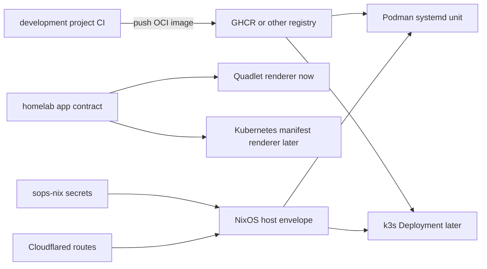

# refactor: homelab app runtime contract for image-driven deploys

## Summary

Keep the current Podman/Quadlet runtime for near-term homelab app deployment, but reshape new app definitions around a Kubernetes-shaped application contract: image, env, secrets, ports, volumes, health, routing, and update policy. Quadlet remains the immediate systemd renderer; k3s becomes a later renderer/migration target rather than a separate redesign.

---

## Problem Frame

The homelab already uses NixOS, comin, Cloudflared, sops-nix, Podman, and manually generated Quadlet files. The user wants to push container images from development projects and have the homelab consume those images, but is concerned that investing further in Podman/Quadlet may make the eventual k3s move harder.

The planning constraint is to avoid both extremes: do not introduce k3s before Kubernetes features are needed, but also do not let Podman-specific details become the application model.

---

## Requirements

- R1. New homelab apps can be deployed by updating an OCI image tag or digest without changing the NixOS host envelope for every app release.
- R2. App definitions stay close to Kubernetes primitives so later migration maps cleanly to `Deployment`, `Service`, `Secret` or `ConfigMap`, `PersistentVolumeClaim`, and ingress/routing resources.
- R3. Existing Hindsight runtime behavior remains stable; the plan must not force a risky migration of `Network=host`, database storage, or llama-swap integration.
- R4. The NixOS layer continues to own durable infrastructure: runtime enablement, secrets, volumes, systemd ordering, Cloudflared routing, and operational checks.
- R5. The design stays small enough for the current one-node homelab and avoids adopting a framework solely because it is trending.
- R6. The migration path to k3s is explicit, including what must be true before introducing `services.k3s`, Flux, Helm controllers, or image automation.

---

## Scope Boundaries

- Do not replace Podman/Quadlet with k3s in the first implementation pass.
- Do not convert the root flake to flake-parts or introduce den/dendritic patterns for the existing root system.
- Do not migrate Hindsight away from `Network=host` until its host-local dependencies have a safer network boundary.
- Do not introduce `quadlet-nix` immediately unless the manual Quadlet surface becomes repetitive enough to justify the dependency.
- Do not build a generic internal platform or DSL. The contract should be a small local Nix shape, not a framework.

### Deferred to Follow-Up Work

- k3s activation: defer until there are multiple app workloads, Kubernetes-native routing needs, or GitOps workflow pressure.
- Flux/Renovate image automation: defer until the homelab is actually running k3s workloads.
- Hindsight network normalization: defer because Hindsight currently depends on host-local llama-swap, embed-prefix-proxy, and database paths.
- `quadlet-nix` adoption: reconsider after 3+ app containers or when networks/pods/volumes need typed cross-references.

---

## Context & Research

### Relevant Code and Patterns

- `systems/homelab/default.nix` already enables Podman, Docker CLI/socket compatibility, and `podman-auto-update.timer`.
- `systems/homelab/hindsight-stack.nix` manually writes Quadlet `.container` and `.volume` files under `/etc/containers/systemd/`.
- `systems/homelab/hindsight-stack.nix` already separates image references in a local `images` attrset, which is the right direction but not yet a reusable app contract.
- `systems/homelab/cloudflared.nix` is the public routing boundary and should remain host-owned rather than app-owned.
- `services.comin` in `systems/homelab/default.nix` is still the host GitOps path: NixOS config changes flow through Git, while app image changes should not require host config churn.
- `.github/workflows/nix.yml` now checks root flake evaluation, Phoenix template evaluation, and root formatting.

### Institutional Learnings

- `docs/solutions/tooling-decisions/homelab-podman-quadlet-runtime-migration-2026-04-27.md` records the current boundary: NixOS owns the stable envelope; app image updates may happen via registry pull plus restart or Podman auto-update.
- `docs/solutions/database-issues/hindsight-recall-eval-on-switch-db-waits-2026-04-27.md` shows that Quadlet file changes via comin do not automatically imply the currently running service process has restarted with the intended settings. Runtime refresh behavior must be explicit and verified.
- Earlier homelab plans emphasize comin as the recovery/deploy path and Cloudflared as the public exposure boundary; those should not be diluted by app-specific deployment shortcuts.

### External References

- Podman auto-update supports `AutoUpdate=registry` in Quadlet and restarts the systemd unit when the remote image digest changes; it requires a fully qualified image reference and has a default rollback behavior when restart fails.
  Source: https://docs.podman.io/en/v4.9.0/markdown/podman-auto-update.1.html
- `quadlet-nix` supports containers, networks, pods, volumes, rootful/rootless resources, and Podman auto-update, but its own README positions vanilla Quadlet as simpler and `oci-containers` as limited around networks/pods.
  Source: https://github.com/SEIAROTg/quadlet-nix
- k3s auto-deploys manifests from `/var/lib/rancher/k3s/server/manifests`, tracks them as AddOns, and does not delete resources just because manifest files disappear.
  Source: https://documentation.suse.com/cloudnative/k3s/latest/en/installation/packaged-components.html
- `rorosen/k3s-nix` demonstrates a small pure-Nix k3s cluster pattern using `services.k3s.manifests`, `services.k3s.images`, Helm chart deployment, and NixOS VM tests.
  Source: https://github.com/rorosen/k3s-nix
- `niki-on-github/nixos-k3s` demonstrates the fuller future state: single-node k3s, Flux, Renovate, sops, Cilium, cert-manager, disko, and nixos-anywhere. This is useful as a future target, not a first migration step.
  Source: https://github.com/niki-on-github/nixos-k3s
- `nixflix` shows a useful pattern for NixOS homelab modules: domain-specific declarative options plus idempotent application of service configuration. The lesson to borrow is domain-shaped config, not the full stack.
  Source: https://github.com/kiriwalawren/nixflix

### Recent Repository Signal

Recent medium/small repository checks favored these patterns:

| Project | Signal | Planning takeaway |
|---|---:|---|
| `denful/den` | high recent star velocity, active in 2026 | Interesting structure research, but too abstract for this repo's current needs. |
| `Doc-Steve/dendritic-design-with-flake-parts` | high recent star velocity | Good flake-parts guidance for template-style flakes; not a reason to rewrite the root flake. |
| `kiriwalawren/nixflix` | active 2026 homelab module | Borrow domain-shaped NixOS module thinking. |
| `SEIAROTg/quadlet-nix` | medium-sized, directly relevant | Keep as a future typed renderer option if manual Quadlets grow. |
| `rorosen/k3s-nix` | small, focused k3s example | Best reference for minimal Nix-managed k3s manifests/images. |
| `niki-on-github/nixos-k3s` | full GitOps k3s example | Useful future target once Kubernetes complexity is justified. |

---

## Key Technical Decisions

- Start with a runtime-neutral app contract rendered to Quadlet: this protects future k3s migration without paying Kubernetes operational cost now.
- Keep the contract Kubernetes-shaped rather than Podman-shaped: app authors think in image, env, ports, volumes, health, and route; the renderer decides whether those become Quadlet fields or Kubernetes manifests.
- Keep Hindsight special for now: its host network and local AI service dependencies are real operational constraints, not cleanup targets.
- Use `AutoUpdate=registry` only for apps whose CI/release path is trusted and whose rollback behavior is understood. Moving tags are convenient but should be treated as mutable deploy channels, not immutable release records.
- Prefer fully qualified GHCR image references. For private images, registry auth should be declared as a host concern through sops-backed auth material, not hand-maintained on the box.
- Defer `quadlet-nix` until there is repeated structure. Current manual Quadlet files are explicit and locally understandable; adding a dependency is only justified when it removes real repetition or escaping risk.
- Introduce k3s in two steps when needed: first `services.k3s` with Nix-managed manifests/images, then Flux/Renovate only when app count and update workflows justify a separate Kubernetes GitOps loop.

---

## Open Questions

### Resolved During Planning

- Should Podman/Quadlet be removed now to avoid k3s migration cost?
  Resolution: no. Use it as the current renderer, but keep the app model runtime-neutral.
- Should root flake-parts or dendritic patterns be introduced now?
  Resolution: no. Recent Nix structure work is interesting, but this repo's root flake is already understandable and the migration concern is app-runtime specific.
- Should Hindsight be normalized into the new contract immediately?
  Resolution: only partially. Preserve behavior and avoid network/storage changes; use it as a compatibility example, not the first clean app model.

### Deferred to Implementation

- Exact contract attr names: defer until implementation sees the smallest shape that renders the first new app cleanly.
- Whether private GHCR auth is needed: depends on whether the first app image is public or private.
- Whether k3s should use bundled Traefik, Cloudflared-only exposure, or a separate ingress controller: defer until k3s is actually being introduced.
- Whether app images should be mutable tags, semver tags, or digests: choose per app based on rollback and release maturity.

---

## Output Structure

Expected near-term shape:

    systems/homelab/
      default.nix
      app-containers.nix
      hindsight-stack.nix
      cloudflared.nix
      sops.nix
    docs/solutions/tooling-decisions/
      homelab-image-driven-app-contract-2026-04-29.md

Potential future k3s shape, deferred until activation:

    systems/homelab/
      k3s.nix
      k3s-apps.nix

---

## High-Level Technical Design

> *This illustrates the intended approach and is directional guidance for review, not implementation specification. The implementing agent should treat it as context, not code to reproduce.*

Runtime-neutral contract fields should stay close to this conceptual mapping:

| Contract field | Quadlet now | Kubernetes later |
|---|---|---|
| `image` | `Image=` | `containers[].image` |
| `env` | `Environment=` | `env` or `ConfigMap` |
| `secretEnvFile` | `EnvironmentFile=` | `Secret` references |
| `ports` | `PublishPort=` or localhost bind | `Service` |
| `volumes` | `.volume` + `Volume=` | `PersistentVolumeClaim` |
| `route` | `cloudflared.nix` ingress | `Ingress` or Gateway route |
| `updatePolicy` | `AutoUpdate=registry` plus timer | Flux/Renovate/Image Automation |
| `health` | systemd readiness/check docs | probes |

---

## Implementation Units

- U1. **Define the local app contract boundary**

**Goal:** Create a small, documented Nix shape for future homelab app containers without introducing a framework.

**Requirements:** R1, R2, R4, R5

**Dependencies:** None

**Files:**
- Create: `systems/homelab/app-containers.nix`
- Modify: `systems/homelab/default.nix`
- Test: `.github/workflows/nix.yml`

**Approach:**
- Add `app-containers.nix` as the home for new image-driven app workloads.
- Keep the first version explicit and boring: a local `let` block for app definitions and rendered Quadlet text.
- Include a short comment that identifies which fields are intended to map to Kubernetes later.
- Do not move Hindsight into this module in the first pass; Hindsight remains in `hindsight-stack.nix` because it has special host-network and DB compatibility constraints.

**Patterns to follow:**
- `systems/homelab/hindsight-stack.nix` for manual `environment.etc."containers/systemd/*.container".text`.
- `systems/homelab/default.nix` import list style.
- `.github/workflows/nix.yml` for root flake eval coverage.

**Test scenarios:**
- Happy path: root NixOS configuration evaluates with `app-containers.nix` imported and no app definitions enabled.
- Edge case: an app definition with no persistent volume does not create a stray `.volume` file.
- Error path: missing required app fields should fail evaluation clearly if a helper is introduced; if no helper is introduced, this is covered by Nix attr access errors.

**Verification:**
- Root flake evaluation includes the new module.
- No generated Quadlet text appears for disabled or placeholder apps.
- Existing Hindsight generated Quadlet output is unchanged.

---

- U2. **Add the first image-driven app path**

**Goal:** Prove the contract with one small, non-Hindsight app that can be deployed by changing or updating an OCI image reference.

**Requirements:** R1, R2, R4

**Dependencies:** U1

**Files:**
- Modify: `systems/homelab/app-containers.nix`
- Modify: `systems/homelab/cloudflared.nix`
- Modify: `systems/homelab/sops.nix` only if private registry auth or app secrets are needed
- Test: `.github/workflows/nix.yml`

**Approach:**
- Pick a stateless or lightly stateful app as the first contract user; avoid Hindsight as the first clean example.
- Use a fully qualified image reference, preferably GHCR.
- Bind app traffic to localhost or an isolated Podman network where practical; avoid `Network=host` for new apps.
- Route public access through `cloudflared.nix`, keeping route ownership in the host config.
- Keep app secrets in sops-nix, not inline `Environment=`.

**Patterns to follow:**
- `systems/homelab/cloudflared.nix` for hostname routing.
- `systems/homelab/hindsight-stack.nix` for `EnvironmentFile`, journald logging, and restart policy.

**Test scenarios:**
- Happy path: generated `.container` text includes the intended image, env file, port binding, logging, and restart policy.
- Happy path: Cloudflared route points to the app's local port and does not expose unrelated paths.
- Edge case: app without secrets does not require `sops-install-secrets.service`.
- Error path: private image auth requirement is documented or declared; no manual registry login is assumed silently.

**Verification:**
- Nix evaluation exposes the generated Quadlet text.
- Cloudflared configuration includes only the intended route.
- Existing Hindsight route remains unchanged.

---

- U3. **Make update policy explicit**

**Goal:** Separate app release mutability from host configuration mutability, while making rollback and supply-chain risk visible.

**Requirements:** R1, R4, R5

**Dependencies:** U2

**Files:**
- Modify: `systems/homelab/app-containers.nix`
- Modify: `docs/guides/homelab-install-guide.md`
- Create: `docs/solutions/tooling-decisions/homelab-image-driven-app-contract-2026-04-29.md`
- Test: `.github/workflows/nix.yml`

**Approach:**
- Add an app-local update policy field or comment-level convention for `manual`, `registry-auto`, and `pinned-digest`.
- Render `AutoUpdate=registry` only for apps explicitly marked for registry auto-update.
- Keep `podman-auto-update.timer` enabled at host level, but require per-app opt-in.
- Document the difference between a mutable deployment tag and an immutable release digest.
- Prefer manual pull/restart or digest bump for data-critical apps until the rollback path is proven.

**Patterns to follow:**
- `docs/solutions/tooling-decisions/homelab-podman-quadlet-runtime-migration-2026-04-27.md` for operational boundary documentation.
- Podman auto-update docs for policy and fully qualified image requirements.

**Test scenarios:**
- Happy path: an app marked `registry-auto` renders `AutoUpdate=registry`.
- Edge case: an app marked `manual` does not render an auto-update field even though the host timer is enabled.
- Error path: unqualified image names are rejected or called out in review before deployment.
- Integration: changing only the remote image digest should be enough for Podman auto-update to pull and restart the systemd unit, assuming registry credentials are valid.

**Verification:**
- Generated Quadlet text reflects update policy per app.
- Documentation states when mutable tags are acceptable and when digests should be preferred.
- The host-level timer remains present but app opt-in is explicit.

---

- U4. **Normalize Hindsight only at the documentation boundary**

**Goal:** Make Hindsight's exceptions explicit so they do not become the default app pattern.

**Requirements:** R2, R3, R4

**Dependencies:** U1

**Files:**
- Modify: `systems/homelab/hindsight-stack.nix`
- Modify: `docs/solutions/tooling-decisions/homelab-image-driven-app-contract-2026-04-29.md`
- Test: `.github/workflows/nix.yml`

**Approach:**
- Add concise comments that identify Hindsight as a special case: host network for localhost AI services and database access, legacy DB volume bridge, and custom restart-on-Quadlet-change activation behavior.
- Do not convert Hindsight to the generic app module until its network/storage boundaries are deliberately redesigned.
- Keep `images` in `hindsight-stack.nix` so Hindsight's image references remain easy to audit.

**Patterns to follow:**
- Existing Hindsight comments in `systems/homelab/hindsight-stack.nix`.
- Existing solution note links from `docs/solutions/database-issues/hindsight-recall-eval-on-switch-db-waits-2026-04-27.md`.

**Test scenarios:**
- Test expectation: none for behavior -- this unit should only add comments/docs and preserve generated configuration.
- Integration: compare generated Hindsight Quadlet text before and after to confirm no behavioral fields changed.

**Verification:**
- Hindsight generated `.container` and `.volume` text is behaviorally unchanged.
- Documentation clearly warns new apps not to copy `Network=host` unless they have the same class of host-local dependencies.

---

- U5. **Define the k3s migration trigger and minimal landing zone**

**Goal:** Record when k3s becomes worth introducing and what the first k3s implementation should look like.

**Requirements:** R2, R5, R6

**Dependencies:** U1, U2, U3

**Files:**
- Create: `docs/solutions/tooling-decisions/homelab-k3s-migration-trigger-2026-04-29.md`
- Optionally create later: `systems/homelab/k3s.nix`
- Optionally create later: `systems/homelab/k3s-apps.nix`
- Test: `.github/workflows/nix.yml`

**Approach:**
- Define objective triggers for k3s:
  - 5+ app workloads with independent rollout needs.
  - Need for Kubernetes-native health probes, services, ingress, or namespace boundaries.
  - Need for Flux/Renovate image automation instead of Podman auto-update.
  - Need for Helm charts or third-party Kubernetes operators.
- First k3s pass should be NixOS-managed `services.k3s` with Nix-managed manifests/images, not a full Flux stack.
- Flux/Renovate should be Phase 2 of k3s, not day one.
- Keep Cloudflared as the external exposure boundary unless a concrete ingress-controller need appears.

**Patterns to follow:**
- `rorosen/k3s-nix` for minimal Nix-managed manifests/images.
- `niki-on-github/nixos-k3s` for later GitOps shape, not initial complexity.

**Test scenarios:**
- Test expectation: none for code if this unit only writes docs.
- If `k3s.nix` is created later, evaluation should show `services.k3s.enable = false` or the module should remain unimported until activation.
- If k3s manifests are later introduced, invalid manifest names with underscores should be avoided because k3s AddOn names must follow Kubernetes naming constraints.

**Verification:**
- The repo has an explicit, reviewable k3s trigger policy.
- No k3s service is enabled before the trigger criteria are met.
- The app contract table maps cleanly to future k3s resources.

---

- U6. **Add migration-readiness checks to CI/evaluation**

**Goal:** Keep the app contract and generated runtime outputs reviewable before deployment.

**Requirements:** R1, R2, R4, R6

**Dependencies:** U1, U2, U3

**Files:**
- Modify: `.github/workflows/nix.yml`
- Modify: `justfile`
- Optionally modify: `flake.nix`

**Approach:**
- Add or document evaluation targets that expose generated Quadlet text for app containers.
- Keep checks build-light: prefer eval and formatting over remote deployment or host rebuilds in CI.
- If custom checks are added to `flake.nix`, keep them narrow and avoid a full internal test framework.
- Do not add remote sudo or SSH-dependent checks.

**Patterns to follow:**
- Existing `.github/workflows/nix.yml` root/template flake evaluation.
- Existing `just check` and `just fmt` shape.

**Test scenarios:**
- Happy path: CI evaluates root flake and app-container generated outputs without requiring homelab SSH.
- Edge case: template flake checks remain independent from homelab app checks.
- Error path: invalid app definition fails at Nix evaluation time rather than after comin deploy.

**Verification:**
- CI remains runnable on GitHub-hosted Linux.
- Local `just check` stays fast enough for routine use.
- No check assumes remote sudo access.

---

## System-Wide Impact

- **Interaction graph:** Development project CI pushes OCI images; NixOS declares runtime envelope; Podman/Quadlet runs containers now; k3s may run the same app contract later; Cloudflared remains public ingress boundary.
- **Error propagation:** Invalid Nix app contract should fail evaluation; invalid registry credentials should fail pull/update; failed app readiness should surface in systemd status today and Kubernetes events later.
- **State lifecycle risks:** Bind mounts and legacy volume paths are the hardest part to migrate. Keep stateful volume declarations explicit and avoid app-specific host paths where possible.
- **API surface parity:** Any app added through this contract should have a clear future mapping to Kubernetes resources.
- **Integration coverage:** Unit-level Nix evaluation is not enough for runtime proof; first deployment of each app still needs live service status, logs, health endpoint, and route checks.
- **Unchanged invariants:** `services.comin`, `services.cloudflared`, Hindsight's current host-network behavior, llama-swap, embed-prefix-proxy, and `services.llama-cpp` are not changed by the first contract refactor.

---

## Alternative Approaches Considered

- Move directly to k3s now: rejected for first pass because it introduces Kubernetes API, storage, ingress, secrets, and controller lifecycle before the workload count requires them.
- Stay with raw manual Quadlet forever: rejected as a strategy because it can let Podman-specific fields become the app model and make k3s migration more manual later.
- Adopt `quadlet-nix` immediately: deferred because the current app count does not yet justify another flake input and module surface. It remains a good candidate once repeated networks, pods, or volumes appear.
- Adopt den/dendritic patterns: rejected for this scope. The migration problem is runtime-boundary design, not global Nix configuration composition.
- Use Docker Compose or compose2nix: rejected because the repo has already moved toward Podman/Quadlet, and compose-derived boilerplate would not improve k3s migration clarity.

---

## Success Metrics

- New non-Hindsight app can be added with image, env, port, route, and update policy visible in one place.
- The generated Quadlet for that app is readable enough to review directly.
- The same app definition can be manually mapped to Kubernetes resources without rediscovering ports, secrets, volumes, or routes.
- App image updates can happen without a NixOS config change when the app opts into registry auto-update.
- Hindsight behavior remains stable and explicitly documented as a special case.
- k3s is not introduced until a written trigger is met.

---

## Risks & Dependencies

| Risk | Likelihood | Impact | Mitigation |
|------|-----------|--------|------------|
| Contract becomes a homemade platform | Medium | Medium | Keep the first module local, explicit, and app-count driven. Do not build a generic library before repeated apps exist. |
| Auto-update pulls a bad image | Medium | High | Opt in per app, require fully qualified images, prefer digest pins for critical stateful apps, and document rollback expectations. |
| Private registry auth is handled manually | Medium | Medium | Treat registry auth as host-owned secret material via sops-nix if private images are used. |
| Hindsight special cases leak into new apps | Medium | Medium | Document Hindsight as an exception and avoid `Network=host` for new apps by default. |
| k3s migration still requires hand work | Medium | Medium | Keep contract fields aligned with Kubernetes resources and record a mapping table now. |
| comin applies a broken runtime config | Low | High | Keep CI/eval checks local and non-remote; consider deploy-branch gating only for risky infrastructure changes. |

---

## Documentation / Operational Notes

- Add a tooling-decision note for image-driven app contracts after implementation so future changes do not rediscover the same boundary.
- Keep `docs/solutions/tooling-decisions/homelab-podman-quadlet-runtime-migration-2026-04-27.md` as the Podman/Quadlet runtime note; add a new note for the runtime-neutral app contract rather than overwriting history.
- Document app deploy runbooks in terms of app image, update policy, service status, logs, health endpoint, and route check.
- If k3s is later introduced, document the first k3s app as a migration case study from this contract.

---

## Phased Delivery

### Phase 1: Contract Without Behavior Change

- Add `app-containers.nix`.
- Import it into homelab with no enabled app or a disabled placeholder.
- Document Hindsight as a special case.

### Phase 2: First Image-Driven App

- Add the first small app through the contract.
- Add Cloudflared route if public.
- Choose manual, auto-update, or digest-pinned update policy.

### Phase 3: Operational Hardening

- Add documentation for update policy, registry auth, rollback, and verification.
- Add lightweight eval checks for generated runtime output.

### Phase 4: k3s Trigger Review

- Reassess after several apps or after Kubernetes-specific needs appear.
- If trigger is met, introduce `services.k3s` with Nix-managed manifests/images first.
- Add Flux/Renovate only after Kubernetes app lifecycle complexity justifies it.

---

## Sources & References

- Related code: `systems/homelab/default.nix`
- Related code: `systems/homelab/hindsight-stack.nix`
- Related code: `systems/homelab/cloudflared.nix`
- Related code: `.github/workflows/nix.yml`
- Institutional note: `docs/solutions/tooling-decisions/homelab-podman-quadlet-runtime-migration-2026-04-27.md`
- Institutional note: `docs/solutions/database-issues/hindsight-recall-eval-on-switch-db-waits-2026-04-27.md`
- Podman auto-update docs: https://docs.podman.io/en/v4.9.0/markdown/podman-auto-update.1.html
- K3s packaged components and auto-deploy manifests: https://documentation.suse.com/cloudnative/k3s/latest/en/installation/packaged-components.html
- NixOS k3s README: https://github.com/NixOS/nixpkgs/blob/master/pkgs/applications/networking/cluster/k3s/README.md
- `quadlet-nix`: https://github.com/SEIAROTg/quadlet-nix
- `rorosen/k3s-nix`: https://github.com/rorosen/k3s-nix
- `niki-on-github/nixos-k3s`: https://github.com/niki-on-github/nixos-k3s
- `kiriwalawren/nixflix`: https://github.com/kiriwalawren/nixflix
