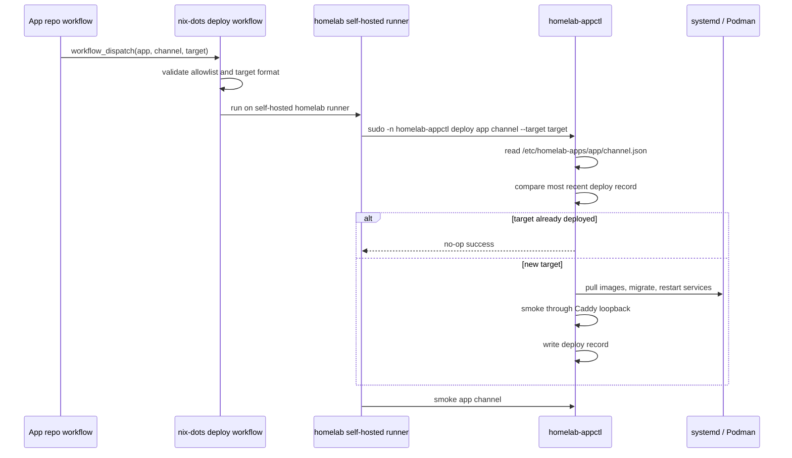

# feat: homelab deploy dispatch

## Summary

Add the host-side dispatch target that lets an app repo request an admitted
homelab deploy without learning homelab internals. The implementation keeps app
repos responsible for release identity and image publication, while `nix-dots`
validates the request, invokes `homelab-appctl`, records deploy identity, and
no-ops repeated target deployments.

---

## Problem Frame

The app-side Deopjib dev release reached image publication and moved its channel
tag, but failed at the final homelab dispatch because this repo did not yet have
a default-branch workflow target and the app repo dispatch token was empty. The
host-side workflow and deploy runner behavior must land here before the app repo
can complete that final handoff.

---

## Requirements

### Workflow Dispatch

- R1. Provide `.github/workflows/deploy-homelab-app.yml` on the default branch
  with `workflow_dispatch` inputs `app`, `channel`, and `target`.
- R2. Run the dispatch job only on the homelab self-hosted runner labels
  `self-hosted` and `homelab`.
- R3. Validate an explicit initial allowlist containing only `deopjib:dev` and
  `deopjib:prod`.
- R4. Make the workflow least-privilege and serialized: no unnecessary
  `GITHUB_TOKEN` permissions, and no parallel deploys for the same app/channel.

### Deploy Identity and Boundary

- R5. Treat `target` as the deploy identity, preferring release identifiers such
  as `deopjib-v0.0.1` while allowing full source SHAs during transition.
- R6. A given release target must map immutably to one component image set. If
  that invariant cannot be guaranteed during transition, no-op must compare the
  target plus resolved image identity or expose an explicit operator-only force
  path.
- R7. Execute host-owned deploy behavior through `homelab-appctl`, not SSH or
  app-repo deploy logic.
- R8. Prod dispatch requires separate authority from dev dispatch, such as a
  protected GitHub Environment, separate credential, or protected release/tag
  gate.

### Appctl Deploy Semantics

- R9. Make `homelab-appctl deploy <app> <channel> --target <identifier>` read
  `/etc/homelab-apps/<app>/<channel>.json`.
- R10. No-op deploy only when the most recent deploy record for the app/channel
  is successful and has the same target. Any newer failed record disables no-op
  and allows retry.
- R11. Verify the homelab runner's service user is covered by the narrow
  passwordless sudo rule, and keep root-side validation strong enough that
  workflow input validation is not the only guard before root deploy actions.

### Deploy Records

- R12. Successful deploy records include app, channel, target, deployed time,
  service image refs or resolved IDs/digests, migration result, and smoke result.
- R13. Failed deploy attempts after record creation include explicit failure
  result state for pull, migration, restart, or smoke failure, and are excluded
  from no-op target comparison.

---

## Scope Boundaries

- Do not add SSH deploy scripts or direct homelab runtime knowledge to app repos.
- Do not create the app repo `HOMELAB_DEPLOY_DISPATCH_TOKEN`; that remains app
  repo setup after this workflow lands on the remote default branch and host
  readiness is verified.
- Do not infer SemVer or release identity from `nix-dots`; app CI supplies
  `target`.
- Do not use mutable channel tags as the only deploy identity.
- Do not implement automatic rollback; current rollback remains conservative and
  record-oriented.
- Do not redesign the app runtime contract, Podman/Quadlet renderer, or future
  k3s/Flux path.

### Deferred to Follow-Up Work

- App repo workflow/secret wiring: complete after this repo's workflow exists on
  the remote default branch.
- Broader app/channel allowlist model: defer until a second app or channel needs
  dispatch.
- Automatic image restoration rollback: defer until image restore and migration
  rollback semantics are proven safe.
- App repo token provisioning: defer until the host has switched to a generation
  whose rendered `homelab-appctl` supports `--target`, no-op, structured
  records, and runner sudo verification.

---

## Context & Research

### Relevant Code and Patterns

- `.github/workflows/nix.yml` is the existing GitHub Actions surface in this
  repo.
- `systems/homelab/app-containers.nix` owns generated app metadata,
  Podman/Quadlet units, migration units, Caddy/Cloudflared routing, sudo rules,
  and the `homelab-appctl` shell application.
- `systems/homelab/app-admissions.nix` imports the app-owned Deopjib admission
  data through the `deopjibRuntime` flake input.
- `docs/guides/homelab-image-deploy-guide.md` and `rules/repo-policy.md` define
  the durable app-owned contract / host-owned deploy boundary.

### Institutional Learnings

- `docs/solutions/architecture-patterns/homelab-app-contract-generic-deploy-runner-2026-05-06.md`
  captures the current boundary: app repos publish images and release intent;
  `nix-dots` admits runtime contracts and owns the generic deploy runner.
- `docs/solutions/tooling-decisions/homelab-podman-quadlet-runtime-migration-2026-04-27.md`
  explains why routine app image updates should not require a NixOS rebuild.

### External References

- GitHub Actions workflow syntax documents explicit workflow/job `permissions`
  and `concurrency`; use those native controls rather than relying on defaults.
- GitHub's workflow dispatch REST API requires repo-level Actions write
  permission for fine-grained tokens. Treat that as repository-level authority,
  not per-workflow or per-input isolation.

---

## Key Technical Decisions

- Workflow dispatch stays in `nix-dots`: this keeps homelab runner labels,
  admission validation, sudo boundary, migration, service restart, and smoke
  checks out of app repos.
- Keep the allowlist explicit in the workflow first: only Deopjib dev/prod is in
  scope, and a generic registry or dynamic lookup is unnecessary until more apps
  need dispatch.
- Keep workflow permissions explicit and minimal: the deploy workflow does not
  need repository write access from its own `GITHUB_TOKEN`.
- Serialize deploys per app/channel at the workflow level first. Host-side file
  locking can be added later if another deploy entry point bypasses the GitHub
  workflow.
- Extend the existing `homelab-appctl` script in `systems/homelab/app-containers.nix`:
  it already has the metadata path, service units, image units, smoke behavior,
  deploy records, and sudo rule in one host-owned module.
- Record both compatibility files and structured summary: existing
  `metadata.json`, image TSVs, and `result` remain useful for operators, while a
  structured record summary gives the dispatch flow the requested app/channel/
  target/time/result shape.
- No-op compares the most recent record, not any historical success: a successful
  latest record with the same target can no-op; any newer failed record disables
  no-op so the same target can retry.
- Treat release targets as immutable image-set identities. If app CI repairs
  channel pointers for the same semantic version during transition, the host
  must either compare resolved image identity before no-op or use an explicit
  operator-only force path.

---

## Open Questions

### Resolved During Planning

- Should `target` be required by the GitHub workflow? Yes. The dispatch workflow
  is app CI initiated and must carry a release identity.
- Should `target` be required for local `homelab-appctl deploy`? No. Keep local
  operator compatibility, but dispatch always passes it.
- Should this plan update app repo workflow or secrets? No. The handoff states
  that app repo setup happens after the host workflow is on the remote default
  branch.
- Can the app repo dispatch token enforce one workflow or one input allowlist by
  itself? No. GitHub's fine-grained token permission for workflow dispatch is
  repository-level Actions write; this workflow's own validation and prod gate
  are the hard guards.

### Deferred to Implementation

- Exact structured deploy record filename: choose the simplest name that fits
  the existing record directory layout.
- Exact image identity source: prefer resolved repo digests when Podman exposes
  them cheaply; otherwise record image refs plus local image IDs and make clear
  that target is a release label, not cryptographic provenance.

---

## High-Level Technical Design

> *This illustrates the intended approach and is directional guidance for
> review, not implementation specification. The implementing agent should treat
> it as context, not code to reproduce.*

---

## Implementation Units

### U1. Audit and Tighten Host Dispatch Workflow

**Goal:** Ensure the existing GitHub Actions workflow is the narrow host-owned
dispatch target that app repos can call after publishing images and choosing a
release target.

**Requirements:** R1, R2, R3, R4, R5, R7, R8

**Dependencies:** None

**Files:**
- Modify only if gaps remain: `.github/workflows/deploy-homelab-app.yml`

**Approach:**
- Start by auditing the existing workflow against this unit; patch only missing
  behavior.
- Keep `workflow_dispatch` inputs for `app`, `channel`, and required `target`.
- Keep `runs-on` labels `self-hosted` and `homelab`.
- Add an explicit least-privilege `permissions` block. Use no token permissions
  unless a future step proves it needs repository/API access.
- Add workflow/job concurrency keyed by app/channel with in-progress deploys not
  canceled, so two dispatches for the same app/channel cannot interleave.
- Validate the exact initial allowlist before running any host command.
- Validate `target` as a Deopjib release-id shape for prod. Allow transitional
  full lowercase source SHA only for dev unless the operator explicitly accepts
  prod SHA dispatch later.
- Add a prod authority gate before host deploy, such as a protected GitHub
  Environment or an equivalent separate credential/protected release gate.
- Call host-owned `homelab-appctl` commands only after validation passes.

**Patterns to follow:**
- Existing workflow formatting in `.github/workflows/nix.yml`.
- Host/app responsibility split in `docs/guides/homelab-image-deploy-guide.md`.
- GitHub Actions workflow `permissions` and `concurrency` keys.

**Test scenarios:**
- Happy path: `app=deopjib`, `channel=dev`, `target=deopjib-v0.0.1` passes
  validation and reaches the deploy step.
- Happy path: `app=deopjib`, `channel=prod`, `target=deopjib-v0.0.1` passes
  validation and reaches the prod authority gate before host deploy.
- Error path: unsupported app/channel fails before invoking `homelab-appctl`.
- Error path: empty or malformed target fails before invoking `homelab-appctl`.
- Error path: prod dispatch with a transitional SHA target fails before invoking
  `homelab-appctl`.
- Integration: two dispatches for the same app/channel are serialized by the
  workflow concurrency group rather than running host mutation concurrently.

**Verification:**
- Workflow file parses as YAML and exposes the three required dispatch inputs.
- The only runner labels are `self-hosted` and `homelab`.
- Workflow token permissions are explicitly minimized.
- Workflow concurrency is scoped to app/channel and does not cancel an
  in-progress deploy.
- Prod dispatch has a documented approval or credential gate distinct from dev.
- The deploy step contains no SSH, Caddy, systemd, secret, or migration logic
  beyond invoking `homelab-appctl`.

### U2. Audit and Tighten Appctl Target Semantics

**Goal:** Ensure `homelab-appctl deploy` accepts `--target`, validates the
root-side deploy request, compares the requested target to the most recent
record safely, and no-ops only when the most recent record proves the same
target is already deployed.

**Requirements:** R5, R6, R9, R10, R11

**Dependencies:** U1 can be implemented independently, but dispatch becomes
fully useful only after this unit.

**Files:**
- Modify only if gaps remain: `systems/homelab/app-containers.nix`

**Approach:**
- Start by auditing the existing `homelab-appctl` parser and deploy path against
  this unit; patch only missing behavior.
- Extend or preserve the existing argument parser for deploy options rather than
  creating a new command.
- Keep metadata lookup through `/etc/homelab-apps/<app>/<channel>.json`.
- Keep app/channel/target validation inside `homelab-appctl` before root deploy
  actions. Workflow validation is defense in depth, not the only guard.
- Define the current target from the most recent deploy record only when that
  record is successful and has the same target.
- Return success without pull, migration, restart, or smoke when current target
  equals requested target.
- Do not no-op when the most recent record is failed, even if an older
  successful record has the same target.
- Preserve the target/image-set invariant: no-op assumes a target maps
  immutably to the same component image set.
- Preserve target-less local deploy behavior for operator compatibility.

**Patterns to follow:**
- Existing `require_metadata`, `cmd_deploy`, and deploy record layout in
  `systems/homelab/app-containers.nix`.
- Existing sudo boundary in the same module.

**Test scenarios:**
- Happy path: no previous successful record and a new target runs the normal
  deploy sequence.
- Happy path: most recent record is successful, target matches requested target,
  and deploy exits successfully without mutating state.
- Edge case: most recent record is smoke-failed with the same target, so deploy
  does not no-op and can retry.
- Error path: malformed target is rejected before root-only deploy actions.
- Integration: `--dry-run --target <id>` reports whether the next action is
  deploy or no-op without writing state.

**Verification:**
- Rendered `homelab-appctl` script includes `--target` in usage, validation,
  dry-run output, current-target lookup, and deploy invocation.
- Nix evaluation of the homelab configuration succeeds.

### U3. Record Structured Deploy Results

**Goal:** Make successful deploy records contain the identity and outcome fields
needed by the handoff while preserving existing operator-readable artifacts.

**Requirements:** R6, R12, R13

**Dependencies:** U2

**Files:**
- Modify: `systems/homelab/app-containers.nix`

**Approach:**
- Continue writing metadata snapshot, metadata hash, and before/after image
  snapshots.
- Add a structured summary record containing app, channel, target when provided,
  deployed timestamp, before/after image refs and local IDs or digests,
  migration result, smoke result, and final result.
- Treat migration as `skipped` when no manual migration unit exists.
- Write explicit failure results for pull, migration, restart, and smoke
  failures once the record directory exists.
- Keep failed records visible for operators but excluded from no-op target
  comparison.

**Patterns to follow:**
- Existing record directory under `/var/lib/homelab-appctl/<app>/<channel>/`.
- Current rollback command that reads previous image records conservatively.

**Test scenarios:**
- Happy path: successful deploy writes structured app/channel/target/time/image/
  migration/smoke fields.
- Happy path: deploy without a migration unit records migration as skipped.
- Error path: image pull failure records pull failure and keeps the workflow
  failing.
- Error path: migration failure records migration failure and keeps the workflow
  failing.
- Error path: restart failure records restart failure and keeps the workflow
  failing.
- Error path: smoke failure records smoke failure and still points the operator
  at the rollback surface.
- Edge case: target-less manual deploy still writes a useful record without
  pretending to have release identity.

**Verification:**
- Rendered appctl script writes the structured record in the same record
  directory as existing artifacts.
- Existing rollback output can still read previous image snapshots.

### U4. Patch Only Stale Operator and Agent Documentation

**Goal:** Keep durable docs aligned with the final cross-repo dispatch boundary
without creating churn in docs that already describe the current contract.

**Requirements:** R1, R5, R6, R7, R10, R12, R13

**Dependencies:** U1, U2, U3

**Files:**
- Modify only if stale after inspection: `docs/guides/homelab-image-deploy-guide.md`
- Modify only if stale after inspection: `rules/repo-policy.md`
- Modify if command examples or deploy-record descriptions are stale:
  `docs/solutions/architecture-patterns/homelab-app-contract-generic-deploy-runner-2026-05-06.md`

**Approach:**
- Inspect docs first and leave already-current docs untouched.
- Document that app CI dispatches the host-owned workflow with app/channel/
  target after publishing images.
- Document `--target` as release identity and same-target no-op behavior.
- Document record contents at the policy level without making app repos depend
  on `/etc/homelab-apps` or `/var/lib/homelab-appctl` paths.
- Document token reality precisely: an app repo token can be narrowed to repo
  Actions write, but not to one workflow/input allowlist by token scope alone.
  The workflow allowlist and prod gate remain the hard guards.
- Keep OCI release manifests described as optional provenance, not deploy ABI.

**Patterns to follow:**
- Existing guide sections on release automation and portability boundary.
- Existing concise rule style in `rules/repo-policy.md`.

**Test scenarios:**
- Documentation expectation: no behavioral test; validate by reviewing that app
  repo responsibilities and host responsibilities stay separated.

**Verification:**
- Docs mention the GitHub workflow dispatch path and `--target` no-op semantics.
- Docs do not instruct app repos to SSH into the homelab or call systemd/Caddy/
  secret/migration logic directly.

### U5. Validate Rendered Host Surface

**Goal:** Prove the planned workflow and NixOS module changes evaluate and expose
the expected host adapter surface.

**Requirements:** R1, R2, R3, R4, R5, R6, R7, R8, R9, R10, R11, R12, R13

**Dependencies:** U1, U2, U3, U4

**Files:**
- Modify: no source files expected unless validation reveals a defect in prior
  units.

**Approach:**
- Use repo-standard Nix formatting and evaluation checks after Nix/doc/workflow
  edits.
- Inspect rendered `homelab-appctl` text from the homelab NixOS configuration
  instead of relying only on diff review.
- Inspect rendered metadata for the admitted Deopjib app/channel to confirm the
  path remains `/etc/homelab-apps/<app>/<channel>.json`.
- Verify the homelab host has applied the generation that contains the rendered
  `homelab-appctl --target`, no-op, and structured record behavior before app
  repo secret/wiring is enabled.
- Verify the self-hosted runner service user can run the intended sudo command
  non-interactively, and that `sudo -l -n` does not expose a broader deploy
  surface than intended.
- Keep full live app repo dispatch testing out of this plan unless the operator
  explicitly chooses to run it after merge, but do require host-side rendered
  surface and sudo readiness checks before declaring dispatch ready.

**Patterns to follow:**
- `rules/README.md` verification guidance.
- Prior homelab verification pattern of evaluating generated output before live
  host behavior.

**Test scenarios:**
- Integration: homelab configuration evaluation succeeds with admitted Deopjib
  app metadata.
- Integration: rendered `homelab-appctl` contains target validation, no-op
  target comparison, and structured record writing.
- Error path: unsupported workflow app/channel remains rejected before host
  command invocation.
- Integration: runner-side dry-run can invoke `sudo -n homelab-appctl deploy
  deopjib dev --dry-run --target <valid-dev-target>` without prompting for a
  password.
- Integration: app repo secret/wiring is not marked ready until the host
  generation with the new appctl behavior is active.

**Verification:**
- Nix formatting and the relevant flake or evaluation checks complete
  successfully.
- Workflow and rendered appctl surfaces match the handoff requirements.
- Host readiness is proven separately from workflow file existence.

---

## System-Wide Impact

- **Interaction graph:** app repo workflow dispatches this repo's GitHub Actions
  workflow; homelab runner invokes `homelab-appctl`; `homelab-appctl` controls
  systemd image/migration/service units and Caddy-loopback smoke checks.
- **Error propagation:** workflow validation errors fail before host mutation;
  appctl deploy errors fail the workflow; pull, migration, restart, and smoke
  failures keep an explicit deploy record result when the record directory exists
  and point to the conservative rollback command where useful.
- **State lifecycle risks:** target comparison must only trust the most recent
  record when it is successful, otherwise a failed deploy could incorrectly
  block retry or an older success could mask a newer failure.
- **API surface parity:** local operator `homelab-appctl` remains usable; GitHub
  dispatch is a remote trigger for the same host-owned command, not a second
  deploy implementation.
- **Integration coverage:** Nix eval and rendered script inspection prove the
  generated host surface; runner sudo readiness proves the dispatch path can
  invoke root deploy non-interactively; live dispatch requires the app repo token
  and remote default-branch workflow to exist.
- **Unchanged invariants:** app repos still own release identity and image
  publication; `nix-dots` still owns host admission, secrets, migrations, service
  control, Caddy, Cloudflared, smoke checks, and deploy records.

---

## Risks & Dependencies

| Risk | Mitigation |
|------|------------|
| App repo dispatch token remains empty | Land this workflow first; app repo secret setup is a follow-up prerequisite after host readiness is verified. |
| Workflow lands before homelab host switches to the matching appctl generation | Gate app repo secret/wiring on rendered appctl and runner sudo verification from the active host generation. |
| Workflow GITHUB_TOKEN inherits unnecessary default permissions | Add explicit least-privilege workflow/job permissions. |
| Leaked app dispatch token can request prod | Require a separate prod authority gate and reject transitional SHA targets for prod unless explicitly accepted. |
| Concurrent dispatches interleave deploy records or service mutation | Add workflow concurrency keyed by app/channel without canceling in-progress deploys. |
| Workflow allowlist becomes stale as apps grow | Keep the initial allowlist explicit; broaden only when a second app/channel needs dispatch. |
| No-op compares against a failed deploy record or older success | Compare only the most recent deploy record, and only no-op when it is successful with the same target. |
| Image digest fields are not always available cheaply | Record image refs plus local image IDs now, prefer resolved digests when cheap, and avoid claiming cryptographic provenance without digest binding. |
| App repo gains hidden host authority | Keep workflow host-owned, input-validated, runner-label constrained, protected for prod, and backed by verified narrow sudo rules. |

---

## Documentation / Operational Notes

- After this workflow reaches the remote default branch and the homelab host has
  switched to the matching appctl generation, configure the app repo
  `HOMELAB_DEPLOY_DISPATCH_TOKEN` with the narrowest repo-level Actions write
  permission available for workflow dispatch.
- Do not describe the dispatch token as workflow/input-scoped. GitHub token
  permission for workflow dispatch is repository Actions write; the workflow
  allowlist, prod gate, and avoiding other sensitive `workflow_dispatch`
  workflows are the actual guards.
- First live end-to-end verification should use Deopjib dev with an explicit
  release target, then immediately repeat the same dispatch to prove no-op
  behavior.
- First prod verification should use a release-id target, not a transitional SHA,
  and pass through the chosen prod authority gate.
- Do not treat public URL health as deploy provenance; the deploy record target
  is the host-side release label for this flow, with image refs and resolved IDs
  or digests providing the component evidence.

---

## Sources & References

- **Origin document:** [docs/plans/2026-05-06-001-homelab-cross-repo-deploy-dispatch-handoff.md](2026-05-06-001-homelab-cross-repo-deploy-dispatch-handoff.md)
- Related plan: [docs/plans/2026-04-30-001-feat-homelab-app-release-automation-plan.md](2026-04-30-001-feat-homelab-app-release-automation-plan.md)
- Related guide: [docs/guides/homelab-image-deploy-guide.md](../guides/homelab-image-deploy-guide.md)
- Related policy: [rules/repo-policy.md](../../rules/repo-policy.md)
- Related module: `systems/homelab/app-containers.nix`
- Related workflow target: `.github/workflows/deploy-homelab-app.yml`
- External docs: [GitHub Actions workflow syntax](https://docs.github.com/en/actions/reference/workflows-and-actions/workflow-syntax)
- External docs: [GitHub REST workflow dispatch API](https://docs.github.com/en/rest/actions/workflows#create-a-workflow-dispatch-event)
