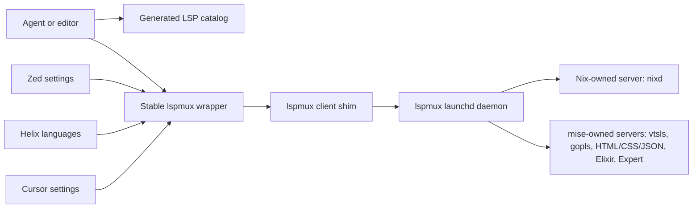

# feat: Expose language servers to agents through lspmux

## Summary

Extend the current `lspmux` setup from editor-specific Elixir/Rust routing into a shared agent-facing language-server layer. All supported LSP entrypoints, including Nix's `nixd`, should have stable Home Manager wrapper binaries that run through `lspmux`; non-Nix LSP versions should be owned by `mise` where `mise` supports the tool backend.

---

## Problem Frame

The current draft PR proves the basic `lspmux` daemon and wrapper approach, but it still leaves many language servers on direct editor-managed or Nix-managed paths. The user's main need is broader than editor startup: agents should have a stable, inspectable way to discover and invoke language servers through `lspmux` across languages.

---

## Requirements

- R1. Route `nixd` through `lspmux`, while keeping `nixd` itself Nix-owned and preserving the existing flake-aware settings.
- R2. Route non-Nix language servers through `lspmux` wrappers backed by `mise`-managed tools when `mise` supports the backend.
- R3. Provide stable wrapper names and a generated server catalog so agents can discover the language-server command surface without scraping editor settings.
- R4. Keep Zed, Cursor, and Helix aligned with the same wrapper family where each tool exposes a safe override surface.
- R5. Preserve the existing Elixir rule: `elixir-ls` first, `expert` second, with `lexical` and `next-ls` disabled or absent.
- R6. Avoid broad lockfile updates, editor rewrites, or replacing Cursor built-in language features where no supported binary override exists.
- R7. Keep the current Nix verification path authoritative: formatting, eval, wrapper build/smoke, and flake check.

---

## Scope Boundaries

- Do not make `mise` responsible for `nixd`; `nixd` remains a Nix package but is launched through a Nix-generated `lspmux` wrapper.
- Do not claim Codex has live LSP-backed answers unless an actual agent-callable LSP tool is visible in the current runtime.
- Do not force Cursor's built-in TypeScript, CSS, HTML, or JSON extensions through unsupported internal hooks.
- Do not reintroduce `lexical` or `next-ls`.
- Do not remove existing Nix LSP packages until the wrapper equivalent has been built and smoke-tested.

### Deferred to Follow-Up Work

- Cursor full parity for built-in TS/CSS/HTML/JSON should be handled only if a supported extension or documented override surface is selected.
- A dedicated agent tool that consumes the generated LSP catalog is separate from this Nix/editor configuration plan.

---

## Context & Research

### Relevant Code and Patterns

- `sharedHome/development/lspmux.nix` currently defines the `lspmux` daemon, config, and wrappers for `elixir-ls`, `expert`, and `rust-analyzer`.
- `sharedHome/development/default.nix` imports the `lspmux` module.
- `sharedHome/development/lsp.nix` currently installs shared Nix packages for YAML, TOML, JSON, HTML, CSS, and ESLint language servers.
- `sharedHome/development/go.nix` currently installs `go`, `gopls`, `gofumpt`, `golangci-lint`, and `delve` through Nix.
- `sharedHome/development/devops/nixpkgs.nix` installs `nixd`, `nil`, and the repo formatter.
- `files/workspace/.config/mise/config.toml` already owns `elixir-ls`, `expert`, Rust components, and other workspace tools.
- `files/workspace/.config/zed/settings.json` has a direct `lsp.<server>.binary.path` override pattern and already uses `nixd`, `vtsls`, `gopls`, Tailwind, HTML, Elixir, and Expert blocks.
- `files/workspace/.config/cursor/settings.json` has verified override settings for Rust Analyzer, ElixirLS, Expert, TOML/Taplo, ESLint runtime/node path, TypeScript SDK/node path, and Nix extension settings when the relevant extension is installed.
- `files/workspace/.config/helix/languages.toml` currently launches `tailwindcss-language-server`, `elixir-ls`, and `gopls` by command name.

### Institutional Learnings

- `docs/solutions/developer-experience/nix-zed-lsp-nixd-switch-2026-03-26.md` establishes that `nixd` is the right Nix LSP because it supports flake evaluation, while `nil` should not run in parallel for the same Nix files.
- `AGENTS.md` explicitly says current Codex sessions should not claim LSP-backed answers unless a live Codex LSP/MCP tool is exposed. This plan should improve the runtime surface without overstating present capability.
- The current draft PR `#22` established the first Home Manager `lspmux` wrapper pattern and showed that wrapper smoke tests can validate version resolution.

### External References

- `lspmux` README: the client shim can wrap any language server by passing `client --server-path`, while the server owns process lifecycle and multiplexing.
- `mise` CLI help and dry-runs show backend-qualified tools are supported for `npm:`, `go:`, and `aqua:` tools.
- npm package metadata confirms current binary names for `@vtsls/language-server`, `vscode-langservers-extracted`, `@tailwindcss/language-server`, `@olrtg/emmet-language-server`, `yaml-language-server`, `bash-language-server`, and `dockerfile-language-server-nodejs`.
- Cursor extension manifests confirm override support is extension-specific; built-in TypeScript/CSS/HTML/JSON packages do not expose a single generic LSP binary override like Zed.

---

## Key Technical Decisions

- Build two wrapper families: `lspmux-nix-*` for Nix-owned LSP binaries and `lspmux-mise-*` for mise-owned LSP binaries.
- Keep `pkgs.lspmux` as the Nix-owned multiplexer binary, even when the actual server is mise-owned.
- Add `lspmux-nix-nixd` and route Zed/agent Nix access through it while preserving the existing `lsp.nixd.settings` workspace configuration.
- Use backend-qualified mise tool declarations for non-Nix LSPs: `npm:` for JS language servers, `go:` for `gopls`, and `aqua:` where registry-backed tools like Taplo and Biome are already available.
- Treat `vscode-langservers-extracted` as one mise tool with multiple wrapper entrypoints for HTML, CSS, JSON, ESLint, and Markdown.
- Generate a small agent-facing server catalog from the same Nix data that builds wrappers; editor settings should consume wrapper paths, agents should consume the catalog or the wrapper names.
- Keep Cursor conservative: configure only documented/manifest-confirmed override keys and leave built-in language features alone unless a supported extension path is chosen.

---

## Open Questions

### Resolved During Planning

- Should `nixd` bypass `lspmux` because it is Nix-owned? No. The user clarified that `nixd` must also go through `lspmux`, but the underlying binary should remain Nix-owned.
- Can `gopls` be installed through `mise` instead of Nix? Yes. `mise install --dry-run` accepts `go:golang.org/x/tools/gopls@latest`.
- Can `vtsls` be installed as `npm:vtsls`? No. The usable package is `npm:@vtsls/language-server`, whose binary is `vtsls`.
- Should Cursor built-in TS/CSS/HTML/JSON be force-routed through `lspmux`? No. Use verified override surfaces only.

### Deferred to Implementation

- Final exact wrapper list should be trimmed to installed/used language extensions after implementation-time smoke checks.
- Cursor Nix parity depends on whether the Nix extension is installed in Cursor; if absent, implementation should either install it explicitly or leave Cursor Nix routing documented as unavailable.
- Whether `vscode-eslint-language-server` needs additional workspace settings or package-local ESLint resolution should be verified with a smoke project.

---

## High-Level Technical Design

> *This illustrates the intended approach and is directional guidance for review, not implementation specification. The implementing agent should treat it as context, not code to reproduce.*

The key invariant is that the agent-visible wrapper command and the editor-visible wrapper command are the same command family. `lspmux` owns process reuse; Nix owns the wrapper/catalog generation; `mise` owns the version of every non-Nix language server where supported.

---

## Implementation Units

### U1. Normalize lspmux wrapper generation

**Goal:** Generalize the current wrapper code so it can generate Nix-owned and mise-owned LSP wrappers from one server definition set.

**Requirements:** R1, R2, R3

**Dependencies:** None

**Files:**
- Modify: `sharedHome/development/lspmux.nix`

**Approach:**
- Split wrapper generation into a provider-neutral shape with fields for server name, wrapper name, provider type, executable, default arguments, version probe strategy, and whether the server should appear in the agent catalog.
- Add a Nix-owned wrapper path for `nixd` that launches `lspmux client --server-path` against the Nix store `nixd` binary.
- Keep the current mise wrapper behavior for ElixirLS, Expert, and Rust Analyzer, including the ElixirLS version-probe guard that avoids starting the full LSP process.
- Keep `lspmux` daemon config and launchd ownership in Home Manager.

**Patterns to follow:**
- Current `sharedHome/development/lspmux.nix`
- Existing Home Manager package modules under `sharedHome/development/`

**Test scenarios:**
- Test expectation: none -- this is declarative wrapper generation; behavior is verified by Nix eval/build and wrapper smoke checks.

**Verification:**
- Home Manager evaluation includes the expanded wrapper package set.
- Built wrapper commands for `nixd`, ElixirLS, Expert, and Rust Analyzer resolve without starting long-running LSP processes for version probes.

### U2. Move non-Nix LSP tool versions into mise

**Goal:** Declare the non-Nix language servers as mise-owned tools so future version upgrades happen through `mise`, not through Nix package changes.

**Requirements:** R2, R5, R6

**Dependencies:** None

**Files:**
- Modify: `files/workspace/.config/mise/config.toml`

**Approach:**
- Add backend-qualified tools for TypeScript, web, Go, shell, YAML, Docker, TOML, and formatter-backed language services where supported.
- Use `npm:@vtsls/language-server` for `vtsls`.
- Use `npm:vscode-langservers-extracted` for HTML, CSS, JSON, ESLint, and Markdown language server binaries.
- Use `npm:@tailwindcss/language-server` for Tailwind and CSS mode support.
- Use `npm:@olrtg/emmet-language-server` for Emmet.
- Use `go:golang.org/x/tools/gopls` for `gopls`.
- Use `npm:yaml-language-server`, `npm:bash-language-server`, and `npm:dockerfile-language-server-nodejs` for their respective servers.
- Use `aqua:tamasfe/taplo` and `aqua:biomejs/biome` where mise registry support is available.
- Do not add `lexical` or `next-ls`.

**Patterns to follow:**
- Existing backend-qualified `[tools."pipx:graphifyy"]` style in `files/workspace/.config/mise/config.toml`

**Test scenarios:**
- Test expectation: none -- this is a tool declaration change; command resolution is validated by `mise` dry-run/current/exec checks.

**Verification:**
- `mise install --dry-run` recognizes every newly declared backend-qualified tool.
- `mise exec -- <server> --version` or an equivalent non-starting version probe works for each wrapper target where the server supports it.

### U3. Expand lspmux wrapper coverage and generate an agent catalog

**Goal:** Add stable wrapper binaries and a generated catalog that agents can use to discover language-server entrypoints.

**Requirements:** R1, R2, R3

**Dependencies:** U1, U2

**Files:**
- Modify: `sharedHome/development/lspmux.nix`

**Approach:**
- Add wrappers for `nixd`, `vtsls`, `vscode-html-language-server`, `vscode-css-language-server`, `vscode-json-language-server`, `vscode-eslint-language-server`, `vscode-markdown-language-server`, `tailwindcss-language-server`, `emmet-language-server`, `gopls`, `yaml-language-server`, `bash-language-server`, `docker-langserver`, `taplo`, and `biome`.
- Preserve existing wrappers for `elixir-ls`, `expert`, and `rust-analyzer`.
- Generate an agent-facing catalog under the user's Home Manager-managed config/data surface containing server name, wrapper binary name, provider type, language association, and notes such as "Cursor override unavailable" where applicable.
- Keep the catalog pure data generated from the same server definitions as wrappers, so wrapper coverage and catalog entries cannot drift.
- Keep direct Nix package installs for `nixd` and `lspmux`; remove or defer duplicate Nix LSP package installs only after wrapper smoke checks pass.

**Patterns to follow:**
- `xdg.configFile` and `home.file` usage in `sharedHome/development/lspmux.nix`
- Existing `home.packages` language-server package lists

**Test scenarios:**
- Test expectation: none -- generated wrapper/catalog data is validated by eval, JSON/TOML parsing, and command smoke checks.

**Verification:**
- The generated catalog parses as structured data.
- Every catalog entry points to a wrapper included in Home Manager packages.
- Each wrapper can execute a safe version/help probe without bypassing `lspmux` for normal LSP startup.

### U4. Route Zed and Helix through the shared wrappers

**Goal:** Make editor configurations that support command overrides consume the same wrapper family as agents.

**Requirements:** R1, R3, R4, R5

**Dependencies:** U3

**Files:**
- Modify: `files/workspace/.config/zed/settings.json`
- Modify: `files/workspace/.config/helix/languages.toml`

**Approach:**
- Add or update Zed `lsp.<server>.binary.path` entries for `nixd`, `vtsls`, HTML, CSS, JSON, ESLint, Tailwind, Emmet, `gopls`, Taplo, YAML, Biome, ElixirLS, Expert, and Rust Analyzer where those server names are active in language blocks.
- Keep `lsp.nixd.settings` exactly responsible for flake-aware Nix evaluation; only the binary path changes to the `lspmux` wrapper.
- Update Helix language-server command entries for Elixir, Tailwind, Go, and any additional configured language servers to use wrappers instead of raw command names.
- Preserve Elixir/HEEx ordering and lexical/next-ls disabling.

**Patterns to follow:**
- Current Zed `lsp` and `languages` sections
- Current Helix `language-server.*.command` shape
- `docs/solutions/developer-experience/nix-zed-lsp-nixd-switch-2026-03-26.md`

**Test scenarios:**
- Test expectation: none -- editor config changes; validation is syntax parsing plus wrapper presence.

**Verification:**
- Zed JSON parses.
- Helix TOML parses.
- Zed Nix language config still selects `nixd` and disables `nil`.
- Elixir and HEEx still list `elixir-ls` before `expert` and keep `lexical`/`next-ls` disabled.

### U5. Apply conservative Cursor routing

**Goal:** Route Cursor through the shared wrappers wherever a verified extension setting supports it, without breaking built-in language features.

**Requirements:** R3, R4, R5, R6

**Dependencies:** U3

**Files:**
- Modify: `files/workspace/.config/cursor/settings.json`

**Approach:**
- Keep current ElixirLS, Expert, and Rust Analyzer overrides pointed at shared wrappers.
- If the Cursor Nix extension is installed or added, set its server path to the `nixd` wrapper and preserve the existing Nix server settings.
- Set Taplo override settings to the Taplo wrapper and disable bundled Taplo if required by the extension setting contract.
- Configure ESLint runtime/node path only if it can point at the mise-managed Node/tool surface without bypassing project-local ESLint rules.
- Do not force Cursor built-in TypeScript, CSS, HTML, or JSON features through `lspmux` unless an extension-level override is available and verified.
- Record unsupported Cursor built-in parity gaps in the generated catalog notes rather than hiding them.

**Patterns to follow:**
- Current Cursor settings for ElixirLS, Expert, Rust Analyzer, Nix, ESLint, and Taplo
- Local Cursor extension manifests for the relevant override keys

**Test scenarios:**
- Test expectation: none -- Cursor settings are declarative; behavior requires editor restart and extension activation.

**Verification:**
- Cursor JSON parses.
- Extension list and manifests confirm every configured override key exists.
- No unsupported built-in override settings are added.

### U6. Verification, documentation, and PR update

**Goal:** Validate the expanded language-server routing and update the draft PR documentation without mixing unrelated working-copy changes.

**Requirements:** R3, R6, R7

**Dependencies:** U1, U2, U3, U4, U5

**Files:**
- Modify: `docs/plans/2026-05-07-001-feat-lspmux-editor-mise-lsps-plan.md`
- Modify: `docs/plans/2026-05-07-002-feat-agent-lspmux-language-access-plan.md`
- Optional create: `docs/solutions/developer-experience/lspmux-agent-language-server-routing-2026-05-07.md`

**Approach:**
- Update the existing draft PR plan or PR body to reflect the expanded agent-facing scope if implementation lands in the same PR.
- Add a solution doc only if implementation reveals durable operational guidance worth preserving.
- Use `jj` to keep the expanded lspmux work separated from unrelated `grill-with-docs` and skills-lock changes already present in the working copy.

**Patterns to follow:**
- Existing `docs/plans/` frontmatter and section structure
- Existing `docs/solutions/developer-experience/` documents

**Test scenarios:**
- Test expectation: none -- documentation and PR hygiene; verification is diff scope and rendered markdown review.

**Verification:**
- `nix fmt` leaves the repo formatted.
- JSON and TOML editor configs parse.
- Home Manager eval shows launchd, config, wrapper packages, and generated catalog.
- Wrapper smoke checks cover `nixd`, `vtsls`, representative `vscode-langservers-extracted` binaries, `gopls`, ElixirLS, Expert, Rust Analyzer, Taplo, and Biome.
- `nix flake check --all-systems --no-build --show-trace` passes.
- `graphify update .` runs because the repo graph exists.

---

## System-Wide Impact

- **Interaction graph:** Agents and editors should converge on the same Home Manager wrapper family; wrappers connect to `lspmux`; `lspmux` owns language-server process lifecycle.
- **Error propagation:** Wrapper failures surface immediately to the invoking agent/editor; `lspmux` daemon failures continue to log through the launchd-managed log path.
- **State lifecycle risks:** Existing `lspmux` instances may keep old LSP versions until reload, editor restart, daemon restart, or idle timeout.
- **API surface parity:** Zed and Helix can be close to full wrapper parity; Cursor should only claim parity for extension-supported overrides.
- **Integration coverage:** The critical integration is wrapper command -> `lspmux` client -> daemon -> real language server, not just package installation.
- **Unchanged invariants:** `nixd` remains the Nix LSP; `nil` remains disabled for Nix language blocks; ElixirLS remains first-priority for Elixir.

---

## Risks & Dependencies

| Risk | Mitigation |
|------|------------|
| `lspmux` drops some server-to-client requests for certain language servers | Roll out wrapper routing per server with smoke checks and keep rollback simple by removing the binary override. |
| Cursor built-in language services cannot be routed cleanly | Limit Cursor changes to verified extension override keys and expose remaining gaps in the agent catalog. |
| `vscode-langservers-extracted` wrappers share one mise package but expose multiple binaries | Generate one wrapper per binary from a single server-definition list and validate each wrapper target. |
| `gopls` installed through `mise` may depend on mise's Go toolchain state | Use the `go:` backend dry-run/install path and keep `go` itself declared in mise before relying on the `gopls` wrapper. |
| Nixd flake-aware behavior regresses when routed through `lspmux` | Preserve `lsp.nixd.settings` unchanged and verify Zed/Cursor Nix settings still reach `nixd` through workspace configuration. |
| Agent catalog drifts from actual wrappers | Generate catalog entries from the same Nix data structure that creates wrappers and packages. |

---

## Documentation / Operational Notes

- After a Home Manager or nix-darwin switch, restart editors and reload or restart `lspmux` so existing server instances pick up new wrappers and mise versions.
- Updating mise-managed LSPs should not require a Nix switch, but already-running `lspmux` server instances may need reload or timeout before the new binary is spawned.
- The generated catalog should be treated as the agent-facing contract: agents should prefer it over scraping Zed/Cursor settings.
- Current Codex sessions should still report that no live LSP tool is available unless the runtime exposes one; this plan only prepares the local LSP surface.

---

## Alternative Approaches Considered

- Route every Cursor built-in language feature through wrappers immediately: rejected because local manifests do not show a safe generic binary override for TypeScript, CSS, HTML, or JSON built-ins.
- Let agents connect directly to the `lspmux` socket: deferred because most agent/editor integrations expect an executable language-server command, and wrappers preserve that contract.
- Keep `nixd` direct for editor performance: rejected because the user's clarified requirement is that `nixd` also pass through `lspmux` for agent accessibility.
- Keep all LSPs in Nix packages: rejected for non-Nix LSPs because the user wants mise-owned version updates after Nix switch.

---

## Success Metrics

- Every planned language server has either a working `lspmux-*` wrapper or an explicit catalog note explaining why it is not routable for a given surface.
- Zed and Helix no longer invoke direct LSP binaries for the covered language servers.
- Cursor only uses wrapper overrides where the extension setting is verified.
- Agents can inspect one generated catalog and invoke wrappers without knowing editor-specific settings.
- `nixd` runs through `lspmux` without losing flake-aware option/package completion settings.

---

## Sources & References

- Related plan: `docs/plans/2026-05-07-001-feat-lspmux-editor-mise-lsps-plan.md`
- Related code: `sharedHome/development/lspmux.nix`
- Related code: `sharedHome/development/lsp.nix`
- Related code: `sharedHome/development/go.nix`
- Related code: `sharedHome/development/devops/nixpkgs.nix`
- Related code: `files/workspace/.config/mise/config.toml`
- Related code: `files/workspace/.config/zed/settings.json`
- Related code: `files/workspace/.config/cursor/settings.json`
- Related code: `files/workspace/.config/helix/languages.toml`
- Related learning: `docs/solutions/developer-experience/nix-zed-lsp-nixd-switch-2026-03-26.md`
- Related PR: `https://github.com/rjcnd105/hj-dotfiles/pull/22`
- External docs: `https://codeberg.org/p2502/lspmux`
- External docs: `https://mise.jdx.dev/`
- External package metadata: `https://www.npmjs.com/package/@vtsls/language-server`
- External package metadata: `https://www.npmjs.com/package/vscode-langservers-extracted`
- External package metadata: `https://www.npmjs.com/package/@tailwindcss/language-server`
- External package metadata: `https://www.npmjs.com/package/@olrtg/emmet-language-server`
- External package metadata: `https://www.npmjs.com/package/yaml-language-server`
