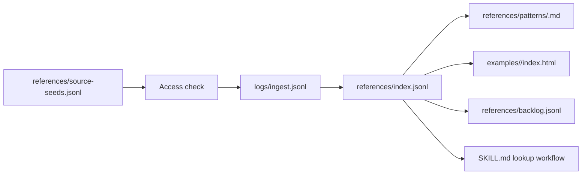

# feat: Add modern CSS/HTML platform patterns skill

## Summary

Create a repo-managed `modern-css-html-patterns` skill that indexes modern CSS-first platform patterns, keeps source provenance and browser-support notes separate from examples, and provides runnable minimal HTML demos for each indexed pattern. HTML primitives such as `popover`, `dialog`, and declarative invoker behavior are included when they are part of the CSS pattern contract.

---

## Problem Frame

The user wants a durable, evolving skill for current and near-future CSS techniques rather than one-off snippets. The skill needs to ingest sources from X/Twitter, CSS article sites, MDN, web.dev Baseline, and other online examples while keeping support status, source reliability, and reconstructed code clearly labeled.

---

## Requirements

- R1. Create a repo-managed skill named `modern-css-html-patterns` under the authoritative workspace skill tree.
- R2. Treat CSS as the primary domain, with HTML primitives included only when they complete a CSS/platform pattern.
- R3. Index patterns with a stable schema that separates source provenance, browser-support level, Browserslist target, caveats, fallback strategy, and verification status.
- R4. Split X/Twitter inspiration from verified or reconstructable code sources so video-only examples do not masquerade as extracted source code.
- R5. Include Baseline 2024, 2025, and 2026 patterns, with current MDN/web.dev support status checked before recording each pattern.
- R6. Provide a minimal runnable `index.html` example for every initial pattern entry.
- R7. Keep the skill maintainable through append-only ingest logs and a machine-readable index that future sessions can update.
- R8. Avoid broad skill bloat: keep `SKILL.md` lean and route detailed pattern knowledge through reference files and examples.
- R9. Bound v1 to a reproducible seed corpus: 8-12 runnable patterns, with remaining candidate sources recorded as backlog instead of expanding the implementation indefinitely.
- R10. Make the corpus schema versioned and closed-enum validated so future updates do not invent incompatible category, source, verification, or support values.

---

## Scope Boundaries

- Do not create a general frontend design skill; this skill focuses on modern CSS/HTML platform techniques and browser support.
- Do not treat video-only X/Twitter content as verified code without reconstruction and separate verification.
- Do not scrape gated or Cloudflare-blocked CodePen source as if it were accessible; record access failures in provenance.
- Do not require support tables for every browser version; use Baseline year, Browserslist query, caveats, and fallback notes.
- Do not mutate the Obsidian `kb/` vault; this is a repo-managed Codex skill corpus, not a vault ingest.

### Deferred to Follow-Up Work

- Automated OCR/video frame extraction for X/Twitter examples: useful later, but v1 can record media URLs and reconstruct examples manually.
- Browser-driven visual regression checks for all examples: defer until the initial corpus and schema stabilize.
- A full search CLI for pattern lookup: v1 can use JSONL plus `rg`; a script can be added after usage proves the repeated query shape.

---

## Context & Research

### Relevant Code and Patterns

- `files/workspace/.agents/skills` is the authoritative writable skill source tree in this repo.
- `files/workspace/.codex/skills/.system/skill-creator/scripts/init_skill.py` is the generic initializer for Codex skills and should be used for a new skill scaffold.
- `files/workspace/.agents/skills/kb/SKILL.md` provides the closest local pattern for schema-first corpus maintenance, append-only logs, and index-refresh discipline.
- `files/workspace/.agents/skills/kb/scripts/kbtool` shows the local pattern for keeping deterministic corpus operations in scripts rather than long `SKILL.md` prose.
- `files/workspace/skills-lock.json` is part of the skill install footprint for `skills` CLI-managed installs; manual repo-local skill creation should leave it untouched unless the implementation intentionally uses that install flow.

### Institutional Learnings

- Prior skill work in this repo found that writable installs should target `files/workspace/.agents/skills`, while runtime exposure should be verified separately with `codex debug prompt-input`.
- The KB workflow established that discovery/update and embedding/indexing are distinct operations; this skill should likewise keep source ingestion, index updates, and example verification distinct.
- Skill metadata budget has been a real constraint in this environment, so `SKILL.md` must stay concise and put detailed pattern entries in `references/` and `examples/`.

### External References

- web.dev Baseline explains Baseline targets and states that 2026 is the latest developing feature set; Browserslist supports Baseline-oriented queries.
- web.dev Baseline 2026 lists newly available HTML/CSS features such as CSS font-relative units and other 2026 platform additions.
- Browserslist documents Baseline-oriented queries such as `baseline widely available` and year-based Baseline queries; exact installed syntax should still be verified locally before encoding a hard query.
- MDN marks `@starting-style` as Baseline 2024 and documents its use for first-style-update transitions.
- MDN marks the HTML `popover` global attribute as Baseline 2024 with caveats for varying subfeature support.
- MDN documents the Popover API as Baseline 2025.
- MDN documents container scroll-state queries with 2026-era guidance.
- MDN documents CSS anchor positioning as a modern module for tethering elements and fallback positions.
- MDN marks `alignment-baseline` as Baseline 2026 with caveats.
- MDN marks CSS `if()` and `sibling-count()` as limited availability, so these should be indexed as experimental/limited rather than Baseline.

---

## Key Technical Decisions

- Name the skill `modern-css-html-patterns`: this keeps CSS primary while making HTML companion primitives visible in trigger matching.
- Store the skill under `files/workspace/.agents/skills/modern-css-html-patterns`: this matches repo-managed skill practice and avoids writing into Home Manager store symlink targets.
- Use `source_kind` and `verification_status` as separate fields: X/Twitter can be an inspiration source while the example code remains reconstructed or needs review.
- Use separate support fields rather than a single support string: `support.status`, `support.baseline_target`, `support.browserslist_query`, and `support.query_verified` let Baseline entries, limited entries, and experimental entries coexist without pretending every feature has a valid Baseline query.
- Keep every pattern example as plain HTML/CSS first: examples should be runnable without framework setup unless the specific pattern requires JavaScript or a browser API.
- Treat MDN/web.dev as support-status authorities and social/example sites as pattern inspiration or demo sources.
- Treat `references/index.jsonl` as the canonical current pattern catalog, `logs/ingest.jsonl` as the append-only source-access event log, and `references/patterns/*.md` as agent-readable narrative that must cross-reference the catalog ID.

---

## Open Questions

### Resolved During Planning

- Should the skill be CSS-only? No. CSS is primary, but HTML primitives are included when they are part of the platform pattern.
- Should X/Twitter examples be mixed with verified code sources? No. Source kind and verification status are separate.
- Should browser support list every browser/version? No. Use Baseline year, Browserslist query, caveats, and fallback strategy.

### Deferred to Implementation

- Exact v1 pattern selection: choose 8-12 entries from the seed corpus after duplicate detection, then record unselected candidates in backlog.
- Exact Browserslist query syntax for Baseline 2026: verify against the installed Browserslist version or current docs before encoding examples; allow `browserslist_query: null` for limited or non-Baseline patterns.
- `skills-lock.json` should be left untouched unless implementation intentionally uses the `skills` CLI/install flow; manually maintained local skills can live under `.agents/skills` without lockfile churn.
- Whether CodePen source can be reached through an official or embedded endpoint: initial probing returned Cloudflare 403, so v1 should not depend on it.

---

## Output Structure

```text
files/workspace/.agents/skills/modern-css-html-patterns/
├── SKILL.md
├── agents/
│   └── openai.yaml
├── references/
│   ├── schema.md
│   ├── index.jsonl
│   ├── source-seeds.jsonl
│   ├── backlog.jsonl
│   └── patterns/
│       └── <pattern-slug>.md
├── examples/
│   └── <pattern-slug>/
│       └── index.html
├── scripts/
│   └── validate_index.go
└── logs/
    └── ingest.jsonl
```

---

## High-Level Technical Design

> *This illustrates the intended approach and is directional guidance for review, not implementation specification. The implementing agent should treat it as context, not code to reproduce.*



The schema should let future sessions answer: "Which modern CSS/HTML platform pattern fits this UI requirement, what support level does it need, and which runnable example should be adapted?"

---

## Implementation Units

### U1. Scaffold the skill shell

**Goal:** Create the `modern-css-html-patterns` skill directory with the required Codex skill metadata and resource folders.

**Requirements:** R1, R8

**Dependencies:** None

**Files:**
- Create: `files/workspace/.agents/skills/modern-css-html-patterns/SKILL.md`
- Create: `files/workspace/.agents/skills/modern-css-html-patterns/agents/openai.yaml`
- Create: `files/workspace/.agents/skills/modern-css-html-patterns/references/schema.md`
- Create: `files/workspace/.agents/skills/modern-css-html-patterns/references/index.jsonl`
- Create: `files/workspace/.agents/skills/modern-css-html-patterns/references/source-seeds.jsonl`
- Create: `files/workspace/.agents/skills/modern-css-html-patterns/references/backlog.jsonl`
- Create: `files/workspace/.agents/skills/modern-css-html-patterns/logs/ingest.jsonl`

**Approach:**
- Use `skill-creator` initializer where it fits the repo-managed target.
- Keep frontmatter trigger text specific to modern CSS, CSS/HTML platform patterns, browser support, Baseline, `popover`, `dialog`, anchor positioning, scroll-state queries, and runnable CSS examples.
- Leave detailed pattern content out of `SKILL.md`; describe when to read `schema.md`, `index.jsonl`, pattern docs, and example files.
- Leave `files/workspace/skills-lock.json` untouched for manual repo-local skill creation unless the implementation intentionally invokes the `skills` CLI/install flow.

**Patterns to follow:**
- `files/workspace/.agents/skills/kb/SKILL.md`
- `files/workspace/.codex/skills/.system/skill-creator/SKILL.md`

**Test scenarios:**
- Test expectation: none -- scaffold and metadata setup are validated through skill validation and runtime visibility, not unit tests.

**Verification:**
- `quick_validate.py` accepts the skill folder.
- If `quick_validate.py` is used, invoke it in an environment that provides PyYAML, such as `uv run --with PyYAML python files/workspace/.codex/skills/.system/skill-creator/scripts/quick_validate.py <skill-dir>`; otherwise use a stdlib-only validation fallback and report that the generic validator was unavailable.
- `SKILL.md` stays concise and references all resource directories.
- Runtime discoverability is checked with `codex debug prompt-input` after the skill is exposed by the workspace.

### U2. Define the pattern indexing schema

**Goal:** Define a schema that supports source provenance, browser support, examples, duplicate detection, and future maintenance.

**Requirements:** R3, R4, R5, R7, R10

**Dependencies:** U1

**Files:**
- Modify: `files/workspace/.agents/skills/modern-css-html-patterns/references/schema.md`
- Modify: `files/workspace/.agents/skills/modern-css-html-patterns/references/index.jsonl`
- Modify: `files/workspace/.agents/skills/modern-css-html-patterns/references/source-seeds.jsonl`
- Modify: `files/workspace/.agents/skills/modern-css-html-patterns/references/backlog.jsonl`
- Modify: `files/workspace/.agents/skills/modern-css-html-patterns/logs/ingest.jsonl`

**Approach:**
- Define required catalog fields such as `schema_version`, `id`, `title`, `category`, `aliases`, `css_features`, `html_features`, `source_refs`, `support_source_ref`, `example_source_ref`, `verification_status`, `support.status`, `support.baseline_target`, `support.browserslist_query`, `support.query_verified`, `support.requires`, `support.caveats`, `fallback`, `fallback_test_method`, `verification_mode`, `example_path`, `states_demonstrated`, `checked_states`, `checked_viewports`, `a11y_checks`, `verification_evidence`, `example_verified_at`, `verification_target`, `expected_primary_result`, `fallback_result`, `related_patterns`, and `last_checked`.
- Define per-source fields in `source-seeds.jsonl` and `logs/ingest.jsonl`: `source_event_id`, `source_id`, `url`, `source_kind`, `access_status`, `http_status`, `checked_at`, `captured_evidence`, `intended_pattern_ids`, `accepted`, and `rejected_reason`.
- Make `source_refs`, `support_source_ref`, and `example_source_ref` point to exact evidence events by `source_event_id`, not only URL-level `source_id`.
- Define closed enum tables for `source_kind`: `inspiration`, `article`, `docs`, `code`, `demo`, and `support-doc`.
- Define closed enum tables for `verification_status`: `extracted`, `reconstructed`, `verified`, `needs-review`, and `limited-fallback-only`.
- Define closed enum tables for `support.status`: `baseline`, `limited`, `experimental`, and `deprecated`.
- Define closed enum tables for canonical categories: `layout`, `interaction`, `motion`, `state-query`, `visual-effect`, `typography`, `form-control`, and `html-primitive`, with aliases for search terms.
- Include a duplicate policy based on feature set, interaction pattern, and visual outcome rather than URL alone.

**Patterns to follow:**
- `files/workspace/.agents/skills/kb/SKILL.md` source/index/log split
- `files/workspace/.agents/skills/kb/scripts/kbtool/frontmatter.go` as an example of treating schema validation as structured data

**Test scenarios:**
- Happy path: a pattern with MDN docs, a runnable example, and Baseline 2026 support validates as `verified`.
- Edge case: an X/Twitter video-only pattern records `source_kind: inspiration` and `verification_status: reconstructed` or `needs-review`, not `verified`.
- Edge case: a CodePen source that returns 403 records access failure in `ingest.jsonl` and does not block the pattern if a reconstructed example exists.
- Error path: an index entry missing `support.status`, `support.baseline_target`, or `example_path` is flagged during validation.
- Error path: a limited or experimental feature with `support.browserslist_query: null` passes only when `support.status` and caveats explain why no query applies.
- Error path: an unknown enum value or missing `schema_version` fails validation.

**Verification:**
- The schema is explicit enough for another Codex session to add a new pattern without inventing fields or collapsing multiple sources into one URL.
- `index.jsonl` entries can be searched with `rg` and parsed line-by-line as JSON.

### U3. Index the initial source corpus

**Goal:** Convert the provided source URLs and selected current MDN/web.dev features into structured pattern entries.

**Requirements:** R3, R4, R5, R7, R9

**Dependencies:** U2

**Files:**
- Create: `files/workspace/.agents/skills/modern-css-html-patterns/references/patterns/*.md`
- Modify: `files/workspace/.agents/skills/modern-css-html-patterns/references/index.jsonl`
- Modify: `files/workspace/.agents/skills/modern-css-html-patterns/references/source-seeds.jsonl`
- Modify: `files/workspace/.agents/skills/modern-css-html-patterns/references/backlog.jsonl`
- Modify: `files/workspace/.agents/skills/modern-css-html-patterns/logs/ingest.jsonl`

**Approach:**
- Record the seed URLs from the Source Inventory section into `references/source-seeds.jsonl` before pattern selection.
- Record access checks for all seed URLs, including duplicate URLs and CodePen 403 results.
- Seed 8-12 runnable v1 pattern docs from the confirmed accessible groups: X/Twitter tweet text and media metadata, `css-tip.com` article pages, `webdevvisuals.com` public visual pages, MDN references, and web.dev Baseline pages.
- Use this v1 selection matrix: include at least one Baseline 2024 pattern, one Baseline 2025 pattern, one Baseline 2026 target pattern, one limited/experimental pattern, one HTML-primitive companion pattern, one article/demo source, one support-doc source, and one inspiration source. Each backlog entry must record the reason it was deferred.
- Treat these as candidate pattern families, then select a bounded 8-12 for v1 after duplicate detection: layered shadow borders, magnetic nav with anchor positioning, scroll-state containers, stacking context isolation, `@starting-style` entry transitions, container queries, CSS filters for icon variants, intrinsic block sizing with margin behavior, popover/dialog transitions, anchor-positioned tooltips, conditional border radius, range selection, sequential animations, CSS `if()` limited patterns, `sibling-count()`/`sibling-index()` limited patterns, custom highlight, view transition selectors, and 2026 font-relative units.
- Mark limited/experimental features as such even if they are trendy; record unselected candidates in `references/backlog.jsonl` rather than expanding v1.

**Patterns to follow:**
- `Source Inventory` entries in this plan
- MDN feature pages for support wording
- web.dev Baseline target pages for Baseline-year grouping

**Test scenarios:**
- Happy path: an MDN Baseline feature creates a `docs` source entry with `support.baseline_target` set to the checked year.
- Happy path: a CSS Tip article creates an `article` source entry and links any CodePen access result separately.
- Edge case: duplicate user-provided X/Twitter URL appears once in the index with multiple source references if needed.
- Error path: an inaccessible or gated page is logged with access status and excluded from verified-code claims.
- Error path: a candidate outside the 8-12 v1 limit is recorded in backlog with enough metadata to revisit later.

**Verification:**
- Every pattern doc has a matching `index.jsonl` line and at least one `source_refs` entry whose `source_event_id` exists in `logs/ingest.jsonl`.
- Each pattern doc names support status and fallback strategy.
- Duplicate-like examples are merged or cross-linked rather than copied as separate near-identical entries.

### U4. Write runnable HTML examples

**Goal:** Provide a minimal runnable `index.html` for each indexed pattern.

**Requirements:** R2, R5, R6

**Dependencies:** U3

**Files:**
- Create: `files/workspace/.agents/skills/modern-css-html-patterns/examples/<pattern-slug>/index.html`
- Modify: `files/workspace/.agents/skills/modern-css-html-patterns/references/patterns/*.md`
- Modify: `files/workspace/.agents/skills/modern-css-html-patterns/references/index.jsonl`

**Approach:**
- Keep examples self-contained with inline CSS and minimal semantic HTML.
- Prefer progressive enhancement: a base experience should remain usable when a limited feature is unsupported.
- For HTML companion primitives, show the HTML contract directly, such as `popover`, `popovertarget`, `dialog`, `::backdrop`, or relevant attributes.
- For interactive primitives, demonstrate and document relevant states such as closed/open, focus, keyboard dismissal, light dismiss, backdrop, anchor fallback, reduced motion, and unsupported-feature fallback.
- Include a concrete UI use case, expected visible outcome, when-to-use/avoid note in the pattern doc, and fallback behavior tied to that use case.
- Add short comments only where the platform feature would otherwise be obscure.

**Patterns to follow:**
- MDN examples for HTML primitive semantics
- CSS Tip examples for compact demo style, without copying gated CodePen source

**Test scenarios:**
- Happy path: opening an example HTML file in a current browser shows the intended visual/interaction pattern.
- Edge case: unsupported features do not leave the page blank or unusable; fallback content remains visible.
- Edge case: limited/experimental examples distinguish `expected_primary_result` from `fallback_result` so fallback visibility is not counted as feature support.
- Accessibility: keyboard navigation, `Escape`/focus return where relevant, accessible names/roles, touch target sizing, and `prefers-reduced-motion` are covered for interactive examples.
- Responsive: small, medium, and desktop viewport checks keep text and controls visible without overlap.
- Smoke matrix: check at 390x844, 768x1024, and 1440x900 viewports; verify at least one keyboard path from trigger to result and back, accessible names for interactive controls, touch targets of at least 44x44 CSS px where controls are touch-facing, and reduced-motion behavior when motion is present.
- Integration: pattern docs and `index.jsonl` point to the exact example path.

**Verification:**
- Every indexed pattern has an existing `examples/<pattern-slug>/index.html`.
- HTML files are valid enough to open directly without a build step.
- Examples avoid external dependencies unless the pattern explicitly documents why one is needed.
- Initial corpus examples are opened in the in-app browser or Chromium-compatible browser; `example_verified_at`, `checked_states`, `checked_viewports`, `a11y_checks`, and `verification_evidence` are recorded only after DOM state or screenshot inspection confirms the intended primary or fallback result.
- Fallback verification records `fallback_test_method` and `verification_mode`: use forced fallback, non-supporting browser evidence, or static `@supports` inspection before marking fallback behavior verified.

### U5. Add lightweight validation and maintenance workflow

**Goal:** Make future updates repeatable without overloading `SKILL.md`.

**Requirements:** R3, R7, R8

**Dependencies:** U2, U3, U4

**Files:**
- Create: `files/workspace/.agents/skills/modern-css-html-patterns/scripts/validate_index.go`
- Modify: `files/workspace/.agents/skills/modern-css-html-patterns/SKILL.md`
- Modify: `files/workspace/.agents/skills/modern-css-html-patterns/references/schema.md`

**Approach:**
- Add a small stdlib validator for JSONL parsing, required fields, pattern-doc existence, example-file existence, duplicate IDs, and ingest-log presence.
- Add cross-field checks: every `source_refs` entry resolves to an ingest event by `source_event_id`, every pattern doc references a catalog ID, every example path exists, every interactive pattern lists `states_demonstrated`, `checked_states`, `checked_viewports`, `a11y_checks`, and `verification_evidence`, and limited patterns have explicit primary/fallback verification targets.
- Validate `schema_version` and reject unknown enum values for source kind, verification status, support status, and category.
- Document the update workflow in `SKILL.md`: check access, classify source, update `index.jsonl`, write/adjust pattern doc, write/adjust example, append ingest log, update backlog if deferred, run validation.
- Document SKILL.md flows for "recommend a pattern", "adapt an example", and "add/update a pattern", including how to handle limited support, duplicate candidates, and fallback-heavy choices.
- Avoid adding a search engine in v1; `rg` over `index.jsonl` and pattern docs is enough.

**Patterns to follow:**
- `files/workspace/.agents/skills/kb/scripts/kbtool` for deterministic validation boundaries
- `files/workspace/.agents/skills/kb/SKILL.md` for workflow routing

**Test scenarios:**
- Happy path: validator passes with all initial pattern docs and examples present.
- Error path: removing an example file causes validator failure naming the missing path.
- Error path: duplicate pattern IDs in `index.jsonl` fail validation.
- Error path: malformed JSONL fails validation with line number.
- Error path: a pattern doc support note that contradicts the canonical `index.jsonl` support fields fails validation or is reported for manual correction.
- Error path: a fallback claim without `fallback_test_method` and `verification_mode` fails validation.

**Verification:**
- `go run scripts/validate_index.go` passes from the skill directory.
- Generic skill validation passes through the documented PyYAML-capable invocation, or the implementation records why only the stdlib validator could be run.

### U6. Verify and document runtime usability

**Goal:** Confirm the skill is valid and usable by future Codex sessions.

**Requirements:** R1, R7, R8

**Dependencies:** U1, U2, U3, U4, U5

**Files:**
- Modify: `files/workspace/.agents/skills/modern-css-html-patterns/SKILL.md`

**Approach:**
- Run the generic skill validator.
- Run the custom index validator.
- Run the initial example smoke checks for the selected v1 corpus.
- Run 2-3 lookup/adaptation smoke prompts or deterministic `rg` acceptance cases proving aliases/categories lead to the intended pattern and example, such as "tooltip anchored to trigger", "entry animation for popover/dialog", and "responsive type without media queries".
- Check the repo status with `jj status`, not plain `git status`, because this repo has known symlink/index pitfalls.
- If runtime exposure is expected immediately, verify with `codex debug prompt-input`; otherwise state that Home Manager/runtime exposure is a separate generation step.

**Patterns to follow:**
- Prior repo skill-install verification practice
- Repository `AGENTS.md` VCS rule to prefer `jj`

**Test scenarios:**
- Test expectation: none -- runtime usability is verified through validators and prompt-surface checks.

**Verification:**
- Skill validation passes.
- Index validation passes.
- Initial example smoke checks are recorded for every v1 example.
- Lookup/adaptation smoke checks identify the intended catalog entries and example paths.
- `jj status` shows only intended files.
- Runtime exposure status is explicitly reported rather than inferred from file existence.

---

## System-Wide Impact

- **Interaction graph:** New skill only affects Codex skill discovery and repo-managed workspace skill content.
- **Error propagation:** Invalid index/example state should fail the custom validator, not silently degrade during skill use.
- **State lifecycle risks:** `logs/ingest.jsonl` is append-only; pattern docs and `index.jsonl` are mutable current-state artifacts.
- **API surface parity:** No external API changes. The skill surface is `SKILL.md` trigger metadata and resource lookup workflow.
- **Integration coverage:** Runtime skill visibility requires prompt-surface verification because filesystem presence alone is not sufficient in this environment.
- **Unchanged invariants:** Existing `kb` vault workflow remains separate; this plan does not change Obsidian vault content or Home Manager linking behavior.

---

## Risks & Dependencies

| Risk | Mitigation |
|------|------------|
| X/Twitter content is reachable but code may live only in video | Split `source_kind` from `verification_status`; mark reconstructed examples honestly |
| CodePen source returns Cloudflare 403 | Log access failure and avoid depending on CodePen as a verified source |
| Baseline status changes over time | Store `last_checked` and support caveats; require re-checking MDN/web.dev before future updates |
| Skill metadata bloats prompt context | Keep `SKILL.md` lean and move corpus detail into references and examples |
| Duplicate trendy examples crowd the index | Use duplicate detection based on feature set, interaction pattern, and visual outcome |
| Runtime skill visibility differs from repo file state | Verify prompt-visible surface separately with `codex debug prompt-input` |
| v1 corpus expands without bound | Seed 8-12 runnable patterns and put the rest into `references/backlog.jsonl` |
| Pattern metadata drifts across files | Treat `index.jsonl` as canonical current catalog and validate pattern docs against it |
| Append-only source evidence becomes ambiguous | Reference exact `source_event_id` values from catalog entries |
| Schema evolves incompatibly | Require `schema_version` and closed-enum validation |

---

## Documentation / Operational Notes

- The skill should include an update workflow, not a README.
- Pattern docs should prefer short, agent-useful explanations over tutorial prose.
- Example HTML files should be runnable artifacts, not documentation-only snippets.
- Future update sessions should cite current MDN/web.dev support sources when changing `support.baseline_target` or caveats.

---

## Source Inventory

The implementation should transcribe these seeds into `references/source-seeds.jsonl` before selecting the bounded v1 corpus. Access status reflects checks performed on 2026-05-08 from this workspace.

| Source | Access result | Initial classification |
|--------|---------------|------------------------|
| https://x.com/nilseller/status/2051682077003960351 | HTTP 200; tweet text and video metadata extractable from X initial state | inspiration; layered shadow borders |
| https://x.com/jh3yy/status/2051284375434633673 | HTTP 200; tweet text and video metadata extractable from X initial state | inspiration; magnetic nav and anchor positioning |
| https://x.com/KaraBharat/status/2051258693451457007 | HTTP 200; tweet text and video metadata extractable from X initial state | inspiration; container scroll-state queries |
| https://x.com/alicalimli_dev/status/2051542217278497103 | HTTP 200; tweet text and video metadata extractable from X initial state | inspiration; stacking context isolation |
| https://x.com/KaraBharat/status/2048628680524738969 | HTTP 200; tweet text and video metadata extractable from X initial state | inspiration; `@starting-style` entry transitions |
| https://x.com/KaraBharat/status/2048409378315993507 | HTTP 200; tweet text and video metadata extractable from X initial state | inspiration; container queries |
| https://x.com/alicalimli_dev/status/2052630471771853045 | HTTP 200; tweet text and video metadata extractable from X initial state | inspiration; CSS filters for icon variants |
| https://x.com/Robby_WebDesign/status/2052327589201449023 | HTTP 200; tweet text and video metadata extractable from X initial state | inspiration; block sizing and margin behavior |
| https://www.webdevvisuals.com/ | HTTP 200; public HTML lists visual and collection links; some content may be gated | article/demo index; source discovery |
| https://www.webdevvisuals.com/visuals/css-fluid-typography | HTTP 200; public visual detail page | article/demo; fluid typography |
| https://www.webdevvisuals.com/collections/must-know-css-scroll-properties | HTTP 200; public collection page | article/demo; scroll properties |
| https://css-tip.com/speed-control/ | HTTP 200; article title and CodePen links visible; CodePen direct access returned Cloudflare 403 | article; animation speed control |
| https://css-tip.com/counter-gotcha/ | HTTP 200; article title visible | article; CSS counters and containers |
| https://css-tip.com/if-trick/ | HTTP 200; article title and CodePen links visible; CodePen direct access returned Cloudflare 403 | article; CSS `if()` and style queries |
| https://css-tip.com/graph-theory/ | HTTP 200; article title and CodePen links visible | article; graph-like CSS relationships |
| https://css-tip.com/tooltip-anchor-3/ | HTTP 200; article title and CodePen links visible | article; anchor-positioned tooltip |
| https://css-tip.com/conditional-border-radius/ | HTTP 200; article title and CodePen links visible | article; conditional border radius |
| https://css-tip.com/range-selection/ | HTTP 200; article title and CodePen links visible | article; CSS range selection |
| https://css-tip.com/sequential-animations/ | HTTP 200; article title and CodePen links visible | article; sequential animations |
| https://css-tip.com/explore/alignment/ | HTTP 200; article title visible | article; alignment fundamentals |
| https://web.dev/baseline | HTTP 200 via web research; Baseline overview | support-doc |
| https://web.dev/baseline/2026 | HTTP 200 via web research; Baseline 2026 feature set | support-doc |
| https://web.dev/articles/use-baseline-with-browserslist | HTTP 200 via web research; Browserslist Baseline query guidance | support-doc |
| MDN feature pages listed in Sources & References | HTTP accessible via web research/search; exact status should be re-opened during implementation before recording final support | support-doc |

---

## Sources & References

- Local skill source tree: `files/workspace/.agents/skills`
- Local KB workflow pattern: `files/workspace/.agents/skills/kb/SKILL.md`
- Skill creator: `files/workspace/.codex/skills/.system/skill-creator/SKILL.md`
- web.dev Baseline overview: https://web.dev/baseline
- web.dev Baseline 2026: https://web.dev/baseline/2026
- MDN Baseline glossary: https://developer.mozilla.org/en-US/docs/Glossary/Baseline/Compatibility
- MDN `@starting-style`: https://developer.mozilla.org/en-US/docs/Web/CSS/%40starting-style
- MDN HTML `popover`: https://developer.mozilla.org/en-US/docs/Web/HTML/Global_attributes/popover
- MDN Popover API: https://developer.mozilla.org/en-US/docs/Web/API/Popover_API
- MDN CSS anchor positioning: https://developer.mozilla.org/en-US/docs/Web/CSS/Guides/Anchor_positioning
- MDN container scroll-state queries: https://developer.mozilla.org/en-US/docs/Web/CSS/Guides/Conditional_rules/Container_scroll-state_queries
- MDN `alignment-baseline`: https://developer.mozilla.org/en-US/docs/Web/CSS/Reference/Properties/alignment-baseline
- MDN CSS `if()`: https://developer.mozilla.org/en-US/docs/Web/CSS/if
- MDN `sibling-count()`: https://developer.mozilla.org/en-US/docs/Web/CSS/sibling-count
